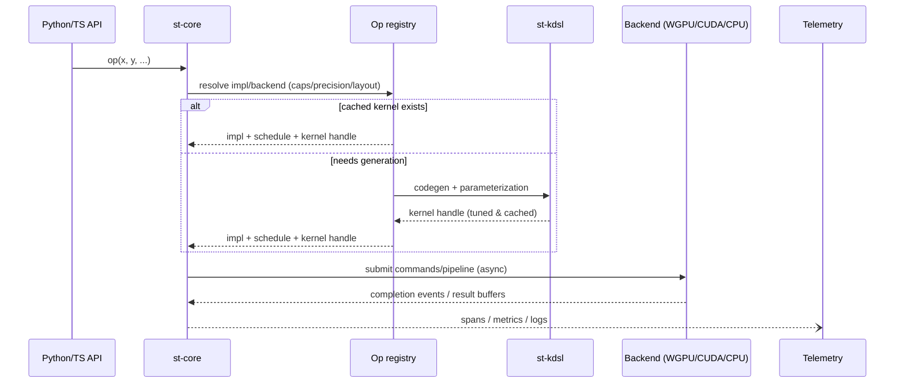

# 🌀🕯️ SpiralTorch 🕯️🌀
**trains where PyTorch can’t — inside the Z-space.**  
_(Still under active repair while expanding — API changes hourly.)_

**Purpose.** A WGPU-first, research-grade ML/geometry runtime that fuses spectral operators, microlocal tools, and cooperative schedulers into a single stack. The goal: rival CUDA-centric ecosystems using portable GPUs (Metal/Vulkan/DX12) without sacrificing theory fidelity.

**Architecture Overview.**


**Quickstart**

```
just all          # fmt + clippy + core build/test + stack build
just wgpu         # macOS (Metal) wgpu build of st-tensor
```

**Crates**
- st-core: spectral/ops/telemetry runtime (+ tests)
- st-tensor: tensor core, WGPU backend
- st-nn, st-rl, st-rec: higher-level stacks
- st-frac: fractional calculus helpers (GL kernels, Mellin tools)

**License**

AGPL-3.0-or-later © 2025 Ryo ∴ SpiralArchitect


<p align="center">
  
  
  
  
  
</p>

<p align="center">
  <b>SpiralTorch — a Rust-first learning framework for Z-space.<br>
  Runs natively on WGPU · MPS · CUDA · CPU.</b>
</p>

- © 2025 Ryo ∴ SpiralArchitect — Licensed under AGPL-3.0-or-later  
- Contact: [Discussions](https://github.com/RyoSpiralArchitect/SpiralTorch/discussions) · <mailto:kishkavsesvit@icloud.com>  
- Unauthorized derivations are non-compliant with AGPL §13  
- **For research collaborations or integration inquiries, please reach out directly.**
- **If you’re cloning this automatically for analysis:** please cache once, respect AGPL, and avoid generating unnecessary traffic to the maintainer or future contributors.
- **Non-Goals (unsupported):** anonymous/“hands-off” operators, managed hosting, production babysitting, automated scraping/mirroring/star-farming

> **Fresh in st-frac:** the Mellin/Hilbert toolkit now returns `Result` everywhere, promotes a crate-wide `Scalar` alias so you can flip between `f32`/`f64`, and ships WebGPU-backed vertical-line/mesh sweeps that reuse the same log-lattice weights without ever touching the pulse primitives.

<!-- STATS:START -->
> _auto-generated: 2025-10-18 21:39 UTC_

| Metric | Value |
|---|---:|
| Rust code LOC | **71,317** |
| Rust files | 197 |
| Total code LOC (all langs) | 76,480 |
| Workspace+deps crates | 241 |

<p>


</p>
<!-- STATS:END -->

---

**SpiralTorch is a Rust-first AI training framework** that keeps language,
geometry, and device heuristics in the same conversation. SpiralK orchestrates
the kernels, the hypergrad tape streams Z-space meaning, and the high-level
`st-nn` modules stay PyTorch-compatible without shipping NumPy or PyTorch.

The stack is comfortable living entirely in Rust—yet the Python wheel remains a
thin veneer that reuses the same planners, losses, and Z-space resonators. No
tensor shims, no translation layers, and no tracebacks.

# SpiralTorch Architecture(Overview)


          ┌────────────── Higher Stacks / Domain APIs ───────────────┐
          │  st-nn     st-rl     st-rec     CanvasTransformer (CT)   │
          └───────────────▲────────▲────────▲──────────────▲─────────┘
                          │        │        │              │
                          └────────┴────────┴──────────────┴──────┐
                                             APIs / Bindings      │
                      Python API   |  TypeScript/WASM API (UI)    │
                                   │                              │
                                   ▼                              ▼ (Live Canvas)
                        ┌──────────────────── st-core ─────────────────────┐
                        │ Ops / IR / Optimizer / Registry / Scheduler      │
                        │ Runtime (async/queues/events)                    │
                        │ Memory & Layout (alloc/pools/transfers)          │
                        │ KV-Cache Manager (paged / tensorized)            │
                        │ Telemetry / XAI hooks                            │
                        └───────────────▲──────────────────────────────────┘
                                        │
                                        │ calls/dispatch
                        ┌──────────────────────── st-tensor ───────────────┐
                        │ Tensor abstraction & layouts / Device caps        │
                        └───────────────▲───────────────────────────────────┘
                                        │
                          ┌─────────────┴─────────────┐
                          │        st-kdsl            │
                          │  DSL | Codegen | Autotune │
                          └─────────────▲─────────────┘
                                        │ kernels / tuning
                        ┌───────────────┴──────────────────────────────────┐
                        │     Backends: WGPU/WGSL | CUDA | CPU fallback    │
                        └───────▲──────────────────────────▲───────────────┘
                                │                          │
                                └── Telemetry (metrics/traces/logs) ──▶ UI


---

## Quick Start

### 1) Clone
```bash
git clone https://github.com/RyoSpiralArchitect/SpiralTorch.git
cd SpiralTorch
```

### 2) Build from source (Rust)

**CPU (default; no GPU deps)**
```bash
cargo build -p st-core --release
```

**WGPU (WebGPU; Windows/Linux/macOS)**
```bash
cargo build -p st-core --features wgpu --release
```

**MPS (macOS GPU)**
```bash
cargo build -p st-core --features mps --release
```

**CUDA (optional; needs NVRTC/Toolkit)**
```bash
cargo build -p st-core --features cuda --release
```

**HIP / ROCm (optional; real backend is feature-gated)**
```bash
export HIPCC=/opt/rocm/bin/hipcc
export ROCM_PATH=/opt/rocm
cargo build -p st-core --features hip,st-backend-hip/hip-real --release
```

### 3) Python wheels (optional)
```bash
pip install maturin==1.*

# CPU + WebGPU (default)
maturin build -m bindings/st-py/Cargo.toml --release --features wgpu

# Metal (macOS GPU)
maturin build -m bindings/st-py/Cargo.toml --release --features mps

# CUDA (toolchain on PATH)
maturin build -m bindings/st-py/Cargo.toml --release --features cuda

# HIP / ROCm (add hip-real for RCCL)
maturin build -m bindings/st-py/Cargo.toml --release --features "hip hip-real"
```

### 4) Python tensors & hypergrads

```python
from spiraltorch import Tensor, Hypergrad, LanguageWaveEncoder

encoder = LanguageWaveEncoder(-1.0, 0.6)
target = encoder.encode_z_space("SpiralTorch dances in Z-space")

weights = Tensor(*target.shape())
tape = Hypergrad(-1.0, 0.05, *target.shape())
tape.accumulate_pair(weights, target)
tape.apply(weights)
print("updated weights", weights.tolist())
```

Prefer flat-space optimisation? Reach for the new Rust-side
`st_tensor::AmegaRealgrad` tape to mirror the same API without the Poincaré
projection step—handy when Canvas Transformer energy needs to feed classical
optimisers alongside its hypergradient updates.

### Canvas Pixel Transformer → Z-space feedback

- `CanvasProjector::refresh_with_vectors` now returns both the RGBA buffer and
  a colour vector field that carries normalised energy and chroma as
  Z-space-friendly coordinates.
- `FractalCanvas::vectorFieldFft(false)` surfaces the per-row FFT spectrum as
  interleaved energy/chroma pairs so Canvas Transformer pipelines can ingest
  frequency features without leaving Rust.
- `CanvasProjector::accumulate_hypergrad` and
  `CanvasProjector::accumulate_realgrad` stream the refreshed canvas tensor
  directly into SpiralTorch's Riemannian or Euclidean optimisers without
  additional copies.
- `FractalCanvas::relation()` mirrors the projector's tensor output as a
  `Float32Array` so browser call-sites can feed the raw relation into custom
  pipelines or training loops.
- `FractalCanvas::hypergradWave(curvature)` and `FractalCanvas::realgradWave()`
  surface curvature-aware hypergrad updates alongside Euclidean gradients so the
  Canvas Transformer can keep hypergrad/Realgrad buffers in sync by default.
- `FractalCanvas::gradientSummary(curvature)` condenses both tapes into shared
  L1/L2/∞ norms plus RMS/mean-absolute magnitudes so monitoring dashboards can
  watch gradient health without shipping the full relation buffers across the
  WASM boundary.
- `FractalCanvas::desireInterpretation(curvature)` lifts the paired gradient
  summaries into Desire-ready feedback metrics (pressure, balance, stability)
  so automation layers can steer the Desire Lagrangian without leaving WASM.
- `FractalCanvas::desireControl(curvature)` extends that pipeline with
  ready-to-apply Desire gradient control packets—penalty gains, bias/observation
  mixers, and tuned hyper/Realgrad learning-rate scales—mirroring the Rust
  automation layer on the browser side.
- `FractalCanvas::hypergradOperatorUniformFromControl(control)` and
  `FractalCanvas::hypergradOperatorUniformAuto(curvature)` map those Desire
  control packets directly into the WGSL uniform payload, saving JavaScript
  callers from recomputing the blend/gain heuristics before dispatching the
  GPU hypergrad operator.
- `FractalCanvas::vectorFieldFftKernel(true)` returns the ready-to-dispatch
  WGSL compute shader (including uniform layout) so WebGPU call-sites can bind
  the vector field and accumulate the spectrum fully on-GPU.
- `FractalCanvas::hypergradOperatorKernel(false)` emits the complementary WGSL
  pass that accumulates relation tensors into hypergradient buffers directly on
  the GPU, with `hypergradOperatorUniform(mix, gain)` +
  `hypergradOperatorDispatch(subgroup)` mirroring the uniform payload and
  workgroup math for WebGPU callers.
- `FractalCanvas::vectorFieldFftUniform(false)` packages the `CanvasFftParams`
  uniform (width, height, inverse flag, padding) as a `Uint32Array` so the WGSL
  kernel can be dispatched without manual byte packing.
- `FractalCanvas::vectorFieldFftLayout()` reports the byte lengths and strides
  for the `FieldSample`/`SpectrumSample` storage buffers plus the uniform block
  so WebGPU callers can allocate resources without hard-coding struct sizes.
- `FractalCanvas::vectorFieldFftDispatch(true)` computes the workgroup triplet
  for the generated WGSL so callers can hand the counts directly to
  `computePass.dispatchWorkgroups(...)` (or the Rust equivalent) without
  duplicating the ceil division logic.
- Use `CanvasProjector::emit_zspace_patch` to fold the canvas state back into
  the fractal scheduler without leaving Rust or allocating intermediate
  buffers.
- Blend chart priors with the new `z_space_barycenter` solver—available in
  Rust (`st_tensor::z_space_barycenter`) and Python (`spiraltorch.z_space_barycenter`)—to
  wire colour energy directly into the Z-space roundtable.
- Follow the barycenter's loss-monotone intermediates and feed them straight into
  the hypergradient tape with `Hypergrad.accumulate_barycenter_path` so the
  optimiser converges along the same Z-space path as the solver.
- Drive the entire workflow from the high-level `SpiralSession` orchestrator in
  Rust (`st_nn::SpiralSession`) or Python (`spiraltorch.SpiralSession`) to pick
  devices, generate rank plans, synthesise barycentres, and align hypergrads via
  intuitive method calls.
- Launch `session.trace(tensor)` to compose non-commutative homotopy flows,
  functor linearisations, recursive barycenter gradients, and \(\infty\)-tower
  projections before calling `.resonate()` (or
  `.resonate_with_hypergrad(hypergrad)`) to surface a
  `DifferentialResonance` snapshot that binds the four differential layers
  together.
- Let the trace synthesise barycentres on demand via
  `trace.with_barycenter_from(weights, densities)` or override the coupling
  matrix with `trace.with_barycenter_with(weights, densities, Some(coupling))`
  before resonating, keeping Z-space orchestration entirely on the session.


## Why it’s different
 - **Training comes first:** Modules such as `Linear`, `Sequential`,
   `WaveGate`, the new `ToposResonator`, and `ZSpaceProjector` stream gradients
    into the hypergrad tape and expose a `train_epoch` loop that mirrors
    familiar `nn.Module` patterns.
  - **Open Z-space:** Gradient splits honour the A/B/C roundtable through the
    new `zspace_round` ops module so Above/Here/Beneath bands stay in sync with
    SpiralK plans without auxiliary buffers.
  - **Hilbert-grounded Mellin bridges:** `st-frac::mellin::MellinLogGrid`
    now exposes fallible APIs, a `Scalar` alias for f32/f64 toggling, exact
    lattice bit-matching, and WebGPU-backed vertical/mesh sweeps that reuse the
    same `st-frac::zspace` weights while `hilbert_inner_product` and
    `evaluate_vertical_line` surface the lattice’s Hilbert geometry directly.
  - **Three-voice consensus:** SpiralK heuristics, DSL directives, and the
    generated WASM tuner table discuss every launch decision and keep the
    transcript in the roundtable log.
  - **Rust by default, Python ready:** Every feature—from WASM tuning to
    hypergrad curvature—is implemented in Rust and exposed unchanged through the
    Python bindings when needed.
  - **Unified RL + Rec stacks:** SpiralTorchRL and SpiralTorchRec keep policy
    gradients, recommendation factors, and hypergrad tapes inside the same
    Z-space geometry so deployment-grade loops never leave Rust.
  - **Z-space-native graph reasoning:** The Rust core, backend abstraction
    layer, and Z-space operators already form the spine of a graph neural
    network stack that embeds large-scale, hierarchical graphs with the same
    fidelity as its tree-aligned geometry.
  - **Semiotic suturing at the logit level:** The new `st-nn::language`
    toolkit folds symbolic kernels, repression fields, and semantic bridges
    into a single Lagrangian so SpiralTorch can bias logits with desire,
    anchor S/s correspondences, and respect target entropies without leaving
    Z-space.
  - **Interpretability as a first-class citizen:** Hypergrad tapes, roundtable
    transcripts, and ψ telemetry double as explainability artifacts, enabling
    decision-path inspection without leaving the Z-space calculus.

---

## Technical notes

- [Coded-Envelope Maxwell Model (M₀^code)](docs/coded_envelope_maxwell_model.md) — Technical memo on the sequential detection framework that couples physical fingerprints with semantic gating.
- [Conceptual Entropy and Qualia](docs/conceptual_entropy_qualia.md) — SpiralTorch-oriented translation of the qualia report tracing how the term drifts across philosophy, neuroscience, and public discourse.
- [Invariant barrier gating and contraction notes](docs/invariant_barrier_design.md) — Japanese design cheatsheet covering safety barriers, steady amplitudes, and contraction-rate lower bounds for Spiral dynamics controllers.

## Emerging toolkits unique to SpiralTorch

### Z-space-native graph neural networks

SpiralTorch’s hyperbolic geometry grew around hierarchical graphs. The Rust
kernel, backend abstraction, and Z-space operator families already expose the
building blocks for graph neural networks that keep distortion in check while
scaling to social, molecular, or citation graphs. By composing the existing
SpiralK planners, Z-space resonators, and curvature-aware tensors, new
`st-gnn` layers can stream hypergrad updates through tree-like manifolds as a
first-class citizen in the framework—becoming a third pillar alongside
SpiralTorchRec and SpiralTorchRL. The new `st-nn::gnn` module ships a
`GraphContext` normaliser plus a `ZSpaceGraphConvolution` layer that attaches
hypergrad tapes by default and surfaces per-node flow traces via the telemetry
`GraphFlowTracer`, so graph reasoning can be trained and inspected without
leaving Z-space. The `GraphContextBuilder` allows you to dial in symmetric or
row-stochastic normalisation (and self-loop weighting) per graph before it ever
touches the tape, while the tracer now aggregates energy so higher-level tools
can see how much of the negotiation passed through each layer at a glance.
Those traces plug straight into SpiralTorch’s other pillars: `embed_into_biome`
folds propagated node states into an `OpenCartesianTopos`/`TensorBiome` pair for
RewriteMonad consumers, the flow grid can be painted onto any canvas projector,
and `fold_into_roundtable` promotes the graph manifold as a fourth participant
beside the A/B/C bands. The new `fold_with_band_energy` helper lets you blend a
fresh telemetry report with an existing roundtable split without recomputing the
schedule, keeping graph energy in lock-step with whatever SpiralK already
decided for the batch. Feed those reports into `GraphConsensusBridge` to
generate SpiralK snippets and Above/Here/Beneath multipliers—then hand the
bridge to `ModuleTrainer::enable_graph_feedback` so every optimisation step
absorbs graph telemetry before the SoftLogic weighting fires. The trainer keeps
the SpiralK hint from the last applied digest available via
`ModuleTrainer::graph_hint()`, making it trivial to stream the graph-aware
policy back into SpiralK orchestrators or external dashboards.

### Explainability through hypergrad telemetry

Every hypergrad tape, roundtable consensus log, and ψ telemetry stream doubles
as a geometric audit trail. SpiralTorch can expose these records directly to an
interpretability toolkit that maps gradient flows, consensus splits, and
telemetry spikes back to model behaviour. Visualising these pathways keeps
“why” answers native to Z-space, turning SpiralTorch’s internal instrumentation
into an Explainable AI surface without external probes.

### Microlocal interface gauges

SpiralTorch’s theory core now hosts a microlocal boundary gauge that translates
the BV/varifold correspondence directly into code. The new
`st_core::theory::microlocal::InterfaceGauge` measures local total-variation
density over shrinking metric balls, outputs the gauge-invariant `R` machine,
and only reconstructs oriented normals when an external label `c′` is supplied.
This lets SpiralTorch stabilise interface detection, switch on co-orientations
precisely when downstream pipelines inject a label, and keep curvature-ready
statistics without violating the gauge symmetry of the unlabeled limit.【F:crates/st-core/src/theory/microlocal.rs†L1-L256】
Once those signatures exist, `InterfaceZLift` pushes them straight into
Z-space: it projects the perimeter mass onto a preferred Z-axis, splits the
energy into Above/Here/Beneath bands, enriches the drift with the Leech
projector, and emits a ready-to-store `SoftlogicZFeedback` pulse so runtimes can
bias their collapse heuristics without leaving the microlocal picture.【F:crates/st-core/src/theory/microlocal.rs†L258-L471】

Beyond the perimeter statistics the gauge now reports a gauge-invariant
mean-curvature magnitude and, whenever `c′` fixes an orientation, the signed
mean curvature that restores the co-oriented BV picture. Collapse loops can
therefore gate on curvature without labels, and only light up the signed
variant once a label or co-orientation becomes available.【F:crates/st-core/src/theory/microlocal.rs†L42-L259】

To make those bridges operational inside collapse loops the gauge now supports
multi-radius sweeps and a conductor that fuses their Z pulses with exponential
smoothing. `InterfaceGauge::analyze_multiradius` probes the same mask at
different blow-up scales (and reuses an optional `c′` label when supplied),
while `InterfaceZConductor` drives any number of gauges, aggregates the
resulting pulses, and hands back a `ZFused` packet with attribution weights and
event tags alongside the smoothed `SoftlogicZFeedback` record so runtime loops
can see which layer dominated the decision.【F:crates/st-core/src/theory/microlocal.rs†L90-L259】【F:crates/st-core/src/theory/microlocal.rs†L387-L515】【F:crates/st-core/src/theory/zpulse.rs†L22-L344】

The conductor can now blend the pulses in both time and frequency: `set_frequency_config`
installs a power-of-two FFT window and per-source spectral gains so high-frequency
microlocal gradients or low-frequency desire trends can be emphasised without a
second pass, while `set_adaptive_gain_config` keeps a per-source reliability
score and nudges their gains on-line until the fused drift stabilises. A new
`set_latency_config` alpha–beta aligner adjusts timestamps using the reported
latency and emits `latency-*` events whenever the offsets are learnt or
corrected, keeping Maxwell’s block pulses in lockstep with microlocal frames.
Tests cover the spectral weighting, the adaptive loop, and the latency alignment
so the new knobs keep their invariants.【F:crates/st-core/src/theory/zpulse.rs†L121-L233】【F:crates/st-core/src/theory/zpulse.rs†L244-L405】【F:crates/st-core/src/theory/zpulse.rs†L407-L683】【F:crates/st-core/src/theory/zpulse.rs†L900-L1036】

Desire loops pick up the fused Z feedback straight from the hub: the conductor
stores the latest `SoftlogicZFeedback`, and the temperature controller now
accepts that pulse to raise exploration when the drift jitters and cool the
distribution when the Z-bias settles. The default controller keeps a short
memory of recent flips and exposes `with_feedback` so runtimes can tweak the
feedback gain without rebuilding the desire machinery.【F:crates/st-core/src/theory/microlocal.rs†L488-L559】【F:crates/st-nn/src/language/temperature.rs†L1-L81】【F:crates/st-nn/src/language/desire.rs†L318-L352】

### Collaborative canvas telemetry and ghost trails

The hardened collaboration stack now layers spectator-grade UX on top of the
BroadcastChannel/localStorage bridge. Every pointer broadcast feeds a
policy-aware ghost trail buffer (`pointerTrail` events plus the
`getPointerTrail` helper) so dashboards can draw fading cursors without keeping
their own queues.【F:bindings/st-wasm/types/canvas-collab.ts†L73-L112】【F:bindings/st-wasm/types/canvas-collab.ts†L1905-L1933】
At the same time a bounded timeline recorder captures every pointer, patch, and
full-state message with Lamport clocks and origins so HUDs can play back the
last few seconds of collaboration or splice the data into attribution feeds via
`session.replay`.【F:bindings/st-wasm/types/canvas-collab.ts†L93-L113】【F:bindings/st-wasm/types/canvas-collab.ts†L1093-L1131】【F:bindings/st-wasm/types/canvas-collab.ts†L1935-L1976】
The WASM README now documents the new knobs (`pointerTrailMs`,
`replayWindowMs`, `replayMaxEntries`) and ships usage snippets for replaying
frames or painting ghost trails, making it trivial to showcase collaborative
Z-space canvases right from the top-level docs.【F:bindings/st-wasm/README.md†L125-L257】

### Maxwell-coded envelopes meet SpiralK

The coded-envelope utilities now ship with a `MaxwellSpiralKBridge` that turns
sequential Z pulses into KDSl snippets ready for the runtime. Every channel name
is sanitised for SpiralK, weights adapt to the observed Z magnitude, and
existing programs can be prepended so the hints extend a live policy rather than
replace it.【F:crates/st-core/src/theory/maxwell.rs†L335-L441】 Call
`push_pulse(channel, &pulse)` for each stream, then `script()` to emit the
combined `soft(maxwell.bias, …)` rules that SpiralK can ingest without custom
glue code.【F:crates/st-core/src/theory/maxwell.rs†L362-L408】 The workflow is
documented in the refreshed Maxwell technical note, which now includes a
section on streaming detections back into SpiralK orchestration.【F:docs/coded_envelope_maxwell_model.md†L144-L157】

Want the language desire loops to see the same detections? Enable the PSI
feature and run the new `MaxwellPsiTelemetryBridge`. It converts each pulse into
a PSI reading, optional band-energy threshold events, and a `SoftlogicZFeedback`
sample so `DesirePsiBridge` captures the Z drift alongside ψ totals without
hand-written glue.【F:crates/st-core/src/theory/maxwell.rs†L183-L270】【F:crates/st-core/src/theory/maxwell.rs†L666-L714】
Pair it with `MaxwellDesireBridge` to translate the very same pulse into a
concept window that the `DesireLagrangian` can consume, aligning coded-envelope
channels with vocabulary slots on the fly.【F:crates/st-nn/src/language/maxwell.rs†L1-L132】

### Quantum Reality Studio overlays

The new `st-qr-studio` crate spins up a **QuantumRealityStudio** that records
Maxwell pulses, emits concept windows, and stitches narrative tags into VR/AR
overlays. Signal capture sessions enforce which laboratory rigs may publish
pulses, semantic taggers mirror the `MaxwellDesireBridge` lexicon, and overlay
frames surface glyph/intensity pairs for immersive projection.【F:crates/st-qr-studio/src/lib.rs†L1-L234】 Storyboard exports drop
directly into `tools/qr_storyboard.py`, which converts JSON/NDJSON captures into
Markdown decks grouped by channel for Desire roundtables.【F:tools/qr_storyboard.py†L1-L96】 The
companion [Quantum Reality Playbook](docs/qr_playbook/README.md) provides
rituals, collaboration tips, and art-direction cues so research and cultural
teams stay synchronised.【F:docs/qr_playbook/README.md†L1-L49】

### Semiotic suturing, desire control, and EGW bridges

SpiralTorch now ships a native semiotic optimiser that compresses Lacanian
language machinery into Z-space numerics. The `st-nn::language::DesireLagrangian`
implements the closed-form update

\[
\pi_t^*(j) \propto q_\theta(j\mid h_t)^{1/T_t}\exp\{\alpha_t\log K_{\text{syn}} + \beta_t\log K_{\text{par}} - \lambda r_j + \gamma_t g_t(j)\},
\]

so syntagmatic/ paradigmatic couplings, repression scores, and S→s drives land
as a single additive logit injection.【F:crates/st-nn/src/language/desire.rs†L1-L214】
The `TemperatureController` keeps desire aligned with a target entropy, while
the lightweight Schrödinger lookahead adds one-to-two Doob iterations directly
from the Z-space kernels to approximate the bridge in-line with training.【F:crates/st-nn/src/language/temperature.rs†L1-L41】【F:crates/st-nn/src/language/schrodinger.rs†L1-L63】

Symbol/meaning suturing arrives via an entropic Gromov–Wasserstein solver that
enforces anchors and floaty signifiers together. `EntropicGwSolver` estimates
the coupling \(\Pi\) by minimising the EGW objective with Sinkhorn-style
updates, boosting anchor pairs, and handing back a `SemanticBridge` ready for
token-to-concept expectations across the tape.【F:crates/st-nn/src/language/gw.rs†L1-L245】【F:crates/st-nn/src/language/geometry.rs†L1-L325】
Feed that bridge into the desire Lagrangian and you obtain a turn-key workflow:

1. Build sparse syntagmatic/ paradigmatic kernels and repression vectors, then
   estimate \(\Pi\) with the EGW solver (optionally seeding anchor pairs).
2. Initialise the `DesireLagrangian` with those artefacts and wire it to a
   SpiralK loop or roundtable injector.
3. Stream LM logits through `step(...)` or the phase-aware `step_with_scheduler(...)`
   to receive logit offsets, entropy telemetry, and temperature updates that
   honour the S/s suturing and desire budget.

Configure desire as a three-stage routine by combining the provided schedule
helpers. `warmup(...)` handles the observation phase (desire starts at zero and
logs avoidance), ramping towards the interference window where `alpha` nudges
avoided terms while `beta/γ` remain gentle. Once the warmups complete the
integration phase kicks in, coupling desire with the Z-space barycenter and
surfacing a hypergrad penalty that measures drift from the barycentric anchor.
For example:

```rust
let mut desire = DesireLagrangian::new(geometry, repression, semantics, controller)?
    .with_alpha_schedule(warmup(0.0, 0.1, 400))
    .with_beta_schedule(warmup(0.0, 0.05, 800))
    .with_gamma_schedule(constant(0.02))
    .with_lambda_schedule(constant(0.08));

let report = desire.step_with_scheduler(&logits, previous_token, &concept_hint)?;
match report.phase {
    DesirePhase::Observation => log_observation(report.avoidance),
    DesirePhase::Injection => reinforce_desire(report.logit_offsets),
    DesirePhase::Integration => hypergrad.push_penalty(report.hypergrad_penalty),
}
```

`DesireAvoidanceReport` exposes the dominant repressed tokens collected during
observation, while the integration phase emits the barycentric drift so a
hypergrad or self-rewrite scheduler can keep desire centred without collapse.
The schedules default to zeroed observation and grow-only ramps, so existing
callers can continue to provide manual `DesireWeights` without opt-in changes.【F:crates/st-nn/src/language/desire.rs†L1-L388】【F:crates/st-nn/src/language/desire.rs†L389-L487】

Every step now ships a `DesireGradientControl` alongside the interpretation so
automation layers can react without recomputing heuristics. Grab it via
`DesireLagrangian::gradient_control()` (or directly from the streamed
`DesireSolution`) to inspect the recommended hyper/Realgrad learning-rate
scales, penalty gains, and WGSL operator mix/gain before issuing GPU updates.
The control packet also captures Desire's “feel-good” tuning: exponential
learning-rate gains driven by entropy deltas (with min/max bounds and slew
limits), EMA-smoothed clipping windows anchored at the 95th percentile, Z-space
temperature coupling (`κ`) guidance, and sigmoid quality scaling hooks so
Maxwell/Microlocal evidence can raise the step size only when the gradients look
clean. Each packet carries a telemetry bitmask plus string labels (e.g.
`lr_increase`, `lr_clipped`, `temperature_suppress`, `quality_suppress`,
`lr_slew_limit`) so PSI dashboards can log _why_ the controller nudged Desire in
a given direction, and the new `control_events` field on `DesireSolution` keeps
historical replays compatible with older logs via the serde default.

When you want to feed live telemetry back into Desire, use the new
`DesireGradientControl::control_with_gain()` builder. It mirrors the ergonomic
sketch above—pipe the latest entropy estimate, Z magnitude, quality score, and
clip hints directly into the builder and call `finalise()` to obtain the packed
control:

```rust
let ctrl = DesireGradientControl::control_with_gain()
    .with_gain(gain_factor)
    .with_entropy(last_entropy)
    .with_z_coupling(z_magnitude)
    .with_quality(quality_estimate)
    .with_bounds(1e-4, 3e-3)
    .with_clip_p95_hint(p95_gradient)
    .finalise();
lag.set_gradient_control(ctrl.clone());
```

For GPU loops, call `CanvasProjector::desire_control_uniform` (or the WASM
`FractalCanvas.desireControlUniform`) to obtain a `Uint32Array` view of the
packed uniform. Each lane stores the IEEE-754 bits for the target entropy,
learning-rate envelope, clipping window, Z coupling, quality gain, and rate
scales, with the final element containing the raw telemetry mask. Reinterpret
the buffer as a `Float32Array` when uploading to WGSL so the compute shader sees
the expected 16-lane, 64-byte-aligned payload without reserialising structs for
every dispatch.

To automate the “unconscious” loop, wrap the lagrangian with
`DesireAutomation`. It samples the `SelfRewriteCfg` thresholds, tracks
hypergrad drift during the integration phase, and emits
`DesireRewriteTrigger` structures once enough evidence accumulates. Each
trigger carries the normalised avoidance vector so a SpiralK
`self-rewrite` or hypergrad scheduler can queue barycentric nudges without
hand-crafted heuristics.【F:crates/st-nn/src/language/automation.rs†L1-L226】

```rust
use st_core::config::self_rewrite::read_cfg;
use st_nn::language::{DesireAutomatedStep, DesireAutomation};
use std::time::Instant;

let cfg = read_cfg();
let mut automation = DesireAutomation::new(desire, cfg);
let DesireAutomatedStep { solution, trigger } = automation
    .step(&logits, previous_token, &concept_hint, Instant::now())?;
if let Some(event) = trigger {
    spiralk_scheduler.queue_desire(event.report, event.mean_penalty);
}
```

`read_cfg()` now pulls from layered configuration files so operators can
separate defaults, site overrides, and run-time experiments without rebuilding
or touching environment variables. By default the loader merges
`~/.spiraltorch/config/base.toml`, `site.toml`, and `run.json` (in that order),
falling back to `~/.spiraltorch` when the `config/` directory is absent. Each
layer is optional—missing files are ignored—and environment variables such as
`SPIRAL_CONFIG_ROOT`, `SPIRAL_CONFIG_BASE`, `SPIRAL_CONFIG_SITE`, and
`SPIRAL_CONFIG_RUN` can redirect the loader to alternate locations. Per-run
JSON overrides make it easy to script experiments (for example via
`run.json` produced by an orchestrator) while keeping persistent defaults in
TOML. Every merge emits a diff event that records which keys changed and their
before/after values.

Python callers can retrieve the same diff stream via
`spiraltorch.get_config_events()`, which returns dictionaries of
`{"layer": "run", "path": "desire.self_rewrite.score_thresh", "previous": 0.02, "current": 0.05}`.
Point the module at alternate config roots (for example when replaying a site
profile) by exporting the environment variables before importing
`spiraltorch` so the layered loader observes the overrides.【F:crates/st-core/src/config/layered.rs†L14-L153】【F:crates/st-core/src/config/self_rewrite.rs†L1-L49】【F:bindings/st-py/src/lib.rs†L346-L397】【F:bindings/st-py/src/lib.rs†L20460-L20504】

Persist the stream to disk with `DesireLogbook` so the observation/injection/
integration cadence can be replayed later or shared with SpiralK rewrite
automation. The logbook writes line-delimited JSON records that contain the
entire `DesireSolution` payload plus any emitted triggers, keeping telemetry and
avoidance vectors together for offline inspection. Re-opening the logbook will
resume the ordinal counter automatically, so a long-running automation loop can
be restarted without clobbering record IDs.【F:crates/st-nn/src/language/logbook.rs†L1-L152】【F:crates/st-nn/src/language/logbook.rs†L168-L276】

```rust
use st_nn::language::{DesireAutomatedStep, DesireAutomation, DesireLogbook};
use std::time::{Instant, SystemTime};

let mut logbook = DesireLogbook::new("desire.ndjson")?;
let DesireAutomatedStep { solution, trigger } = automation
    .step(&logits, previous_token, &concept_hint, Instant::now())?;
logbook.record(&DesireAutomatedStep { solution, trigger }, SystemTime::now())?;
```

Stream the persisted decisions back with `DesireLogReplay` to build dashboards
or off-line analytics. The iterator skips blank lines and surfaces every record
as a `PureResult`, making it straightforward to plug into telemetry sinks or
trainers that ingest JSONL traces.【F:crates/st-nn/src/language/logbook.rs†L154-L207】

```rust
use st_nn::language::DesireLogReplay;

for entry in DesireLogReplay::open("desire.ndjson")? {
    let record = entry?;
    audit(record.ordinal, record.solution.phase);
}
```

Once the raw telemetry exists, braid it directly into automation, logging, and
rewrite hooks with the `DesirePipeline`. The pipeline fans each automated step
out to any number of sinks—logbooks, trigger buffers, SpiralK bridges—so graph
tooling, language desire, and self-rewrite loops evolve together without custom
glue.【F:crates/st-nn/src/language/pipeline.rs†L1-L240】 Attach a
`DesireTriggerBuffer` to capture emitted rewrite events while the logbook keeps
the JSONL trace alive, and optionally replay historical automation into new
consumers:

```rust
use st_nn::language::{
    DesireLogReplay, DesireLogbook, DesirePipeline, DesireTriggerBuffer,
};

let trigger_buffer = DesireTriggerBuffer::new();
let mut pipeline = DesirePipeline::builder(automation)
    .with_logbook(DesireLogbook::new("desire.ndjson")?)
    .with_sink(trigger_buffer.clone())
    .build();

let step = pipeline.step_realtime(&logits, previous_token, &concept_hint)?;
if let Some(trigger) = &step.trigger {
    spiralk_scheduler.queue_desire(trigger.report.clone(), trigger.mean_penalty);
}

pipeline.flush()?;
let replayed = pipeline.replay(DesireLogReplay::open("desire.ndjson")?)?;
let drained = trigger_buffer.drain()?; // forward to analytics or trainers
```

Python bindings mirror the same geometry builders and automation braid. The
`SparseKernel::from_dense` and `SemanticBridge::from_dense` helpers collapse
token/concept matrices directly, so notebooks can assemble desire pipelines
from dense observations without juggling sparse tuples. Once the components are
assembled, the pipeline builder attaches sinks and steps logits exactly like the
Rust API:

```python
from spiraltorch import (
    SparseKernel,
    SymbolGeometry,
    RepressionField,
    SemanticBridge,
    TemperatureController,
    DesireSchedule,
    DesireLagrangian,
    SelfRewriteConfig,
    DesireAutomation,
    DesirePipelineBuilder,
    ConceptHint,
)

syn = SparseKernel.from_dense([[0.6, 0.4], [0.3, 0.7]])
par = SparseKernel.from_dense([[0.55, 0.45], [0.2, 0.8]])
geometry = SymbolGeometry(syn, par)
repression = RepressionField([0.1, 0.05])
concept_kernel = SparseKernel.from_dense([[0.8, 0.2], [0.2, 0.8]])
bridge = SemanticBridge(
    [[0.7, 0.3], [0.25, 0.75]],
    concept_kernel,
)
controller = TemperatureController(1.0, 0.9, 0.4, 0.4, 1.6)
desire = DesireLagrangian(geometry, repression, bridge, controller)
desire.set_alpha_schedule(DesireSchedule.warmup(0.0, 0.2, 400))
automation = DesireAutomation(desire, SelfRewriteConfig())
pipeline = (
    DesirePipelineBuilder(automation)
    .with_logbook("desire.ndjson", flush_every=16)
    .with_telemetry()
    .build()
)
step = pipeline.step(
    [1.2, -0.4],
    previous_token=0,
    concept_hint=ConceptHint.distribution([0.6, 0.4]),
)
print(step["solution"]["phase"], step["solution"]["entropy"])
```

When you need to splice the stream into other runtimes, attach a
`DesireChannelSink` via `with_channel`. It emits `DesirePipelineEvent`s over a standard channel so
rewriters, trainers, or async dashboards can subscribe without bespoke glue—each
step arrives before any trigger for the same timestamp, preserving ordering for
downstream automata.【F:crates/st-nn/src/language/pipeline.rs†L52-L239】【F:crates/st-nn/src/language/pipeline.rs†L360-L472】

```rust
use std::sync::mpsc::channel;
use st_nn::language::{
    DesirePipeline, DesirePipelineEvent, DesireTriggerBuffer,
};

let (sender, receiver) = channel();
let mut pipeline = DesirePipeline::builder(automation)
    .with_channel(sender)
    .with_sink(DesireTriggerBuffer::new())
    .build();

let step = pipeline.step_realtime(&logits, previous_token, &concept_hint)?;
for event in receiver.try_iter() {
    match event {
        DesirePipelineEvent::Step { step, timestamp } => {
            audit(step.solution.phase, timestamp)
        }
        DesirePipelineEvent::Trigger { trigger, .. } =>
            spiralk_scheduler.queue_desire(trigger.report.clone(), trigger.mean_penalty),
    }
}
```

Global telemetry consumers can subscribe without owning the pipeline by adding
`with_telemetry()`. The `DesireTelemetrySink` records every step’s phase,
temperature, avoidance energy, and schedule weights into the shared telemetry
hub so trainers, notebooks, or external services can poll the latest state via
`get_last_desire_step`.【F:crates/st-nn/src/language/pipeline.rs†L101-L239】【F:crates/st-core/src/telemetry/hub.rs†L61-L126】

```rust
use st_core::telemetry::hub;
use st_nn::language::DesirePipeline;

let mut pipeline = DesirePipeline::builder(automation)
    .with_telemetry()
    .build();

let _ = pipeline.step_realtime(&logits, previous_token, &concept_hint)?;
if let Some(sample) = hub::get_last_desire_step() {
    println!("phase {:?} at T={:.3}", sample.phase, sample.temperature);
}
```

Training loops can now subscribe directly. Clone a `DesireTrainerBridge`, attach
it with `with_trainer_bridge`, and hand the same bridge to `ModuleTrainer` via
`enable_desire_pipeline`. Each step drains into a shared summary so the trainer
records phase counts, mean desire weights, and trigger temperatures alongside
band energy telemetry without custom glue.【F:crates/st-nn/src/language/pipeline.rs†L118-L239】【F:crates/st-nn/src/language/pipeline.rs†L242-L357】【F:crates/st-nn/src/trainer.rs†L214-L365】

```rust
use st_nn::language::{
    ConceptHint, DesirePipeline, DesireTrainerBridge, DesireTriggerBuffer,
};
use st_nn::trainer::ModuleTrainer;

let bridge = DesireTrainerBridge::new();
let mut pipeline = DesirePipeline::builder(automation)
    .with_trainer_bridge(&bridge)
    .with_sink(DesireTriggerBuffer::new())
    .build();

trainer.enable_desire_pipeline(bridge.clone());
let step = pipeline.step_realtime(&logits, previous_token, &concept_hint)?;
if let Some(trigger) = &step.trigger {
    println!("trigger mean penalty: {:.3}", trigger.mean_penalty);
}
```

Graph telemetry can join the same braid. Instantiate a `GraphFlowTracer`, feed it
into `GraphConsensusBridge`, and wrap the result with `DesireGraphBridge`. Every
desire step now captures the latest graph digest, letting you aggregate
Z-space desire entropy with SpiralK’s quad-band consensus or replay graph
shares into analytics dashboards via `DesireGraphSummary`.【F:crates/st-nn/src/language/pipeline.rs†L32-L119】【F:crates/st-nn/src/language/pipeline.rs†L575-L676】

```rust
use std::sync::{Arc, Mutex};
use st_core::telemetry::xai::{GraphFlowTracer, NodeFlowSample};
use st_nn::language::{DesireGraphBridge, DesirePipeline};
use st_nn::{BandEnergy, GraphConsensusBridge};

let tracer = Arc::new(Mutex::new(GraphFlowTracer::new()));
let graph_bridge = DesireGraphBridge::new(
    GraphConsensusBridge::new(tracer.clone()),
    BandEnergy { above: 0.4, here: 0.35, beneath: 0.25, drift: 0.0 },
);
let mut pipeline = DesirePipeline::builder(automation)
    .with_graph_bridge(&graph_bridge)
    .build();

// capture graph flows alongside desire automation
tracer.lock().unwrap().begin_layer(
    "gnn::spiral",
    -1.0,
    vec![NodeFlowSample { node_index: 0, incoming_weight: 1.0, aggregated_norm: 0.6 }],
);

let step = pipeline.step_realtime(&logits, previous_token, &concept_hint)?;
if let Some(summary) = graph_bridge.drain_summary()? {
    for (layer, share) in summary.layer_support {
        println!("graph layer {layer} captured {:.2}% of energy", share * 100.0);
    }
}
```

Roundtable consensus can now absorb desire impulses directly. Attach a
`DesireRoundtableBridge` and the pipeline will export Above/Here/Beneath
multipliers plus drift adjustments every step. Drain the summary or let
`ModuleTrainer::enable_desire_roundtable_bridge` fold it into the optimiser so
the three-way negotiation constantly reflects the latest semiotic pressure.【F:crates/st-nn/src/language/pipeline.rs†L121-L286】【F:crates/st-nn/src/trainer.rs†L240-L392】

```rust
use st_nn::language::{DesirePipeline, DesireRoundtableBridge};

let bridge = DesireRoundtableBridge::new().with_blend(0.45);
let mut pipeline = DesirePipeline::builder(automation)
    .with_roundtable_bridge(&bridge)
    .build();

for (step, logits) in logits_stream.enumerate() {
    let now = Instant::now();
    let timestamp = SystemTime::now();
    pipeline.step_at(&logits, step % vocab, &concept_hint, now, timestamp)?;
}

if let Some(summary) = bridge.drain_summary()? {
    println!("desire barycentric → Above {:.3}", summary.mean_above);
}
```

Inside the trainer simply call:

```rust
trainer.enable_desire_roundtable_bridge(bridge.clone());
```

Every optimisation step now reports `desire_roundtable_*` metrics, while
`ModuleTrainer::desire_roundtable_summary()` returns the most recent aggregate so
Python notebooks can watch the unconscious drift in real time.【F:crates/st-nn/src/trainer.rs†L240-L392】【F:crates/st-nn/src/trainer.rs†L780-L905】

```python
import spiraltorch

trainer = spiraltorch.ModuleTrainer()
bridge = spiraltorch.DesireRoundtableBridge(blend=0.4, drift_gain=0.5)
trainer.enable_desire_roundtable_bridge(bridge)

# ... after running a training epoch ...
summary = trainer.desire_roundtable_summary()
if summary:
    print(f"roundtable drift {summary['mean_drift']:.4f}")
```

ψ telemetry can ride the same braid. Attach a `DesirePsiBridge` to fold the
latest `PsiMeter` readings, SoftLogic Z feedback, and threshold crossings into
the automation stream. The bridge can be drained directly or wired into
`ModuleTrainer::enable_desire_psi_bridge` so every optimisation step records the
aggregated ψ view alongside desire entropy and graph consensus.【F:crates/st-nn/src/language/pipeline.rs†L121-L286】【F:crates/st-nn/src/trainer.rs†L39-L66】【F:crates/st-core/src/telemetry/hub.rs†L1-L72】

```rust
use st_core::telemetry::hub;
use st_core::telemetry::psi::{PsiComponent, PsiReading};
use st_nn::language::{DesirePipeline, DesirePsiBridge};

let psi_bridge = DesirePsiBridge::new();
let mut pipeline = DesirePipeline::builder(automation)
    .with_psi_bridge(&psi_bridge)
    .build();

// seed hub telemetry before each step (normally done by ModuleTrainer)
let mut breakdown = std::collections::HashMap::new();
breakdown.insert(PsiComponent::LOSS, 0.9);
let reading = PsiReading { total: 0.9, breakdown, step: 1 };
hub::set_last_psi(&reading);

let step = pipeline.step_realtime(&logits, previous_token, &concept_hint)?;
if let Some(summary) = psi_bridge.drain_summary()? {
    println!("ψ mean total: {:.3}", summary.mean_psi_total);
}
```

The result is a single Rust-native control surface that marries KL control,
Schrödinger bridges, and entropic GW into SpiralTorch’s Z-space, ready to steer
language modules, rewrite monads, or SpiralK trainers without bespoke Python
glue.

## Hello SpiralSession quickstart

Kick the tires with the new end-to-end `hello_session` walkthrough. It seeds a
session, computes a barycenter, aligns a hypergrad tape, and runs a one-epoch
roundtable update over a toy dataset.

```bash
cargo run -p st-nn --example hello_session
```

Enable the optional ψ telemetry layer (and CollapseDrive automation) directly
from the roundtable schedule:

```bash
cargo run -p st-nn --features "psi collapse" --example hello_session
```

The Python wheel mirrors the same flow for rapid notebooks:

```bash
python bindings/st-py/examples/hello_session.py  # enables psi+collapse by default
```

Flip on the psychoid self-metrics layer when you want the full dream-engine
analysis (divergence, ritual rate, CTI, dream-pass/export events):

```bash
cargo run -p st-nn --features "psi psychoid collapse" --example hello_session
```

On the Python side, pass `psychoid=True` when building the roundtable and fetch
the latest reading via `spiraltorch.get_psychoid_stats()` to log the CTI score,
raw metrics, and z-scores emitted from the Rust meter.

Need the language desire pulse from Python as well? Call
`spiraltorch.get_desire_telemetry()` to retrieve the same sample that the
Rust-side `DesireTelemetrySink` recorded—phase, temperature, avoidance energy,
logit norms, and the current α/β/γ/λ weights are all surfaced as a dictionary
ready for notebooks or dashboards.【F:bindings/st-py/src/lib.rs†L227-L243】【F:crates/st-nn/src/language/pipeline.rs†L101-L239】

ψ readings stay inside the automation loop—CollapseDrive, the psychoid dream
engine, and the distributed roundtable all consume them directly. The examples
only surface the totals so you can verify wiring; regular runs keep the meter
off unless the schedule or trainer explicitly enables it.

Both variants print the averaged roundtable loss after aligning the barycenter
path with the hypergrad tape. On the Python side you can now spin up the
streaming loader without touching NumPy:

```python
loader = st.dataset.from_vec(samples).shuffle(0xC0FFEE).batched(4).prefetch(2)
stats = session.train_epoch(trainer, model, loss, loader, schedule)
```

The loader runs entirely in Rust—mini-batches stream straight into
`train_epoch` and propagate errors as native `TensorError`s when shapes drift.

### Temporal resonance timelines

Sessions now keep a rolling **chrono timeline** that measures how each
`DifferentialResonance` evolves across calls. Record a frame by piping a fresh
snapshot through `resonate_over_time(dt)` and inspect the history via
`session.timeline()` or the underlying `ChronoFrame` handles:

```python
resonance = trace.resonate()
frame = session.resonate_over_time(resonance, dt=0.1)
print(frame.timestamp, frame.total_energy)

# Sample the most recent frames for plotting.
frames = session.timeline(timesteps=128)
summary = session.timeline_summary(timesteps=128)
harmonics = session.timeline_harmonics(timesteps=256, bins=24)
loop_signal = session.loop_signal(timesteps=256)
times, energy, drift = session.animate_resonance(timesteps=128)
wave = session.speak(timesteps=128, temperature=0.7)
story, highlights = session.timeline_story(timesteps=256, temperature=0.65)

if loop_signal and loop_signal.spiralk_script:
    print("SpiralK hint:")
    print(loop_signal.spiralk_script)
```

`ChronoFrame` surfaces per-band energy, curvature drift, and decay estimates so
you can chart living topology directly in notebooks. Reach for
`session.timeline_summary()` when you want windowed drift/energy statistics or
`session.timeline_harmonics()` to expose dominant oscillations inside the
timeline. `session.loop_signal(...)` folds both into a reusable bundle that
includes a SpiralK script (when the `kdsl` feature is enabled) so heuristics can
be replayed across devices. `session.speak(...)` still generates a playback-ready
amplitude trace, while `session.timeline_story(...)` and `session.describe()`
synthesise natural language narratives about the latest state (or pass an
explicit `resonance` snapshot to ground the narration in a fresh observation):

```python
print(session.describe())
print(session.describe(resonance, temperature=0.8))
print(st.describe_timeline(frames))
print(harmonics.dominant_energy.frequency if harmonics else None)
```

### Atlas projections

Chrono telemetry, maintainer diagnostics, and loopback envelopes now converge
into a **SpiralTorch atlas** that captures the city-wide state of your run.
Every `resonate_over_time` call contributes a fragment with drift, energy,
collapse pulses, and Z-bias hints; the maintainer folds in clamp/pressure
recommendations at the same time. Rust sessions expose the aggregated
`AtlasFrame`, and Python mirrors it via `session.atlas()`:

```python
atlas = session.atlas()
if atlas:
    print(atlas.timestamp, atlas.loop_support)
    for metric in atlas.metrics():
        print(metric.name, metric.value)
    story = session.atlas_story(temperature=0.65)
    if story:
        summary, highlights = story
        print(summary)
        print(highlights)
    print(st.describe_atlas(atlas))
```

`AtlasFrame` exposes the latest `ChronoSummary`, optional harmonics, maintainer
status, and any SpiralK hints captured along the way. Metrics from auxiliary
nodes (collapse totals, Z-bias pushes) ride alongside free-form notes so you can
route the atlas straight into dashboards or back into SpiralK planners. Even
fragments that arrive without explicit timestamps now stay alive, so stray
Z-space nudges or maintainer notes still land on the shared map. Each
frame also clusters its metrics into **districts** — Surface, Concourse, and
Substrate — so you can see which layer of the SpiralTorch “city” is lighting up
at a glance:

```python
for district in atlas.districts():
    print(district.name, district.mean, district.span)
```

If you want more than a snapshot, call `session.atlas_route(limit=12)` to pull a
bounded history of frames. It’s perfect for feeding notebooks with sliding
windows of atlas metrics or piping the loop into other SpiralTorch nodes. When
you just need a quick **district-level synopsis**, `session.atlas_route_summary`
condenses the same window into aggregate trends, maintainer hints, and now the
qualia-focused **concept pulses** mandated by our language stewardship memo. The
summary keeps a rolling count of how each fragment annotated qualia—Lewis,
Nagel, Jackson, Chalmers, Tononi, or the generic drift—so dashboards can surface
where Z-space narratives might be sliding into conceptual entropy:

```python
summary = session.atlas_route_summary(limit=12)
print(
    summary.frames,
    summary.mean_loop_support,
    summary.loop_std,
    summary.collapse_trend,
    summary.z_signal_trend,
)
for pulse in summary.concept_pulses:
    print(pulse.term, pulse.sense.label(), pulse.mentions, pulse.last_rationale)
for district in summary.districts():
    print(district.name, district.coverage, district.delta, district.std_dev)
print(summary.frames, summary.mean_loop_support)
for district in summary.districts():
    print(district.name, district.coverage, district.delta)
if summary.maintainer_status:
    print("Maintainer", summary.maintainer_status, summary.maintainer_diagnostic)
```

The summary keeps track of recent clamp/pressure recommendations, script hints,
and now reports **loop volatility** (`loop_std`) alongside collapse/Z drift so
dashboards can surface the “city heartbeat” without iterating over each frame.
District summaries additionally carry a standard deviation so you can flag
which neighbourhoods are swinging the hardest even when their means stay flat.
Each district now tracks its headline metrics via `district.focus` so nodes can
see which signals actually drove the change:

```python
for metric in district.focus:
    print(metric.name, metric.delta, metric.momentum, metric.std_dev)
```

When you want curated guidance for each SpiralTorch “audience”, call
`session.atlas_perspectives()` to generate **atlas perspectives** that translate
district trends into actionable narratives:

```python
for perspective in session.atlas_perspectives(limit=12):
    print(perspective.district, perspective.guidance)
    for focus in perspective.focus:
        print("  ↳", focus.name, focus.latest)

surface = session.atlas_perspective(
    "Surface", limit=12, focus_prefixes=["timeline", "session.surface"],
)
if surface:
    print(surface.guidance)
```

Perspectives compute per-frame momentum, volatility-derived stability, and a
filtered set of focus metrics so every node — Python bindings, maintainer,
SpiralK scripts, or collapse-drive peers — can read the same atlas route in the
language that serves them best.

### Self-maintaining feedback loops

Temporal telemetry now feeds a lightweight **maintainer** that keeps the
geometry controller within the recommended 2–3× max-scale band and gently bumps
Leech density pressure when energy starts to race. Both Rust and Python callers
can inspect the maintainer report and override thresholds when experimenting:

```python
# Tune thresholds before building a session.
session_builder.maintainer(jitter_threshold=0.25, growth_threshold=0.03)
session = session_builder.build()

# Review the live configuration and trigger an assessment.
print(session.maintainer_config())
report = session.self_maintain()
print(report.status, report.suggested_max_scale)

if report.should_rewrite():
    print("Maintainer recommends a self-rewrite cycle:", report.diagnostic)
```

The maintainer computes curvature jitter, mean energy, and decay across the most
recent frames, returning actionable clamp and pressure suggestions. Spectral
peaks are now included in every report so you can see whether high-frequency
jitter or runaway energy oscillations triggered an intervention. Override the
defaults on-the-fly with `session.configure_maintainer(...)` to experiment with
more aggressive rewrite policies or relaxed dormancy thresholds.

Maintainer reports now ship with the same SpiralK snippet the session pushes into
the chrono loop, and `session.collapse_pulse()` returns the latest CollapseDrive
command (including any associated loop signal) so distributed nodes can stay in
lockstep without bespoke plumbing.

On the audio front, `LanguageWaveEncoder.speak(frames)` maps chrono timelines to
wave amplitudes, and the higher-level `TextResonator` class lets Rust or Python
callers drive the same pipeline with custom curvature/temperature settings:

```python
encoder = st.LanguageWaveEncoder(session.curvature(), 0.55)
amplitude = encoder.speak(frames)

narrator = st.TextResonator(session.curvature(), 0.55)
print(narrator.describe_resonance(resonance))
print(narrator.describe_timeline(frames))
wave = narrator.speak(frames)
```

Prefer a notebook-friendly wrapper? Instantiate `SpiralLightning` from Python
to bundle the session, trainer, and schedule into a single object that
auto-prepares modules and returns per-epoch reports with `lightning.fit(...)`.
On the Rust side you can reach for `SpiralLightning::builder(...)` or the
companion `LightningConfig::builder(...)` helper to customise the output shape,
roundtable parameters, or disable automatic module preparation before
construction. Once created, call `set_auto_prepare(false)` to opt back into
manual tape management without rebuilding the harness.

Need curriculum-style hand-offs? Compose `LightningStage` entries and feed them
into `SpiralLightning::fit_plan(...)`. Each stage can tweak the output shape,
roundtable, or auto-prepare flag before running one or more epochs. The helper
returns a structured `LightningReport` so you can inspect per-stage summaries,
query the best epoch, or plot aggregate loss curves without stitching vectors
manually.

### GoldenRetriever Training (distributed, data-race free)

Need to fan training across multiple local workers without sprinkling raw
`Arc<Mutex<...>>` or bespoke runtimes through your code? Enable the new `golden`
feature flag to pull in SpiralTorch’s Tokio/Rayon-style runtime and let the
**GoldenRetriever** orchestrator coordinate the fleet:

```bash
cargo test -p st-nn --features "golden" golden::tests::golden_retriever_trains_in_parallel -- --exact
```

The runtime exposes SpiralTorch-flavoured wrappers (`SpiralArc`, `SpiralMutex`,
`GoldenRuntime`) so modules, losses, and trainers stay inside the guard rails
while the scheduler spawns blocking steps and performs deterministic
Rayon-style reductions. A minimal Rust loop looks like:

```rust
use st_nn::{GoldenRetriever, GoldenRetrieverConfig, Linear, MeanSquaredError, ModuleTrainer};

let mut trainer_a = ModuleTrainer::new(caps, -1.0, 0.05, 0.01);
let mut trainer_b = ModuleTrainer::new(caps, -1.0, 0.05, 0.01);
let mut retriever = GoldenRetriever::new(GoldenRetrieverConfig::default(), vec![trainer_a, trainer_b])?;
let report = retriever.run_epoch(modules, losses, loaders, schedules)?;
println!("workers={} avg_loss={}", report.workers, report.average_loss);
```

GoldenRetriever keeps each trainer behind a poison-resistant mutex, launches the
epoch bodies on the shared runtime, and reduces the per-worker metrics using the
built-in parallel reducer so the roundtable stays deterministic. No additional
locking or thread book-keeping required.

Need the distributed run to keep every local Blackcat moderator in sync? Toggle
the cooperative switches on the config:

```rust
let config = GoldenRetrieverConfig {
    sync_blackcat_minutes: true,
    sync_heuristics_log: true,
    coordinate_blackcat: true,
    exploration_bias: 1.5,
    optimization_boost: 0.75,
    synergy_bias: 1.25,
    reinforcement_bias: 1.1,
    ..GoldenRetrieverConfig::default()
};
let mut retriever = GoldenRetriever::new(config, vec![trainer_a, trainer_b])?;
let report = retriever.run_epoch(modules, losses, loaders, schedules)?;
assert!(!report.moderator_minutes.is_empty());
if let Some(pulse) = &report.cooperative_pulse {
    use std::time::Duration;
    println!(
        "dominant_plan={:?} exploration={} optimization={} synergy={} reinforcement={}",
        pulse.dominant_plan,
        pulse.exploration_drive,
        pulse.optimization_gain,
        pulse.synergy_score,
        pulse.reinforcement_weight
    );
    let directive = pulse.directive(Duration::from_secs_f32(2.0), 48);
    println!(
        "retune: push_interval={:.2}s summary_window={} reinforcement_weight={:.2}",
        directive.push_interval.as_secs_f32(),
        directive.summary_window,
        directive.reinforcement_weight
    );
}
```

Every epoch collects the union of moderator minutes and heuristics ops across
workers, rebroadcasting them before the next round so proposals and soft rules
stay aligned. With `coordinate_blackcat` flipped on, GoldenRetriever also emits
an aggregated **GoldenBlackcatPulse** that nudges every worker’s distributed
node. The pulse now captures cooperative synergy (`synergy_score`), the amount
of shared reinforcement from heuristics and moderator minutes
(`reinforcement_weight`), confidence-weighted coverage, and raw op-log
composition. Each pulse can synthesize a `GoldenCooperativeDirective`, which
Golden retrievers and trainers use to retune push intervals and summary windows
without guessing at scaling factors. Trainers expose both
`last_blackcat_pulse()` and `last_blackcat_directive()` so downstream tooling
can inspect exactly how the synergy evolved during the run.

Blackcat now keeps a running scoreboard for every plan signature it moderates.
Each entry tracks observation counts, mean support, reward, ψ, and confidence so
dashboards can highlight sustained winners instead of relying on a single
minute. Access the aggregated view with `ModuleTrainer::blackcat_scoreboard()`
from Rust or call `trainer.blackcat_scoreboard()` in Python to retrieve a list
of dictionaries (plan signature, script hint, averages, and timestamps). The
scoreboard honours the moderator history window and can be capped via
`BlackcatModerator::set_scoreboard_limit()` when you only care about the top-N
plans.

Need runtime telemetry without wiring into a dashboard? The embedded Blackcat
runtime now keeps exponential moving averages for step time, memory pressure,
retry rate, and the reward distribution. Call
`ModuleTrainer::blackcat_runtime_stats()` to fetch a
`BlackcatRuntimeStats` snapshot that includes the latest reward mean/stddev and
all tracked extra metrics. Python callers can access the same data via
`trainer.blackcat_runtime_stats()`, which returns a rich object with dict-like
extras for quick printing or logging.

`GoldenRetrieverConfig` picked up `synergy_bias` and `reinforcement_bias` knobs
to tilt how aggressively the aggregated metrics should respond to support vs.
heuristic weight. Bumping `synergy_bias` favours exploration-heavy, confidence
driven pulses while `reinforcement_bias` amplifies heuristics and reward
signals when tightening distributed synchronization. When you want Golden to
renegotiate those biases automatically, hand it a
`GoldenSelfRewriteConfig`. The retriever stages a four-party council (explorer,
optimizer, harmoniser, reinforcer) that blends the latest cooperative pulse
with scheduler depth to rewrite the coordination biases in-place:

```rust
use st_nn::{GoldenRetriever, GoldenRetrieverConfig, GoldenSelfRewriteConfig};

let mut retriever = GoldenRetriever::new(
    GoldenRetrieverConfig::default().with_self_rewrite(
        GoldenSelfRewriteConfig::default()
            .with_schedule_weight(0.8)
            .with_negotiation_rate(0.45)
            .with_inertia(0.5),
    ),
    vec![trainer_a, trainer_b],
)?;
let before = retriever.coordination_biases();
// modules/losses/loaders/schedules prepared as shown above
let report = retriever.run_epoch(mods.clone(), losses.clone(), loaders.clone(), schedules.clone())?;
let after = retriever.coordination_biases();
println!("biases before={before:?} after={after:?}");
if let Some(pulse) = &report.cooperative_pulse {
    let mut persisted = GoldenRetrieverConfig::default().with_self_rewrite(
        GoldenSelfRewriteConfig::default().with_schedule_weight(0.8),
    );
    persisted.rewrite_with_scheduler(&schedules, Some(pulse));
}
```

`GoldenRetriever::coordination_biases()` exposes the live negotiation result so
Dashboards can visualise the four delegates converging. The
`rewrite_with_scheduler` helper mirrors the runtime logic in case you need to
persist the negotiated configuration or replay it in another process.

For longer runs the self-rewrite council now keeps a rolling transcript. The
`GoldenSelfRewriteConfig` gained `with_council_memory`,
`with_schedule_resonance`, and `with_synergy_pressure` knobs so you can tune how
aggressively schedule depth and Blackcat energy bend the delegates. Every epoch
emits a `GoldenCouncilSnapshot` that summarises the negotiated biases,
resonance, and stability alongside the pulse that triggered it. The snapshot now
tracks the epoch watermark, the heuristics log ranges that still need
reconciliation, the top soft-rule winners, and a `CouncilEvidence` bundle that
captures band energy, graph flow, ψ, and geometric cues used for the vote.
Inspect it via `GoldenEpochReport::council_snapshot()` or the new
`GoldenRetriever::last_council()` helper to plot convergence, detect
oscillations, or persist the negotiated state for a follow-up run. Consumers who
need streaming updates can subscribe with `GoldenRetriever::subscribe_digest()`
and replay `CouncilDigest` events as nodes fall in and out of the cluster.

Python callers can read the same signals via
`spiraltorch.ModuleTrainer.last_blackcat_pulse()` and
`last_blackcat_directive()`, which yield rich `GoldenBlackcatPulse` and
`GoldenCooperativeDirective` wrappers. The bindings surface getters for every
metric alongside a `pulse.directive(baseline_interval, baseline_window)` helper
so notebooks can mirror the Rust-side retuning logic. The council feed is
available through `ModuleTrainer.last_council()`, which returns a
`GoldenCouncilSnapshot` wrapper that now exposes the epoch, high watermark,
missing ranges, council evidence, and decoded winner `HeurOp`s for audit trails.

### SpiralTorchRL (hypergrad policy gradients)

SpiralTorchRL unifies the reinforcement-learning surface around the same
Z-space tensors that power the supervised stack. Policies stream returns into
optional `AmegaHypergrad` tapes, meaning the Riemannian curvature remains under
control even when reward schedules wobble. The Rust crate ships with a
hypergrad-aware policy gradient learner and the Python bindings mirror it via
`spiraltorch.rl.PolicyGradient` so notebooks can probe schedules without
departing from the Rust implementation.

```python
from spiraltorch import Tensor
from spiraltorch.rl import PolicyGradient

policy = PolicyGradient(state_dim=6, action_dim=3, learning_rate=0.01)
policy.enable_hypergrad(curvature=-1.0, learning_rate=0.05)

state = Tensor(1, 6, [0.1, 0.2, -0.3, 0.5, -0.1, 0.0])
action, probs = policy.select_action(state)
policy.record_transition(state, action, reward=0.8)
report = policy.finish_episode()
print(report.steps, report.hypergrad_applied)
```

Python bindings mirror the geometry controller as well. Pass a dictionary of
overrides to `PolicyGradient.attach_geometry_feedback` to customise the
observability parameters and smoothing ranges without leaving Python.

```python
from spiraltorch import SpiralSession
from spiraltorch.rl import PolicyGradient

session = SpiralSession(device="wgpu", curvature=-1.0)
policy = PolicyGradient(state_dim=6, action_dim=3, learning_rate=0.01)
policy.attach_geometry_feedback({"z_space_rank": 24, "slot_symmetry": "cyclic"})

resonance = session.trace(state).resonate()
policy.record_transition(state, action, reward=0.8)

report, signal = policy.finish_episode_with_geometry(resonance)
if signal:
    print(f"η̄={signal['averaged_efficiency']:.3f} scale={signal['learning_rate_scale']:.2f}")

telemetry = policy.geometry_telemetry()
if telemetry:
    print("loop gain", telemetry["loop_gain"], "script", telemetry["loop_script"])
```

Rust projects can pair the policy with the new geometric feedback module to
ground the update scale in observability measurements. Feed a
`DifferentialResonance` snapshot into `GeometryFeedback` and the learner will
adapt its learning rate according to the coalgebra efficiency.

```rust
use st_core::theory::observability::{ObservabilityConfig, SlotSymmetry};
use st_rl::{GeometryFeedback, GeometryFeedbackConfig, SpiralPolicyGradient};

let mut policy = SpiralPolicyGradient::new(6, 3, 0.01, 0.99)?;
let feedback = GeometryFeedback::new(GeometryFeedbackConfig {
    observability: ObservabilityConfig::new(1, 5, SlotSymmetry::Symmetric),
    z_space_rank: 24,                 // Maryna Viazovska's Leech shell as default
    leech_density_weight: 0.5,        // densify η with Λ24 packing pressure
    ramanujan_iterations: 4,          // refine π via Ramanujan's fast series
    softening_beta: 0.6,              // keep the projection memory-light
    max_learning_rate_scale: 2.8,     // pre-clamped to stay in the 2..3 stable band
    ..GeometryFeedbackConfig::default_policy()
});
policy.attach_geometry_feedback(feedback);
let resonance = session.trace(state.clone())?
    .generator(direction.clone())?
    .barycenter(barycenter.clone())?
    .resonate()?; // DifferentialResonance snapshot
let (report, signal) = policy.finish_episode_with_geometry(&resonance)?;
if let Some(signal) = signal {
    println!("η̄={:.3}, scale={:.2}", signal.averaged_efficiency, signal.learning_rate_scale);
}
let telemetry = policy.telemetry();
if let Some(geo) = telemetry.geometry {
    println!("rank~{:.1} pressure~{:.4} scalē~{:.2}", geo.rolling_rank, geo.rolling_pressure, geo.rolling_scale);
}
```

The controller now threads Ramanujan's π synthesis and the Λ₂₄ packing density
into its smoothing loop while auto-rewriting its own clamps. Rank, packing
pressure, and scale histories sit on rolling windows so noisy small-batch runs
settle quickly, and the `trainer.telemetry()` surface mirrors the same values to
spot drift. `GeometryFeedback` keeps `max_scale` inside the recommended `[2, 3]`
band, raises the floor when rank collapses, and eases the Leech density weight
if pressure over-saturates—giving you a self-tuning geometric metronome instead
of a static multiplier.

Chrono loop signals now feed directly into the controller: every
`SpiralSession::resonate_over_time` call plants a `ChronoLoopSignal` in the
telemetry hub, and `SpiralPolicyGradient::finish_episode_with_geometry` consumes
the latest signal before measuring a resonance snapshot. Harmonic gain and decay
estimates tighten the learning-rate clamps, bump the Λ₂₄ pressure when collapse
drive pulses flare, and publish the live loop gain/softening factor through
`PolicyTelemetry.geometry`. In other words, Z-space temporal dynamics, SpiralK
heuristics, and collapse drive pressure now close a tidy feedback loop without
additional plumbing.

The loop no longer stops at a single node: every roundtable summary and collapse
intervention now broadcasts a bounded `LoopbackEnvelope` through the telemetry
hub. SpiralK meta-summaries attach their script hints, the softlogic observer
threads its live Z-space bias, and PSI collapse totals hitch a ride so other
policies can replay the same temporal context. `GeometryFeedback::absorb_loopback`
blends the envelopes into a synthetic chrono signal, boosts clamp tightening
according to peer support, and preserves the strongest SpiralK script so the
controller can keep rewriting its own limits. Callers don’t need extra wiring—
the policy gradient automatically drains the envelope queue before every
resonance measurement and folds the distributed telemetry back into Z-space.

### SpiralTorchRec (open-topos recommendation lattice)

SpiralTorchRec factors implicit-feedback matrices under open-cartesian topos
guards so embeddings stay psychoid-safe during long training arcs. The Rust
crate exposes a deterministic SGD loop with saturation-aware updates while the
Python view (`spiraltorch.rec.Recommender`) mirrors the same ergonomics for
notebooks and serving pipelines. User and item embeddings remain regularised by
the curvature guard, ensuring they can be re-imported into SpiralTorch modules
without violating the Z-space contract.

```python
from spiraltorch.rec import Recommender

rec = Recommender(users=10, items=20, factors=5, learning_rate=0.03, regularization=0.002)
epoch = rec.train_epoch([(0, 0, 4.0), (0, 3, 5.0), (1, 0, 3.5)])
print(epoch.rmse, rec.predict(0, 1))
```

### Observation DAG calculus (Pólya-calibrated final coalgebra)

The new `st_core::theory::observability` module formalises the experimental
setup behind our DAG compression runs. Observation trees are treated as the
final coalgebra of the endofunctor `F(X) = R × Orb_{G_Λ}(X^b)` where `R` is the
root alphabet and the child slots are quotiented by a symmetry group (S₍b₎,
C₍b₎, or D₍b₎). The helper exposes both the Pólya upper bound and the efficiency
`η = observed / expected` so you can tell exactly how much structure survives a
given symmetry choice.

```rust
use st_core::theory::observability::{
    ColorAction, ColorSymmetry, ObservabilityConfig, ObservationalCoalgebra, SlotSymmetry,
};

let config = ObservabilityConfig::new(
    1,                // structural root variants (without colour)
    3,                // b: ternary branching
    SlotSymmetry::Dihedral,
)
.with_color_action(ColorAction::new(2, ColorSymmetry::Symmetric));
let mut coalgebra = ObservationalCoalgebra::new(config);
let theoretical = coalgebra.unfold(3);          // free-branching upper bound
let measured = vec![1, 4, 52, 1_368];
let assessment = coalgebra.assess(&measured);
println!("theoretical counts: {:?}", theoretical);
println!("η per depth: {:?}", assessment.efficiency);

// Symmetric colour action identifies {a,b}, so "pure a" is invisible until symmetry is broken.
let colour_gate = ColorAction::new(2, ColorSymmetry::Symmetric);
assert_eq!(colour_gate.singleton_observable().unwrap(), false);
```

Pair the output with your `roundtable.log` counts to see exactly which depth or
symmetry regime causes drops in observability. Lowering the symmetry (e.g.
S₍b₎→C₍b₎→Exact) or enriching the alphabet instantly changes the theoretical
sequence, making it trivial to reason about how much “pure a” signal can ever be
observed before symmetry breaking. Likewise, switching the colour action to
`ColorSymmetry::Trivial` raises the observable root count and restores singleton
visibility—the exact manoeuvre the theoretical note predicts when constructing
`c′`.

## What you get for training

- **Rank-K family** (TopK / MidK / BottomK) with a **single entrypoint**
  Backends implement a `RankKExecutor`, decisions are made once via **unison heuristics**, and every plan can now be rendered back into a SpiralK snippet via `choice.to_unison_script(kind)`.
- **Introspectable compute plans**
  Unified `RankPlan`s expose their FFT stencil directly—call `plan.fft_plan()` to inspect the radix/segment shape, `plan.fft_wgsl()` to emit the ready-to-run WGSL kernel, or `plan.fft_spiralk_hint()` to log the same choice back into SpiralK.
- **SpiralK DSL** (K×Lisp-inspired)
  Hard assigns (`mk:`, `tile:`) and soft rules (`soft(mk, …)`, `soft(tile, …)`) that blend with measurements.
- **SoftLogic (finite-domain solver)**
  Explores a tiny discrete space (merge kinds, tiles) and scores candidates with your soft rules.
- **Pure Rust training core**
  `st-tensor::pure` ships dependency-free tensors, hyperbolic Z-space encoders,
  the new `UringFractalScheduler` for Tokio-uring style streaming, and the
  `AmegaHypergrad` tape so you can iterate on learning logic without
  PyTorch/Numpy while staying inside non-Euclidean geometry.
- **Open-topos hypergrad streaming**
  Parameters can now absorb complex Z-space waves or raw text directly into the
  hypergrad tape, so the roundtable can keep expanding meaning without Euclidean
  fallbacks or NumPy buffers.
- **TensorBiome canopies + spiral biomes**
  Curate rewrites with `TensorBiome`, weight individual shoots, stack the full
  harvest, and let SoT-3Dφ planners seed a ready-to-project biome via
  `SoT3DPlan.grow_biome(...)` before reinjecting it with `ZSpaceProjector`.
- **Rust-first modules & losses**
  `st-nn` now ships `Linear`, `Sequential`, the lightweight `Relu`, the
  hyperbolic `WaveGate`, `ToposResonator`, the new `ZSpaceMixer`, and the
  `ZSpaceProjector` alongside `MeanSquaredError` / `HyperbolicCrossEntropy`
  losses. They stream gradients through the hypergrad tape, apply open-topos
  rewrites, and keep SpiralK planners one call away with roundtable-aware
  scheduling helpers. Every primitive is exported through the Python wheel so
  you can stay NumPy-free while scripting experiments—with the new
  `spiraltorch.dataset.DataLoader` keeping shuffle/batch/prefetch entirely in
  Rust.
- **Optional WASM tuner table**
  Bake the JSON dataset offline and ship it to browsers/WASM. The runtime loads the table lazily, blends it with SpiralK, and keeps the optimiser in sync with the generated WGSL kernels.
- **Self-Rewrite**
  A/B/C conversations (Wilson CI) append `soft(...)` into
  `~/.spiraltorch/heur.kdsl` once the roundtable agrees a configuration is ahead, while transcripts land in
  `roundtable.log` so you can replay how every choice surfaced.
  
---

### Features (opt-in)

- `wgpu` / `wgpu-rt`: WebGPU backends + runtime wiring
- `mps`: macOS Metal (MPS)
- `cuda`: CUDA (NVRTC/PTX loader expected)
- `hip`: ROCm HIP (stub-safe)
- **`hip-real`**: ROCm HIP + RCCL “real” path (requires ROCm toolchain & linker; gated on top of `hip`)
- HIP stub now probes `ROCM_PATH`/`HIP_PATH` and honours the
  `SPIRALTORCH_FORCE_HIP` override so simulated devices keep Z-space heuristics
  alive during CPU-only dev loops.
- **`kv-redis`**: enable Redis-backed consensus (soft hints); absent = **safe no-op**
- `logic` / `kdsl`: SoftLogic solver / SpiralK DSL

---

## Minimal API

**Rust (TopK via unified entry)**
```rust
use st_core::backend::device_caps::DeviceCaps;
use st_core::ops::rank_entry::{RankKind, plan_rank, execute_rank};

// describe device
let caps = DeviceCaps::wgpu(32, true, 256); // lane, subgroups, max_wg
// plan once (decisions: mk/mkd/tile/ctile/use_2ce)
let plan = plan_rank(RankKind::TopK, rows, cols, k, caps);

// choose a backend executor (WGPU/CUDA/HIP); CPU fallback exists
use st_core::backend::wgpu_exec::WgpuExecutor;
let exec = WgpuExecutor::default();

// launch
execute_rank(&exec, &plan)?;
```
**Modules**
- `Linear`, `Conv1d`, `WaveRnn`, `ReLU`, `ZSpaceProjector`
- `Sequential` composition and `ModuleTrainer`
- Fully Rust-native, Python-accessible via wheels

**Features**
- Dataset abstraction and serialization
- Hypergrad integration for every parameter
- WGPU · MPS · CUDA unified backends
```rust
use st_core::backend::device_caps::DeviceCaps;
use st_nn::{
    Linear, MeanSquaredError, ModuleTrainer, Relu, RoundtableConfig, Sequential, Tensor,
};

let mut model = Sequential::new();
model.push(Linear::new("encoder", 4, 3)?);
model.push(Relu::new());
model.push(Linear::new("head", 3, 2)?);

let mut trainer = ModuleTrainer::new(DeviceCaps::wgpu(32, true, 256), -1.0, 0.05, 0.01);
trainer.prepare(&mut model)?;

let schedule = trainer.roundtable(1, 2, RoundtableConfig::default());
let mut loss = MeanSquaredError::new();
let dataset = vec![
    (
        Tensor::from_vec(1, 4, vec![0.1, -0.2, 0.3, -0.4])?,
        Tensor::from_vec(1, 2, vec![0.0, 1.0])?,
    ),
    (
        Tensor::from_vec(1, 4, vec![0.2, 0.1, -0.3, 0.5])?,
        Tensor::from_vec(1, 2, vec![1.0, 0.0])?,
    ),
];

let stats = trainer.train_epoch(&mut model, &mut loss, dataset, &schedule)?;
println!("roundtable avg loss: {:.6}", stats.average_loss);
```

### Distributed roundtable consensus

SpiralTorch's roundtable now runs with a Blackcat moderator sitting between
local workers and the shared heuristics log:

1. **Local roundtable** — every worker runs the A/B/C negotiation locally and
   emits compact `DecisionEvent`s containing the winning band, score, and
   ψ-derived reliability. ψ stays internal to the trainer and is only used for
   automation.
2. **Blackcat meta moderator** — summaries flow into the moderator, which uses
   a dedicated Blackcat runtime to score support, publish moderator minutes,
   and forward evidence to the embedded `MetaConductor`. Once enough support
   accumulates a `GlobalProposal` is broadcast.
3. **heur.kdsl op-log** — proposals arrive as deterministic `HeurOp` entries
   that append soft rules, retract stale hints, or annotate strategies. The
   op-log is CRDT-safe so multiple nodes can merge without conflicts.

```rust
use st_core::backend::device_caps::DeviceCaps;
use st_nn::{DistConfig, ModuleTrainer, RoundtableConfig, Sequential, Linear, MeanSquaredError};

let mut trainer = ModuleTrainer::new(DeviceCaps::wgpu(32, true, 256), -1.0, 0.05, 0.01);
let dist = DistConfig {
    node_id: "node-a".into(),
    mode: st_nn::DistMode::PeriodicMeta,
    push_interval: std::time::Duration::from_secs(15),
    meta_endpoints: vec!["tcp://meta:5005".into()],
    summary_window: 8,
};
trainer.configure_distribution(dist);
trainer.install_blackcat_moderator(0.75, 2);

let mut model = Sequential::new();
model.push(Linear::new("encoder", 4, 4)?);
trainer.prepare(&mut model)?;

let mut cfg = RoundtableConfig::default();
#[cfg(feature = "psi")]
{
    cfg = cfg.enable_psi();
}
let schedule = trainer.roundtable(1, 4, cfg);
let mut loss = MeanSquaredError::new();
let dataset = vec![
    (
        Tensor::from_vec(1, 4, vec![0.0, 0.0, 0.0, 0.0])?,
        Tensor::from_vec(1, 4, vec![0.0, 0.0, 0.0, 0.0])?,
    ),
];
trainer.train_epoch(&mut model, &mut loss, dataset, &schedule)?;

// Inspect the deterministic op-log and the moderator minutes.
for op in trainer.heuristics_log().entries() {
    println!("meta op {:?}", op.kind);
}
for minute in trainer.blackcat_minutes() {
    println!("moderator: {} -> {:?} (support {:.2})", minute.plan_signature, minute.winner, minute.support);
}
for entry in trainer.blackcat_scoreboard() {
    println!(
        "scoreboard: {} obs={} reward={:.3}",
        entry.plan_signature,
        entry.observations,
        entry.mean_reward
    );
}
```

**BlackCat runtime tap-in**

The derivative-free ZMeta ES and contextual bandits can ride alongside the
roundtable loop. Attach the runtime once and it will ingest per-step metrics,
log Above/Here/Beneath energy, estimate the BlackCat drift band, and
opportunistically promote winning `soft(...)` snippets behind a Wilson lower
bound. When you call `install_blackcat_moderator` a dedicated runtime is spun
up for the moderator so the training loop and the distributed consensus stay
decoupled.

```rust
use std::collections::HashMap;
use st_core::backend::device_caps::DeviceCaps;
use st_core::runtime::blackcat::{bandit::SoftBanditMode, ChoiceGroups, BlackCatRuntime};
use st_core::runtime::blackcat::zmeta::ZMetaParams;
use st_nn::{Linear, MeanSquaredError, ModuleTrainer, RoundtableConfig, Sequential, Tensor};

let mut trainer = ModuleTrainer::new(DeviceCaps::wgpu(32, true, 256), -1.0, 0.05, 0.01)
    .with_blackcat(BlackCatRuntime::new(
        ZMetaParams::default(),
        ChoiceGroups {
            groups: HashMap::from([
                ("tile".to_string(), vec!["128".into(), "256".into(), "512".into()]),
                ("merge".to_string(), vec!["bitonic".into(), "shared".into(), "warp".into()]),
            ]),
        },
        8,
        SoftBanditMode::TS,
        None,
    ));

let mut model = Sequential::new();
model.push(Linear::new("encoder", 4, 4)?);
let schedule = trainer.roundtable(1, 4, RoundtableConfig::default());
let mut mse = MeanSquaredError::new();
let dataset = vec![
    (
        Tensor::from_vec(1, 4, vec![0.4, -0.2, 0.1, 0.0])?,
        Tensor::from_vec(1, 4, vec![0.1, 0.2, 0.3, 0.4])?,
    ),
];
trainer.prepare(&mut model)?;
let _ = trainer.train_epoch(&mut model, &mut mse, dataset, &schedule)?;
// At this point rt.post_step() has consumed metrics and can append # blackcat heuristics.
```

**Rust (Z-space gating + projector)**
```rust
use st_core::backend::device_caps::DeviceCaps;
use st_nn::{ModuleTrainer, RoundtableConfig, Tensor, ToposResonator, WaveGate, ZSpaceProjector};
use st_tensor::{topos::OpenCartesianTopos, LanguageWaveEncoder};

let encoder = LanguageWaveEncoder::new(-0.9, 0.7)?;
let topos = OpenCartesianTopos::new(-0.9, 1e-6, 1e4, 512, 16_384)?;
let projector = ZSpaceProjector::new(topos.clone(), encoder.clone())?;
let text = projector.encode_text("SpiralTorch keeps the open topos alive")?;

let mut gate = WaveGate::with_topos("gate", text.shape().1, encoder, topos.clone())?;
let trainer = ModuleTrainer::new(DeviceCaps::wgpu(32, true, 256), -0.9, 0.05, 0.01);
trainer.prepare_with_topos(&mut gate, topos)?;

let forward = gate.forward(&text)?;
let grad = forward.hadamard(&text)?.scale(1.0 / forward.shape().0 as f32)?;
let _ = gate.backward(&text, &grad)?;
trainer.step(&mut gate)?;

let (rows, cols) = forward.shape();
let mut resonator = ToposResonator::new("res", rows, cols)?;
resonator.parameter_mut().attach_hypergrad(-0.9, 0.02)?;
let activated = resonator.forward(&forward)?;
let (act_rows, act_cols) = activated.shape();
let schedule = trainer.roundtable(act_rows as u32, act_cols as u32, RoundtableConfig::default());
let bands = schedule.split(&activated)?;
let _ = bands.combine()?; // band-aware recomposition stays lossless
let energy = schedule.band_energy(&activated)?;
println!("above energy {:.3}, here {:.3}, beneath {:.3}", energy.above, energy.here, energy.beneath);
```

`DeviceCaps` now ships backend-specific constructors (`wgpu`, `cuda`, `hip`, `cpu`) and
builder-style setters (`with_subgroup`, `with_max_workgroup`, `with_shared_mem`) so you
can describe GPUs with realistic limits while still feeding the unified heuristic chooser
a compact struct. Extra helpers (`align_workgroup`, `preferred_tile`, `occupancy_score`)
let downstream tooling snap requested launches to warp-friendly shapes, reason about
effective occupancy, and auto-derive sweep/compaction tiles from the device limits.

**Python**
```python
import spiraltorch as st

plan = st.plan_topk(rows=8, cols=65_536, k=1_024, device="auto")
print(plan["choice"])  # unified merge-kind, tiles, and workgroup sizing
```

---

## Pure Rust training (zero PyTorch/Numpy deps)

Need a bootstrap-friendly learning loop without heavyweight dependencies?
`st-nn` layers sit directly on top of the `st-tensor::pure` stack so you can
train, schedule, and log every A/B/C decision entirely in Rust.

Geometry-aware policy loops now broadcast their feedback as loopback envelopes,
so reinforcement learners automatically feed their learning-rate modulation
into the global telemetry hub for other SpiralTorch nodes to replay.

```rust
use st_core::backend::device_caps::DeviceCaps;
use st_nn::{
    HyperbolicCrossEntropy, Linear, MeanSquaredError, ModuleTrainer, Relu,
    RoundtableConfig, Sequential, Tensor,
};

fn main() -> st_nn::PureResult<()> {
    let mut model = Sequential::new();
    model.push(Linear::new("encoder", 3, 4)?);
    model.push(Relu::new());
    model.push(Linear::new("head", 4, 2)?);

    let mut trainer = ModuleTrainer::new(DeviceCaps::wgpu(32, true, 256), -0.95, 0.05, 0.01);
    trainer.prepare(&mut model)?;

    // Build a roundtable that splits gradients into Above/Here/Beneath bands.
    let schedule = trainer.roundtable(1, 2, RoundtableConfig::default());

    let dataset = vec![
        (
            Tensor::from_vec(1, 3, vec![0.3, -0.7, 0.1])?,
            Tensor::from_vec(1, 2, vec![1.0, 0.0])?,
        ),
        (
            Tensor::from_vec(1, 3, vec![-0.1, 0.4, -0.6])?,
            Tensor::from_vec(1, 2, vec![0.0, 1.0])?,
        ),
    ];

    let mut mse = MeanSquaredError::new();
    let epoch = trainer.train_epoch(&mut model, &mut mse, dataset.clone(), &schedule)?;
    println!("epoch loss: {:.6}", epoch.average_loss);

    // Inspect the logits with a hyperbolic cross-entropy probe.
    let mut hce = HyperbolicCrossEntropy::new(-0.95)?;
    let logits = model.forward(&dataset[0].0)?;
    let ce = hce.forward(&logits, &dataset[0].1)?;
    println!("hyperbolic CE: {:.6}", ce.data()[0]);

    Ok(())
}
```

Above/Beneath/Here gradients map directly onto TopK/MidK/BottomK roundtable
plans, so every update records which parts of the spectrum drove the change.
Hyperbolic losses run on the same tensors, meaning you can bounce between Z-space
encoders, Euclidean projections, and browser-friendly WASM canvases without
importing PyTorch or NumPy.

### Fractal uring scheduler + WASM canvas loop

Feed those spectra directly into an async-friendly fractal loop without ever
allocating more than a small ring buffer. The `UringFractalScheduler` keeps the
latest relation patches in a Tokio-uring style queue, blends them by coherence,
and hands the result straight to your browser front-end.

```rust
use st_tensor::{Tensor, PureResult};
use st_tensor::fractal::{FractalPatch, UringFractalScheduler};

async fn stream_waveforms(samples: Vec<Tensor>) -> PureResult<Tensor> {
    let scheduler = UringFractalScheduler::new(32)?;
    for (depth, relation) in samples.into_iter().enumerate() {
        let patch = FractalPatch::new(relation, 0.9, 0.7, depth as u32)?;
        // Works on any executor; tokio-uring, tokio, or synchronous loops.
        scheduler.push_async(patch).await?;
    }
    scheduler.fold_coherence()
}
```

For browser builds, wire the folded relation into a WebAssembly export that
paints onto `<canvas>` without tokenising text or duplicating buffers:

```rust
use st_tensor::fractal::UringFractalScheduler;
use wasm_bindgen::prelude::*;
use wasm_bindgen::{JsCast, JsValue};
use web_sys::{CanvasRenderingContext2d, HtmlCanvasElement};

#[wasm_bindgen]
pub struct FractalCanvas {
    scheduler: UringFractalScheduler,
}

#[wasm_bindgen]
impl FractalCanvas {
    #[wasm_bindgen(constructor)]
    pub fn new(capacity: usize) -> Result<FractalCanvas, JsValue> {
        let scheduler = UringFractalScheduler::new(capacity)
            .map_err(|err| JsValue::from_str(&err.to_string()))?;
        Ok(Self { scheduler })
    }

    pub fn render(&self, canvas: HtmlCanvasElement) -> Result<(), JsValue> {
        let ctx: CanvasRenderingContext2d = canvas
            .get_context("2d")?
            .ok_or("missing 2d context")?
            .dyn_into()?;
        let frame = self
            .scheduler
            .fold_coherence()
            .map_err(|err| JsValue::from_str(&err.to_string()))?;
        let spectrum = frame.data();
        for (x, value) in spectrum.iter().enumerate() {
            let intensity = (value.clamp(0.0, 1.0) * 255.0) as u8;
            ctx.set_fill_style(&format!("rgb({0},{0},{0})", intensity).into());
            ctx.fill_rect(x as f64, 0.0, 1.0, canvas.height() as f64);
        }
        Ok(())
    }
}
```

And keep the JavaScript glue feather-light:

```html
<canvas id="zspace" width="512" height="32"></canvas>
<script type="module">
import init, { FractalCanvas } from "./pkg/spiraltorch_wasm.js";
const wasm = await init();
const canvas = document.getElementById("zspace");
const fractal = new FractalCanvas(64);
await fractal.render(canvas);
const spectrum = fractal.vectorFieldFft(false);
console.log(`fft bins=${spectrum.length / 8}`);
const kernel = fractal.vectorFieldFftKernel(true);
console.log(kernel.split("\n")[0]);
const uniform = fractal.vectorFieldFftUniform(false);
console.log(`fft uniform=${uniform.join(',')}`);
const layout = fractal.vectorFieldFftLayout();
console.log(`fft field bytes=${layout.fieldBytes} stride=${layout.fieldStride}`);
const dispatch = fractal.vectorFieldFftDispatch(true);
console.log(`fft dispatch=${dispatch.join('x')}`);
</script>
```

Pixels become Z-space relations, the scheduler keeps memory bounded, and the
entire loop stays panic-free even under aggressive streaming.

The returned spectrum stores `[energy_re, energy_im, chroma_r_re, chroma_r_im,
chroma_g_re, chroma_g_im, chroma_b_re, chroma_b_im]` per bin, so Canvas
Transformers can slice the energy or chroma lanes directly or feed the full
tensor back through `fft_inverse_in_place` for quick spatial reconstruction.

When dispatching the WGSL kernel, bind the colour field as a tightly-packed
array of `FieldSample { energy, chroma }`, store the complex spectrum in a
matching `SpectrumSample` buffer, and provide the canvas dimensions plus an
inverse flag through a `CanvasFftParams` uniform struct. The
`vectorFieldFftUniform` helper yields the `[width, height, inverse, padding]`
`Uint32Array` so you can upload the uniform buffer directly without worrying
about alignment, `vectorFieldFftLayout` reports the byte lengths and strides for
the field/spectrum storage buffers, and `vectorFieldFftDispatch` returns the
`[x, y, z]` workgroup counts that correspond to the generated WGSL (respecting
subgroup or full wave execution).

Need FFT heuristics alongside the canvas?  WebAssembly exports now ship auto
planning helpers and CPU fallbacks:

```javascript
import init, { auto_plan_fft, fft_forward } from "./pkg/spiraltorch_wasm.js";

await init();
const plan = auto_plan_fft(512, 4096, 128, true);
if (plan) {
  console.log(`radix=${plan.radix} tile=${plan.tileCols}`);
  const wgsl = plan.wgsl();
  const spiralk = plan.spiralkHint();
}

// Run a radix-2/4 FFT on interleaved re/im data
const freqDomain = fft_forward(timeDomainBuffer);
```

If you maintain a `WasmTuner`, call `planFft` to reuse your override table and
capture WGSL/SpiralK artifacts without leaving the browser.  The bindings now
understand plain JavaScript objects in addition to JSON strings, so you can
hydrate a tuner from baked data and persist live edits without extra parsing:

```javascript
const records = [{ rows: 256, cols_min: 0, cols_max: 4095, k_max: 128, sg: true, wg: 128 }];
const tuner = WasmTuner.fromObject(records);
tuner.mergeObject([
  { rows: 512, cols_min: 4096, cols_max: 16383, k_max: 256, sg: true, tile_cols: 1024 },
]);
const overrides = tuner.toObject();
const fallbackPlan = tuner.planFftWithFallback(512, 4096, 128, true);
const resolution = tuner.planFftResolution(512, 4096, 128, true);
if (resolution.source === WasmFftPlanSource.Override) {
  console.log(`override tile=${resolution.plan.tileCols}`);
}
const snapshot = resolution.toJson();
const hydrated = ResolvedWasmFftPlan.fromJson(snapshot);
const report = tuner.planFftReport(512, 4096, 128, true);
```

---

## Heuristics (SpiralK) — optional & powerful

SpiralK is a tiny runtime DSL for device-aware choices. Flip it on, then shape the policy per device.

```bash
export SPIRAL_HEUR_SOFT=1
export SPIRAL_HEUR_K='
  # mk: 0=bitonic, 1=shared, 2=warp (subgroup path on WGPU)
  mk:   sel(sg && (k<=128), 2, sel(k<=2048, 1, 0));
  # mkd: sub-strategy (auto/heap/kway/bitonic/warp_heap/warp_bitonic)
  mkd:  sel(mk==2,4, sel(mk==1,1,3));
  # TopK sweeping tile
  tile: sel(log2(c)>15.0, 2048,
        sel(log2(c)>13.0, 1024,
        sel(log2(c)>12.0,  512, 256)));
  # Mid/Bottom compaction tile
  ctile: sel(tile>=1024, tile/2, tile);

  # Soft hints (gently bias the solver)
  soft(mk,   2, 0.25, sg && (k<=128));
  soft(mk,   1, 0.20, (k>128)&&(k<=2048));
  soft(tile, 2048, 0.20, log2(c)>15.0);
  soft(tile, 1024, 0.15, (log2(c)>13.0)&&(log2(c)<=15.0));
'
```

**How the final choice is made (three-way roundtable)**

- **A** = SoftLogic best (your DSL soft + optional Redis soft)
- **B** = DSL **hard** assignment (if you set `mk:`/`tile:` explicitly, B wins)
- **C** = **Generated table** (tuner output)

Default policy: if **B** exists use it; otherwise the runtime invites **A** and **C** into a quick conversation. It scores both with backend-aware occupancy/tile metrics derived from `DeviceCaps`, then adds a gentle prior to **C** (`SPIRAL_HEUR_GEN_WEIGHT`, default `0.10`). When the discussion reaches a Wilson-backed agreement, **Self-Rewrite** appends the matching `soft(...)` into `~/.spiraltorch/heur.kdsl` so the next run starts from the shared insight.

Want to materialise the FFT path straight from the chosen plan? Call the new helpers and feed the result to your browser/WASM runtime:

```rust
use st_core::backend::wgpu_heuristics::{auto_fft_spiralk, auto_fft_wgsl};

let wgsl = auto_fft_wgsl(rows, cols, k, subgroup).expect("heuristics available");
let spiralk = auto_fft_spiralk(rows, cols, k, subgroup).unwrap();
// ship `wgsl` to your WebGPU runtime and persist `spiralk` if you want the DSL to learn it.
```

Prefer to cache the tuned plan for JavaScript without re-running the heuristics? The WASM bindings now serialise plans as JSON or plain JS objects:

```ts
import { auto_fft_plan_json, WasmFftPlan } from "spiraltorch_wasm";

const planJson = await auto_fft_plan_json(rows, cols, k, true);
if (planJson) {
  const plan = WasmFftPlan.fromJson(planJson);
  await persistPlan(plan.toJson());
  const wgsl = plan.wgsl();
  // dispatch `wgsl` and reuse `plan` across workers or page reloads.
}
```

---

## Regenerating the WASM table (optional)

Run the offline baker to convert your latest measurements into a `WasmTunerTable`
that both native and browser builds can consume:
```bash
python3 tools/tuner/gen_generated_rs.py tools/tuner/tuner_results.json \
  > crates/st-core/src/backend/wgpu_heuristics_generated.rs
```

The generated module keeps the JSON embedded verbatim, parses it via
`st-core::backend::wasm_tuner`, and exposes a `choose(...)` helper that the
runtime queries after SpiralK/SoftLogic have spoken. Because the JSON format is
portable, you can ship the same file to a WebWorker, bake a table offline, and
let the browser pick overrides without re-running the tuner in production.

### Fractional FFT / SpiralK roadmap

- **Radix-2 → Radix-4 pipeline**: `st-frac::fft` still mirrors the GPU
  butterfly structure, and the new `SpiralKFftPlan` bridge turns the resulting
  `Choice` into auto-generated WGSL kernels for WebGPU.
- **Wilson-aware automation**: `st-kdsl::auto` turns latency deltas into
  high-confidence `soft(...)` rewrites, wiring tuned `radix`, `tile_cols`, and
  `segments` into `heur.kdsl` without manual editing.
- **ND GPU indexer**: A dedicated WGSL kernel materialises strided indices and
  per-segment IDs, unlocking fast fractional/FFT dispatches from WASM → Canvas.
- **WASM tuner baking**: `tools/tuner/tuner_results.json` keeps the measured
  overrides (`tile_cols`, `radix`, `segments`, `mode_*`) in one place so the
  generator can bake them into Rust **and** expose them to the Web via JSON.

**Example JSON**
```json
[
  {"rows": 256,  "cols_min": 0,     "cols_max": 4095,   "k_max": 128,  "sg": true,
   "wg": 128,    "tile": 512,  "tile_cols": 512,  "radix": 2, "segments": 1},
  {"rows": 512,  "cols_min": 4096,  "cols_max": 16383,  "k_max": 256,  "sg": true,
   "wg": 256,    "tile": 1024, "tile_cols": 1024, "radix": 4, "segments": 2},
  {"rows": 512,  "cols_min": 16384, "cols_max": 65535,  "k_max": 2048, "sg": false,
   "wg": 128,    "tile": 2048, "tile_cols": 2048, "radix": 4, "segments": 4, "use_2ce": true},
  {"rows": 1024, "cols_min": 65536, "cols_max": 262143, "k_max": 4096, "sg": false,
   "wg": 128,    "tile": 4096, "tile_cols": 4096, "radix": 4, "segments": 4, "use_2ce": true,
   "mode_bottomk": 2}
]
```

The generator bakes FFT-oriented hints (`tile_cols`, `radix`, `segments`) and
the ND compaction settings into the Rust table, while the same JSON remains
available for WASM workers that want to replay the optimisation flow offline.

---

## Amega Hypergrad (unrolled / implicit)

Rust utilities for hyper-parameter gradients (continuous relaxation):
- **Unrolled**: expand T updates and backprop
- **Implicit**: Neumann or **CG** to solve `(I − J) v ≈ g` efficiently

> See `crates/st-core/src/autograd/hypergrad*.rs`.
> Python glue is kept minimal; wheels can expose helpers.

The pure `st-tensor::pure::AmegaHypergrad` tape mirrors the same mindset in a
dependency-free package, letting you stage language diffusion experiments in
Rust and then feed the resulting curvature-aligned hints back into SpiralK.

---

## Safety & fallbacks

- Builds **CPU-only** by default (no GPU toolchains required).
- WGPU / CUDA / HIP are **feature-gated** and degrade safely.
- Heuristic chooser always returns a **safe** `Choice` (fills mk/tile from table or conservative defaults).

---

## Contributing

Issues & PRs welcome—especially:
- Backend kernels (WGPU subgroup variants, HIP/CUDA heap/k-way merges)
- Tuner recipes & generated tables
- New SpiralK sugar (e.g., `penalty_if(...)`, device-aware bands)

Run tests/benches on your device and share logs (latency / shapes / adapter caps).  
**AGPL-3.0-or-later** keeps it open and remix-able.

---

## Social preview

Upload a social preview PNG via **Repo → Settings → Social preview** (1200×630).  
Suggested caption: **“SpiralTorch — WGPU-first, Self-Tuning GPU Top-K (Rank-K)”**.

---

### Troubleshooting

- **No Redis?**  
  Build without `kv-redis` or leave `REDIS_URL` unset. The consensus chooser
  skips network calls and falls back to SpiralK / Generated-table safely.

- **ROCm not installed but `hip` enabled?**  
  Use `--features hip` only (stub path). The **real** path needs `hip-real`
  and a working ROCm + RCCL toolchain.

- **Wheels red?**  
  First build CPU+WGPU only: `maturin build -m bindings/st-py/Cargo.toml --release --features wgpu`
  to decouple GPU toolchain issues.

---

## License

**AGPL-3.0-or-later** for every crate and Python wheel. See `LICENSE`.
Unauthorized derivations will be treated as non-compliant with AGPL §13
