# 🌀🕯️ SpiralTorch 🕯️🌀
**trains where PyTorch can’t — inside the Z-space.**  
_(Still under active expanding hourly.)_

**Purpose.** A WGPU-first, research-grade ML/geometry runtime that fuses spectral operators, microlocal tools, and cooperative schedulers into a single stack. The goal: rival CUDA-centric ecosystems using portable GPUs (Metal/Vulkan/DX12) without sacrificing theory fidelity.

## 🌌 SpiralTorch Manifesto

Step into the paradigm shift from imitation to emergent meaning with the [SpiralTorch Manifesto](docs/spiraltorch_manifesto.md).

🌌 **New to the manifold?** Explore how tensors, telemetry, and imported checkpoints share coordinates in [Navigating Z-space in SpiralTorch](docs/zspace_intro.md).

📜 **Licensing at a glance:** SpiralTorch is AGPL-3.0-or-later by default with a commercial option for proprietary deployments. [Read the full policy.](docs/licensing.md)
Unauthorized redistribution, scraping, or resale of this repository
violates AGPL-3.0 and §13. Any commercial deployment requires a license.

## ⚖️ Attribution Required
Reuse or redistribution **must retain the SpiralTorch name and authorship** as per AGPL §5 & §13.

---

## 🚀 Quick Start

**New to SpiralTorch?** Start here:

- 📚 **[Getting Started Guide](docs/getting-started.md)** - Installation, first steps, and core concepts
- 🔄 **[PyTorch Migration Guide](docs/pytorch-migration-guide.md)** - Seamless transition from PyTorch  
- 📖 **[Example Gallery](docs/example-gallery.md)** - 18+ examples across vision, NLP, RL, and more
- 🌌 **[Z-Space Introduction](docs/zspace_intro.md)** - Understanding hyperbolic geometry in ML

**Already familiar?** Jump to [Installation](#install-pip) or explore [Latest Highlights](#-latest-spiraltorch-highlights).

---

### 🧱 Learning Stack (Model Zoo)

SpiralTorch’s “learning stack” is a set of minimal, runnable training baselines (Rust-first; no NumPy/PyTorch required). See `models/README.md`.

- Demo texts: `models/samples/spiral_demo_en.txt`, `models/samples/spiral_demo_ja.txt`
- Run outputs: `models/runs/<timestamp>/` (e.g. `run.json`, `metrics.jsonl`, `samples/`, `weights.json` / `weights.bin`)
- Optional (Python): `--backend cpu|wgpu|cuda|hip|auto` to pick the compute backend
- Optional (Python): `--events <path>` to record events (JSONL) + `--atlas` to emit `atlas_summary.json`
- Optional (Python): `--desire` to enable desire telemetry + apply desire offsets during sampling
- **LLM (raw text, no tokenizer):** `cargo run -p st-nn --example modelzoo_llm_char_finetune -- <text.txt>`
- **LLM (Python, raw text, no tokenizer):** `PYTHONNOUSERSITE=1 python3 -S -s models/python/llm_char_finetune.py <text.txt>`
- **LLM (coherence scan, raw text, no tokenizer):** `cargo run -p st-nn --example modelzoo_llm_char_coherence_scan -- <text.txt>`
- **LLM (Python, coherence scan, raw text, no tokenizer):** `PYTHONNOUSERSITE=1 python3 -S -s models/python/llm_char_coherence_scan.py <text.txt>`
- **LLM (coherence wave, raw text, no tokenizer):** `cargo run -p st-nn --example modelzoo_llm_char_coherence_wave -- <text.txt> [--infuse \"spiral\" --infuse-every batch --infuse-mode separate]`
- **LLM (Python, coherence wave, raw text, no tokenizer):** `PYTHONNOUSERSITE=1 python3 -S -s models/python/llm_char_coherence_wave.py <text.txt> [--infuse \"spiral\" --infuse-every batch --infuse-mode separate]`
- **LLM (Python, WaveRnn+Mixer, attentionless):** `PYTHONNOUSERSITE=1 python3 -S -s models/python/llm_char_wave_rnn_mixer.py <text.txt>`
- Example (Python, desire + atlas): `PYTHONNOUSERSITE=1 python3 -S -s models/python/llm_char_coherence_wave.py models/samples/spiral_demo_en.txt --desire --events models/runs/demo_desire/events.jsonl --atlas --run-dir models/runs/demo_desire`
- WGPU quickstart (build + run): `bash scripts/wgpu_quickstart.sh`
- **Vision (Conv/Pool):** `cargo run -p st-nn --example modelzoo_vision_conv_pool_classification`
- **Vision (Python, Conv/Pool):** `PYTHONNOUSERSITE=1 python3 -S -s models/python/vision_conv_pool_classification.py`
- **Coherence (ZSpace VAE):** `cargo run -p st-nn --example modelzoo_zspace_vae_reconstruction`
- **Coherence (Python, ZSpace VAE):** `PYTHONNOUSERSITE=1 python3 -S -s models/python/zspace_vae_reconstruction.py`
- **Training (Lightning/selfsup):** `cargo run -p st-nn --example modelzoo_lightning_selfsup_minimal`

### Why SpiralTorch  

Modern ML stacks were built around CUDA—fast, but closed and rigid.  
**SpiralTorch** aims to make high-theory GPU computing *portable* again.  
It keeps the expressive PyTorch-style API that researchers already know, but runs on **WGPU** (Metal / Vulkan / DX12), so the same code works across macOS, Windows, and Linux without vendor lock-in.  

Where frameworks chase throughput, SpiralTorch chases **fidelity**: exact spectral operators, stable autodiff at microlocal scales, and a cooperative scheduler designed for reproducible research.  
You can start with existing PyTorch checkpoints via `spiraltorch.compat.torch`, move training loops unchanged, and gradually adopt SpiralTorch’s runtime for fine-grained control over kernels and device orchestration. Attention, softmax, and related primitives are being fused in the WGPU backend so PyTorch users can migrate critical kernels one pass at a time without sacrificing stability.

It’s not just an engine—it’s a **bridge** between the pragmatism of deep-learning frameworks and the precision of computational geometry.  

---

**Architecture Overview.**

```mermaid
%%{init: {'themeVariables': {'fontSize': '20px', 'lineColor': '#7f8cfc'}, 'sequence': {'actorFontSize': 22, 'messageFontSize': 19, 'noteFontSize': 18}}}%%
sequenceDiagram
  participant API as Python/TS API
  participant Bridge as PyO3/wasm bindings
  participant Session as Session manager
  participant Core as st-core orchestrator
  participant Planner as Graph planner + scheduler
  participant Autodiff as Tape/autograd runtime
  participant Reg as Op registry
  participant Caps as Capability DB
  participant Layout as Layout strategist
  participant KD as st-kdsl compiler
  participant Cache as Kernel cache/tuner
  participant Mem as Arena allocator
  participant Stream as Stream graphifier
  participant Queue as Command queue mgr
  participant BE as Backend (WGPU/CUDA/CPU)
  participant TLM as Telemetry/observability
  participant Prof as Profiler/exporter

  API->>Bridge: op(x, y, ...) / launch async task
  Bridge->>Session: hydrate handles / authz
  Session->>Core: dispatch request (device scope)
  Core->>Autodiff: capture gradients / tape guards
  Autodiff-->>Core: differentiation plan
  Core->>Planner: build execution graph (policy, determinism)
  Planner->>Layout: negotiate layout / sharding
  Layout-->>Planner: residency strategy + halo exchange
  Planner->>Reg: request op impl (tensor traits, precision)
  Reg->>Caps: verify backend + layout capabilities
  Caps-->>Reg: supported modes / tiling hints
  Reg->>Prof: emit planning span metadata
  Prof-->>Reg: sampling budget / trace tokens
  par cache probe vs compilation
    Reg->>Cache: fetch tuned kernel handle
    Cache-->>Reg: kernel + launch params
  and
    Reg->>KD: request codegen + schedule lowering
    KD->>Cache: autotune + persist kernel artifact
    Cache-->>Reg: kernel handle + tuning metadata
  end
  Reg-->>Planner: impl + schedule + kernel handle
  Planner->>Mem: acquire arenas / residency locks
  Mem-->>Planner: buffer views + relocation plan
  Planner->>Stream: expand passes → async stages
  Stream-->>Planner: dependency DAG + replay guards
  Planner-->>Core: executable pass graph
  Core->>Queue: enqueue passes (async futures)
  loop execution waves
    Queue->>BE: submit pipelines / barriers
    BE->>Mem: residency updates / reuse hints
    BE->>Autodiff: gradient materialisation callbacks
    BE-->>Queue: completion events + result buffers
    Queue->>TLM: forward stage timings / counters
  end
  Queue-->>Core: ready futures / error states
  Core->>Prof: flush spans + counter deltas
  Prof-->>TLM: export traces / profile artefacts
  Core--)TLM: spans / metrics / structured logs
  Core-->>Session: promise handle / stream token
  Session-->>Bridge: async completion signal
  Bridge-->>API: awaitable result / telemetry hook
```


**Licensing**

SpiralTorch ships under a dual-license model:

- **Open-source:** [AGPL-3.0-or-later](docs/licensing.md#open-source-license-agpl-30-or-later) for community contributions and network-transparent deployments.
- **Commercial:** Flexible subscriptions with priority support for teams that need to keep modifications private or run proprietary SaaS. [Explore tiers and contact details →](docs/licensing.md#commercial-license)

<p align="center">
  
  
  
  
  
</p>

<p align="center">
  <b>SpiralTorch — a Rust-first learning framework for Z-space.<br>
  Runs natively on WGPU · MPS · CUDA · CPU.</b>
</p>

- © 2025 Ryo ∴ SpiralArchitect — Licensed under AGPL-3.0-or-later  
- Contact: [Discussions](https://github.com/RyoSpiralArchitect/SpiralTorch/discussions) · <mailto:kishkavsesvit@icloud.com>  
- Unauthorized derivations are non-compliant with AGPL §13  
- **For research collaborations or integration inquiries, please reach out directly.**
- **Cloud integrations:** see [Cloud Integration Guide](docs/cloud_integration.md) for
  Azure and AWS deployment blueprints.
- **If you’re cloning this automatically for analysis:** please cache once, respect AGPL, and avoid generating unnecessary traffic to the maintainer or future contributors. Any network-facing use must comply with AGPL §13.
- **Non-Goals (unsupported):** anonymous/“hands-off” operators, managed hosting, production babysitting, automated scraping/mirroring/star-farming

## Code stats

<!-- AUTOGEN: CODESTATS BEGIN -->
_Last updated: 2026-1-10 11:22 UTC_

```text
               
===============================================================================
 Language            Files        Lines         Code     Comments       Blanks
===============================================================================
 BASH                    1           54           52            1            1
 COBOL                   1          416          376            8           32
 C++                     1          327          286            3           38
 CSS                     1          160          137            0           23
 Go                     11         2582         2082          200          300
 JSON                    6          372          372            0            0
 Julia                   8         1335         1176           14          145
 Python                106        34962        29486          193         5283
 Shell                   5          226          197            5           24
 SVG                     3           60           60            0            0
 Plain Text              2          670            0          552          118
 TOML                   45         1109          949           27          133
 TypeScript              7         4899         4332          175          392
 YAML                    3           72           65            0            7
-------------------------------------------------------------------------------
 HTML                    2          491          491            0            0
 |- CSS                  1          532          460            0           72
 |- JavaScript           1          769          720            0           49
 (Total)                           1792         1671            0          121
-------------------------------------------------------------------------------
 Jupyter Notebooks       2            0            0            0            0
 |- Markdown             2            9            0            9            0
 |- Python               2           22           20            0            2
 (Total)                             31           20            9            2
-------------------------------------------------------------------------------
 Markdown               79         9037            0         6801         2236
 |- BASH                24          250          189           30           31
 |- C                    1           22           17            0            5
 |- COBOL                1           32           32            0            0
 |- Dockerfile           1            6            6            0            0
 |- HTML                 1           18           18            0            0
 |- JavaScript           1           34           29            3            2
 |- JSON                 1           11           11            0            0
 |- Julia                1           29           26            0            3
 |- Python              10         1514         1135          116          263
 |- Rust                15         1540         1261           81          198
 |- YAML                 2           62           62            0            0
 (Total)                          12555         2786         7031         2738
-------------------------------------------------------------------------------
 Rust                  443       203112       181221         2113        19778
 |- Markdown           294         7842           16         7607          219
 (Total)                         210954       181237         9720        19997
===============================================================================
 Total                 726       259884       221282        10092        28510
===============================================================================


```
---

**SpiralTorch is a Rust-first AI training framework** that keeps language,
geometry, and device heuristics in the same conversation. SpiralK orchestrates
the kernels, the hypergrad tape streams Z-space meaning, and the high-level
`st-nn` modules stay PyTorch-compatible without shipping NumPy or PyTorch.

The stack is comfortable living entirely in Rust—yet the Python wheel remains a
thin veneer that reuses the same planners, losses, and Z-space resonators. No
tensor shims, no translation layers, and no tracebacks.

---

## 🚀 Latest SpiralTorch highlights

- **Learning Stack (model zoo).** Runnable baselines (Rust + Python) including raw-text char LMs (no tokenizer), coherence scan/wave, and an attentionless `WaveRnn+Mixer` variant; use `--desire` to bias sampling and `--events ... --atlas` to emit telemetry routes (see `models/README.md`).
- **Fractal → Quantum RL bridge.** Stream Mellin-log fractal patches straight into the quantum overlay studio and recover policy gradients through `FractalQuantumTrainer` and friends—keeping Python fallbacks and PyO3 builds in lockstep.
- **Self-evolving SpiralK kernels.** A new diversity governor inside `SelfRewriteEngine` tracks plateauing η̄ gains, forces fresh AI rewrites when caches go stale, and surfaces telemetry via `diversity_snapshot()` so operators can keep the autonomous kernel lab on course.
- **Saga-aware kernel evolution.** The `SelfRewriteEngine` now learns multi-step hint sagas, boosting cache priority for sequenced rewrites and exposing the orbits via `saga_snapshots()` so you can audit every cosmic combo.
- **Reinforcement-tuned hint genetics.** Hint chains earn reward-weighted feedback, anomaly filters freeze outliers, recombination fuses cached winners, graph snapshots illuminate hint affinity, and `take_trace()` streams the self-evolution log when `--debug-self-evolution` is enabled.
- **Chain-policy reinforcement.** Cached hint chains now feed a lightweight Q-style policy inside `SelfRewriteEngine`, boosting cache priority via chain multipliers, exposing telemetry with `chain_policy_snapshots()`, and logging `PolicyUpdate` traces whenever the self-evolution loop reshapes its instincts.
- **Contextual bandit autopilot.** A UCB-flavoured bandit now rides alongside the cache, weighting hint reuse via `bandit_snapshots()` telemetry, steering exploration with `with_bandit_*` knobs, and leaving `BanditUpdate` traces whenever rewrites learn a new favourite arm.


## Why it’s different
 - **Training comes first:** Modules such as `Linear`, `Sequential`,
   `WaveGate`, the new `ToposResonator`, and `ZSpaceProjector` stream gradients
    into the hypergrad tape and expose a `train_epoch` loop that mirrors
    familiar `nn.Module` patterns.
  - **Open Z-space:** Gradient splits honour the A/B/C roundtable through the
    new `zspace_round` ops module so Above/Here/Beneath bands stay in sync with
    SpiralK plans without auxiliary buffers.
  - **Hilbert-grounded Mellin bridges:** `st-frac::mellin::MellinLogGrid`
    now exposes fallible APIs, a `Scalar` alias for f32/f64 toggling, exact
    lattice bit-matching, and WebGPU-backed vertical/mesh sweeps that reuse the
    same `st-frac::zspace` weights while `hilbert_inner_product` and
    `evaluate_vertical_line` surface the lattice’s Hilbert geometry directly.
  - **Three-voice consensus:** SpiralK heuristics, DSL directives, and the
    generated WASM tuner table discuss every launch decision and keep the
    transcript in the roundtable log.
  - **Rust by default, Python ready:** Every feature—from WASM tuning to
    hypergrad curvature—is implemented in Rust and exposed unchanged through the
    Python bindings when needed.
  - **Unified RL + Rec stacks:** SpiralTorchRL and SpiralTorchRec keep policy
    gradients, recommendation factors, and hypergrad tapes inside the same
    Z-space geometry so deployment-grade loops never leave Rust.
  - **Z-space-native graph reasoning:** The Rust core, backend abstraction
    layer, and Z-space operators already form the spine of a graph neural
    network stack that embeds large-scale, hierarchical graphs with the same
    fidelity as its tree-aligned geometry.
  - **Semiotic suturing at the logit level:** The new `st-nn::language`
    toolkit folds symbolic kernels, repression fields, and semantic bridges
    into a single Lagrangian so SpiralTorch can bias logits with desire,
    anchor S/s correspondences, and respect target entropies without leaving
    Z-space.
  - **Interpretability as a first-class citizen:** Hypergrad tapes, roundtable
    transcripts, and ψ telemetry double as explainability artifacts, enabling
    decision-path inspection without leaving the Z-space calculus.
    
**Current release:** `spiraltorch==0.4.1` (abi3 wheel, Python ≥3.8)  
**Targets:** CPU (always), MPS, Vulkan/DX (WGPU), CUDA, HIP/ROCm

---

## Install (pip)

```bash
pip install -U spiraltorch==0.4.1
```

- Wheels are **abi3**; you can use any CPython ≥ 3.8.
- macOS/aarch64 wheel bundles the Rust extension; no system Python deps required.

---

## Build from source (cargo)

**Prereqs**

- Rust stable (`rustup`), Cargo
- macOS: Xcode CLT / Linux: build-essentials
- Optional GPU stacks: CUDA / ROCm / Vulkan as needed

**Workspace build**

```bash
# Debug (fast iteration)
cargo build --workspace

# Release (optimised)
cargo build --workspace --release

# Run tests
cargo test --workspace
```

**Per-crate**

```bash
cargo build -p st-core        # core math/runtime
cargo build -p st-nn          # neural helpers
cargo build -p st-vision      # vision kernels/pipelines
```

**Feature flags (typical)**
- `cpu` — CPU fallback (on by default in many crates)
- `wgpu` — Metal/Vulkan/DX12 backends via WGPU
- `cuda` — CUDA kernels
- `hip` — ROCm/HIP kernels

---

## Build Python wheel (maturin)

```bash
# Install maturin (once)
python -m pip install -U "maturin>=1,<2"

# macOS wheel targets (Apple Silicon requires >= 11.0):
# - macOS 11+ (broad compatibility): export MACOSX_DEPLOYMENT_TARGET=11.0
# - macOS 14+ (separate wheel build): export MACOSX_DEPLOYMENT_TARGET=14.0
export MACOSX_DEPLOYMENT_TARGET=11.0

# Release-equivalent (matches PyPI wheels)
maturin build -m bindings/st-py/Cargo.toml --release --locked --features wgpu,logic,kdsl

# CPU-only (no GPU backend)
maturin build -m bindings/st-py/Cargo.toml --release --locked

# Optional backends (toolchains required; not always CI-covered yet)
maturin build -m bindings/st-py/Cargo.toml --release --locked --features cuda,logic,kdsl
maturin build -m bindings/st-py/Cargo.toml --release --locked --features hip,logic,kdsl

# Install the wheel you just built
pip install --force-reinstall --no-cache-dir target/wheels/spiraltorch-*.whl
```

If your local `python` aborts during startup because of a third-party `sitecustomize.py`, rerun the commands above with `PYTHONNOUSERSITE=1` (or `python -s`).

Linux note: build inside a manylinux container (e.g. via GitHub Actions) for broadly-compatible wheels; building directly on Ubuntu may produce a `manylinux_2_3x` tag that won’t install on older distros.

### CI wheel stash (GitHub Actions)

- Artifact build: `.github/workflows/wheels.yml` (Windows / Linux / macOS-13)
- Release assets: `.github/workflows/release_wheels.yml` (attaches wheels to the GitHub Release)

---

## Python quickstart (wheel)

> The snippets below run against the published `spiraltorch` wheel and showcase the rich ecosystem of Python bindings that make SpiralTorch's Z-space runtime accessible and intuitive.
> Copy-paste scripts live in `bindings/st-py/examples/` (e.g. `sot_biome_quickstart.py`, `spiralk_plan_rewrite_quickstart.py`, `zspace_stream_training_quickstart.py`).

### 🌟 Quick Tour: Core Features

#### 1) Tensor creation and basic operations

```python
import spiraltorch as st

# Create tensors from Python lists
x = st.tensor([[1.0, 2.0, 3.0], [4.0, 5.0, 6.0]])
y = st.Tensor(2, 3)  # Zero-initialized 2x3 tensor

# Label your dimensions for clarity
labeled = st.tensor(
    [[0.2, 0.8], [0.4, 0.6]],
    axes=[st.Axis("batch", 2), st.Axis("feature", 2)],
)

# Basic operations
z = x.scale(2.0)  # Multiply by scalar
print("Shape:", x.shape())
print("Data:", x.tolist())
print("Axis names:", labeled.axis_names())
```

#### 2) Zero-copy interop with PyTorch via DLPack

```python
import spiraltorch as st

# DLPack roundtrip (no extra deps)
st_tensor = st.Tensor(2, 3, [1, 2, 3, 4, 5, 6])
capsule = st_tensor.to_dlpack()
st_roundtrip = st.from_dlpack(capsule)
print("Roundtrip:", st_roundtrip.tolist())

try:
    import torch
    from torch.utils.dlpack import from_dlpack as torch_from_dlpack
except ImportError:
    print("PyTorch not installed; skipping torch interop demo.")
else:
    # SpiralTorch → PyTorch (zero-copy)
    torch_tensor = torch_from_dlpack(st_tensor.to_dlpack())

    # Mutations are visible in both (shared memory)
    torch_tensor += 10
    print("SpiralTorch sees changes:", st_tensor.tolist())

    # PyTorch → SpiralTorch
    pt_tensor = torch.arange(6, dtype=torch.float32).reshape(2, 3)
    st_from_torch = st.Tensor.from_dlpack(pt_tensor)
    pt_tensor.mul_(2)
    print("SpiralTorch sees torch mul_:", st_from_torch.tolist())
```

#### 3) Hypergrad tapes for Z-space optimization

```python
import spiraltorch as st

# Initialize weights and create hypergrad tape
weights = st.Tensor(1, 3, [0.1, 0.2, 0.3])
tape = st.hg[weights](
    curvature=-0.9,  # Hyperbolic curvature
    learning_rate=0.02,
)

# Add topological guards for stability
guarded = st.hg[weights].with_topos(
    tolerance=1e-3,
    saturation=0.8,
    max_depth=8
)

# Accumulate gradients
prediction = st.Tensor(1, 3, [0.25, 0.25, 0.25])
target = st.Tensor(1, 3, [0.0, 1.0, 0.0])
tape.accumulate_pair(prediction, target)

# Apply updates to weights
tape.apply(weights)

print("Tape shape:", tape.shape())
print("Learning rate:", tape.learning_rate())
print("Guard curvature:", guarded.curvature())
```

#### 4) Advanced hypergrad sessions with operator hints

```python
import spiraltorch as st

weights = st.Tensor(1, 4, [0.05, -0.15, 0.25, 0.10])
targets = st.Tensor(1, 4, [0.0, 1.0, 0.0, 0.0])

tape = st.Hypergrad(curvature=-0.85, learning_rate=0.03, rows=1, cols=4)
real = st.Realgrad(learning_rate=0.01, rows=1, cols=4)
try:
    tape.accumulate_pair(weights, targets)
    real.accumulate_pair(weights, targets)

    summary = tape.summary()
    telemetry = tape.telemetry()
    print("summary:", {"l2": summary.l2(), "rms": summary.rms(), "std": summary.std()})
    print("non-finite ratio:", telemetry.non_finite_ratio())

    # Desire-derived operator hints (mix/gain etc.)
    control = tape.desire_control(real.summary())
    print("operator mix/gain:", control.operator_mix(), control.operator_gain())
    print("control events:", control.events())
finally:
    tape.reset()
    real.reset()
```

#### 5) Z-space encoding and metric normalization

```python
import spiraltorch as st

z_vec = st.z["Spin up the roundtable", 0.4]

metrics = st.z.metrics(
    speed=0.55,
    memory=0.12,
    stability=0.78,
    drs=0.05,
    gradient=[0.1, -0.2, 0.05],
)

roundtable = st.z.partial(
    metrics,
    origin="telemetry",
    telemetry={"roundtable": {"mean": 0.44, "focus": 0.67}},
)
canvas_hint = st.z.partial(speed=0.35, memory=0.22, coherence_peak=0.61, weight=0.5)
bundle = st.z.bundle(roundtable, canvas_hint)

trainer = st.ZSpaceTrainer(z_dim=z_vec.shape()[1])
loss = trainer.step(bundle)

print("z shape:", z_vec.shape(), "loss:", loss)
```

`st.z[...]` is shorthand for `encode_zspace`, letting you blend text, temperature
overrides, or `(key, value)` tweaks inline. `st.z.metrics(...)` canonicalises the
wheel’s metric aliases, `st.z.partial(...)` captures telemetry/weights in a
`ZSpacePartialBundle`, and `st.z.bundle(...)` (alias `st.z.blend`) merges those
partials before handing them to `ZSpaceTrainer`.

### 6) Zero-copy tensor exchange via DLPack

```python
import spiraltorch as st

a = st.Tensor(2, 3, [1, 2, 3, 4, 5, 6])
capsule = st.to_dlpack(a)
roundtrip = st.from_dlpack(capsule)
print("roundtrip:", roundtrip.tolist())
```

The wheel exposes both `Tensor.to_dlpack()` and `Tensor.from_dlpack(...)` so you
can move data between SpiralTorch, PyTorch, NumPy (via CuPy), or any other
DLPack-aware runtime without copies.

### 7) Row softmax (GPU-accelerated when available)

```python
from spiraltorch import Axis, tensor

time = Axis("time")
feature = Axis("feature", 4)

wave = tensor(
    [
        [0.20, 0.80, -0.10, 0.40],
        [0.90, -0.30, 0.10, 0.50],
    ],
    axes=[time.with_size(2), feature],
)

print(wave.describe())
softmax = wave.row_softmax()
print(softmax.axis_names())  # ('time', 'feature')
```

`Axis`/`tensor` build `LabeledTensor` instances that remember semantic
dimensions. `row_softmax()` automatically dispatches to the best backend
available (WGPU/MPS/CPU) and keeps the axis metadata intact.

### 8) rl.stAgent multi-armed bandit

```python
import random
import spiraltorch as st

Agent = getattr(st.rl, "stAgent", None)
if Agent is None:
    raise SystemExit("st.rl.stAgent not available in this build")

def reward(action: int) -> float:
    p = 0.6 if action == 0 else 0.4
    return 1.0 if random.random() < p else 0.0

agent = Agent(state_dim=1, action_dim=2, discount=0.0, learning_rate=5e-2)

T = 2_000
FORCE_EXPLORE = 200
eps_hi, eps_lo = 0.3, 0.01

wins = 0
pulls = [0, 0]
wins_by_arm = [0, 0]

for t in range(1, T + 1):
    if t <= FORCE_EXPLORE:
        a = t % 2
    else:
        frac = (t - FORCE_EXPLORE) / (T - FORCE_EXPLORE)
        eps = eps_hi + (eps_lo - eps_hi) * frac
        agent.set_epsilon(eps)
        a = agent.select_action(0)

    r = reward(a)
    wins += r
    pulls[a] += 1
    wins_by_arm[a] += r
    agent.update(0, a, r, 0)

print(f"total win rate: {wins / T:.3f}")
for k in range(2):
    rate = (wins_by_arm[k] / pulls[k]) if pulls[k] else 0.0
    print(f"arm {k}: pulls={pulls[k]}, empirical p≈{rate:.3f}")
```

### 9) Self-supervised losses

```python
import spiraltorch as st

anchors = [[0.1, 0.9], [0.8, 0.2]]
positives = [[0.12, 0.88], [0.79, 0.21]]
print("info_nce:", st.selfsup.info_nce(anchors, positives, temperature=0.1, normalize=True))

pred = [[0.2, 0.8], [0.6, 0.4]]
tgt = [[0.0, 1.0], [1.0, 0.0]]
mask = [[1], [0]]  # mask by column indices per row
print("masked_mse:", st.selfsup.masked_mse(pred, tgt, mask))
```

### 10) Z-space trainer

```python
import spiraltorch as st

trainer = st.ZSpaceTrainer(z_dim=4, alpha=0.35, lam_frac=0.1, lr=1e-2)
samples = [
    {"speed": 0.2, "mem": 0.1, "stab": 0.7, "gradient": [0.05, -0.02, 0.01, 0.0]},
    {"speed": 0.3, "mem": 0.2, "stab": 0.6, "drs": 0.1},
]
print("z:", st.step_many(trainer, samples))
```

### 11) Vision × Canvas

```python
import spiraltorch as st

vision = st.SpiralTorchVision(depth=4, height=3, width=3, alpha=0.2, window="hann", temporal=4)
canvas = st.CanvasTransformer(width=3, height=3, smoothing=0.85)

for t in range(3):
    vol = [[[0.0+(t*0.1) for _ in range(3)] for _ in range(3)] for _ in range(4)]
    vision.accumulate(vol)

# If you packaged an apply helper under st.canvas:
snap = st.canvas.apply_vision_update(vision, canvas, include_patch=True)
print("canvas summary:", snap.summary)
print("patch[0][:3]:", snap.patch[0][:3] if snap.patch else None)
```

### 12) NN data utilities

```python
import spiraltorch as st

pairs = [
    (st.Tensor(1,2,[1,0]), st.Tensor(1,2,[1,0])),
    (st.Tensor(1,2,[0,1]), st.Tensor(1,2,[0,1])),
]
dataset = st.dataset.Dataset.from_samples(pairs)
loader = dataset.loader().shuffle(123).batched(2).prefetch(2)
for x, y in loader:
    print("batch:", x.shape(), y.shape())
```

### 13) Recommender & RL

```python
import spiraltorch as st

rec = st.Recommender(users=8, items=12, factors=4, learning_rate=0.05, regularization=0.002)
rec.train_epoch([(0, 0, 5.0), (0, 1, 3.0), (1, 0, 4.0)])
print("top-k:", rec.recommend_top_k(0, k=3))
```

### 14) Interop (PyTorch / JAX / TensorFlow)

```python
import spiraltorch as st

x = st.Tensor(1,3,[1.0, 2.0, 3.0])
try:
    import torch
except ImportError:
    print("PyTorch not installed; skipping st.compat.torch demo.")
else:
    xt = st.compat.torch.to_torch(x, dtype=torch.float32, device="cpu")
    x_back = st.compat.torch.from_torch(xt)
    print(x_back.tolist())
```

### 15) Math & pacing helpers

```python
import spiraltorch as st
st.set_global_seed(42)
print(st.golden_ratio(), st.golden_angle())
print(st.fibonacci_pacing(12))
print(st.pack_tribonacci_chunks(20))
plan = st.sot.generate_plan(16, radial_growth=0.08)
print("sot:", plan.total_steps, plan.polyline()[:3])
```


## Backend Matrix

> Replace feature names if your `Cargo.toml` differs (`cpu`, `wgpu`, `cuda`, `hip` are typical).

| Backend | How to build (cargo) | Notes |
|---|---|---|
| **CPU** | `cargo build -p st-core --no-default-features --features cpu` | Portable, no GPU deps |
| **Metal (macOS)** | `export WGPU_BACKEND=metal` then `cargo build -p st-core --features wgpu` | Apple GPUs via WGPU |
| **CUDA (NVIDIA)** | `export CUDA_HOME=/usr/local/cuda` then `cargo build -p st-core --features cuda` | Ensure driver & toolkit |
| **HIP/ROCm (AMD, Linux)** | `cargo build -p st-core --features hip` | Ensure ROCm installation |

**Wheel builds** mirror these with `maturin build ... --features <backend>`.

---


### Tests

```bash
# Rust tests
cargo test --workspace

# Python smoke
python - <<'PY'
import spiraltorch as st
x = st.Tensor(1,2,[1,0]); cap = st.to_dlpack(x); assert st.from_dlpack(cap).tolist()==[[1.0,0.0]]
print("ok")
PY
```

---

## Troubleshooting & FAQ

**Q: `AttributeError: module 'rl' has no attribute 'DqnAgent'`**  
A: Use **`st.stAgent`**. The DQN surface was renamed for stability; façade provides the alias.

**Q: CUDA/ROCm link errors**  
A: Verify `CUDA_HOME`, driver/toolkit versions, or ROCm installation. On CI, add toolkit paths to `LD_LIBRARY_PATH`/`DYLD_LIBRARY_PATH`.

**Q: Wheel contains stale symbols after code changes**  
A: `pip uninstall -y spiraltorch && pip cache purge` → reinstall the freshly built wheel with `--no-cache-dir`.

**Q: How stable is the Python API?**  
A: The shipped type stubs (`spiraltorch/__init__.pyi`) reflect the **supported** surface. New Rust exports appear dynamically via forwarding; removals/renames adopt compatibility aliases where possible.

---

## Planning the Ecosystem

- Explore the [Ecosystem Roadmap](docs/ecosystem_roadmap.md) for high-level priorities around documentation, samples, and community building.
- Review the [Backend Feature Matrix](docs/backend_matrix.md) when validating device support or filing bugs that touch accelerators.
- **Interop focus.** SpiralTorch now ships a living [Compatibility Strategy](docs/compatibility_strategy.md) that maps out PyTorch, TensorFlow, and JAX migration paths—from trainer APIs to checkpoint conversion—so you can bring existing stacks along for the ride. The Python wheel exposes `spiraltorch.compat.torch|jax|tensorflow` helpers that exchange tensors with those runtimes through zero-copy DLPack capsules, plus ergonomic knobs for dtype/device targeting, gradient flags, and memory format tweaks.

## Julia & Go integration 

- Prototype workflows for future Julia/Go bindings live in [docs/ops/julia_go_development.md](docs/ops/julia_go_development.md). Follow the guide for setup, lint/test commands, and release checklists.

Prefer flat-space optimisation? Reach for the new Rust-side
`st_tensor::AmegaRealgrad` tape to mirror the same API without the Poincaré
projection step—handy when Canvas Transformer energy needs to feed classical
optimisers alongside its hypergradient updates.


### Explore the runtime interactively

Prefer a guided walkthrough of the dispatcher flows? Open the
[interactive runtime explorer](docs/interactive/README.md) for clickable
diagrams, a narrated "story tour" of the runtime handoff, and playful
spotlights on graph-node materialisation versus return-handle delivery:

- 🎬 **Story tour.** Step through a six-beat mini adventure that explains
  how a single API call ripples through SpiralTorch, from the first FFI
  marshals to the triumphant return of tensor handles.
- 🔍 **Focus toggles.** Snap to either the graph-node materialisation
  path or the return-handle arc whenever you want to revisit a specific
  phase.
- 🌈 **Aurora mode.** Bathe the canvas in a psychedelic gradient to feel the
  runtime choreography pop—the toggle sits beside the spotlight buttons.
- ✨ **Phase constellations.** Sidebar cards cluster subsystems by stage so you
  can intuit which teams light up together as the story advances.
- 🧭 **Free roam.** Click any node or edge to read quick lore about the
  component, then resume the story exactly where you left off.

> **Update — GPU-first convolution.** `Conv2d` now routes through a WGPU im2col + GEMM path that expands the 5D activation volume entirely on the GPU before projection back into Z-space, accelerating large vision stacks on portable GPUs.
>
> **New — Conv6da with Leech enrichment.** `Conv6da` fuses six-directional adjacency with optional Leech lattice density boosts so Z-space fields aggregate neighbors with structure-aware gradients.

> **New — DLPack/compat inference bridges.** Import weights over `st.from_dlpack` or the `spiraltorch.compat` adapters and feed them straight into Z-space inference via `st.weights_partial_from_dlpack`, `st.weights_partial_from_compat`, or the higher-level `st.infer_weights_from_dlpack`. PSI telemetry is now summarised live during these projections so models can modulate confidence against streaming telemetry frames.

> **Expanded — Higher-order convolutions.** Fresh `Conv3d` and `Conv4d` modules now mirror the dilation-aware ergonomics of their 1D/2D siblings so volumetric stacks and temporal cubes slide straight into the same API.
>
> **New — Online-softmax fused attention.** A single-kernel QKᵀ + mask + softmax + V pipeline now lands in the WGPU backend, slashing bandwidth for multi-head attention while matching PyTorch semantics for drop-in migrations.

> **In flight — CUDA attention kernel.** The fused scaled dot-product path now supports causal masking, per-context sequence lengths, optional Z-bias/attention bias, and an opt-in attention-probability readback so Z-space transformers can mix ragged batches without leaving the GPU hot path.

> **In progress — Fused attention for PyTorch migrations.** The new single-kernel Q·Kᵀ + softmax + V planner keeps intermediate logits on-chip, so PyTorch users can co-train or stage migrations while retaining numerically stable attention/softmax semantics.

> **In progress — Fused attention for Torch migrations.** The new single-kernel Q·Kᵀ + softmax + V planner keeps intermediate logits on-chip, so PyTorch users can co-train or stage migrations while retaining numerically stable attention/softmax semantics.
>
> **New — Python `Tensor.scaled_dot_attention`.** The fused kernel is now exposed to Python callers with a CPU fallback, so migration experiments can drop directly into WGPU-backed attention without leaving the high-level API.

> **In flight — CUDA attention kernel.** The fused scaled dot-product path now supports causal masking, per-context sequence lengths, optional Z-bias/attention bias, and opt-in attention probability/logit readback so Z-space transformers can mix ragged batches without leaving the GPU hot path.

> **New — Z-space inference for imported checkpoints.** `spiraltorch.infer_weights_from_dlpack` and `spiraltorch.infer_with_psi` now project DLPack/compat weights, Canvas transformers, and PSI telemetry straight into the Z-space posterior. Warm-start inference can blend partial observations with live ψ health data so Rust sessions reuse PyTorch/JAX weights without leaving the SpiralTorch runtime.

> **New — PSI synchroniser learning bundles.** Multi-branch MetaMEMB runs now deliver combined heatmaps, ZPulse snapshots, Atlas fragments, PSI component breakdowns, and Golden directives via `st.psi.run_zspace_learning(...)` so Z-space learners and distributed `golden` retrievers can coordinate straight from Rust or Python.

---

## Technical notes

- [Coded-Envelope Maxwell Model (M₀^code)](docs/coded_envelope_maxwell_model.md) — Technical memo on the sequential detection framework that couples physical fingerprints with semantic gating.
- [Conceptual Entropy and Qualia](docs/conceptual_entropy_qualia.md) — SpiralTorch-oriented translation of the qualia report tracing how the term drifts across philosophy, neuroscience, and public discourse.
- [Drift-Response Linguistics for Z-space Language Training](docs/drift_response_linguistics.md) — Full write-up of the existential load / safe radius theory, signature geometry with timing elasticities, tipping radii, and direction-aware safe radii, plus how SpiralTorch wires DRL penalties into trainers and governance loops.
- [General Relativity Couplings inside Z-space](docs/general_relativity_zspace.md) — How Lorentzian curvature feeds Einstein tensors into ZPulse telemetry so gravitational signals steer the cooperative runtime.
- [Invariant barrier gating and contraction notes](docs/invariant_barrier_design.md) — Design cheatsheet covering safety barriers, steady amplitudes, and contraction-rate lower bounds for Spiral dynamics controllers.
- [COBOL web dispatch quickstart](docs/cobol_web_dispatch.md) — structure of the WASM planner and how to shuttle envelopes into MQ or CICS entrypoints.
- [SpinoTensorVector derivation notes](docs/stv_z_space.md), Start architecting Z-space kernels with the new  covering determinant identities, kernel causality, and minimal-norm constructions ready for implementation.

---

## 🛠️ Why Robotics Teams Are Watching

SpiralTorch’s runtime mirrors the main pressure points that robotics teams wrestle with today:

1. **Vendor-agnostic acceleration (WGPU-first).** Robots ship on Jetsons, Raspberry Pis, Apple Silicon laptops, AMD workstations, and plain x86 servers. SpiralTorch kernels are written against WGPU, so the same Z-space operators run across Metal, Vulkan, or DirectX 12 without CUDA lock-in.
2. **A control-plane grade runtime.** The mermaid diagram above is effectively a realtime robotics OS: session managers, graph planners, schedulers, command queues, and observability hooks coordinate sensing, planning, and actuation in one pipeline.
3. **Unified sensor fusion via Z-space.** Camera frames, LiDAR point clouds, IMU states, force/torque readings, and language instructions all project into a single geometric manifold. Planning loops consume multi-modal context without writing one-off fusion code per robot, while per-channel exponential smoothers and staleness monitors keep jittery or missing proprioception from destabilising downstream control.
4. **Geometric + gravitational dynamics.** Z-space now carries configurable geometry (Euclidean, curved manifolds, or GR-inspired metrics) and gravity wells (Newtonian or relativistic) so training can explore non-Euclidean kinematics, orbital behaviours, or heavy-mass safety regimes without leaving the runtime. The new Relativity Bridge mirrors the general relativity tensors used in the theory module—including Lorentzian metrics generated from symmetry ansätze—so the same conceptual primitives power both physics experiments and real robot rollouts.
5. **Instinctive behaviours with Desire Lagrangians + SpiralTorchRL.** Instead of hand-crafting reward functions, core instincts—“don’t tip over,” “seek charge,” “avoid the ledge”—are encoded as potentials. Traditional policy-gradient loops still plug in, but they optimise around explainable priors.
6. **Self-aware safety through ψ telemetry.** The runtime continuously measures kernel stability, allocator pressure, dynamics drift, and channel health. When thresholds break—whether from physical saturation or stale sensors—ψ telemetry drives self-maintain routines that pause execution or transition to safe postures before a robot ever enters an unrecoverable state.
7. **Training-grade data capture.** A built-in trajectory recorder snapshots fused observations, instinct evaluations, telemetry, and policy commands so teams can stream curated rollouts into offline RL pipelines or regression harnesses without bolting on a separate logging stack.
8. **Pluggable safety governance.** Robotics runtimes can now host drift-response safety plugins sourced from the `spiral-safety` crate. ψ telemetry, Desire energy, and channel health feed directly into SpiralTorch’s governance metrics so the same policy guardrails auditing language models can halt physical robots when hazards spike.
9. **Z-space trainers with temporal feedback.** The new `TemporalFeedbackLearner` and `ZSpaceTrainerBridge` convert runtime steps, ψ telemetry, and Desire energy into Z-space trainer metrics (speed, memory, stability, drift) and `ZSpacePartialBundle` payloads. Vision and instinctive signals stay synchronised so offline trainers can replay the exact feedback a robot experienced on the floor.
10. **CanvasProjector-aligned vision control.** `VisionFeedbackSynchronizer` aligns CanvasProjector vector fields with sensor channels, exposes alignment/energy metrics, and feeds them into the same partial bundles. Reinforcement loops now mix proprioceptive policies with live visual feedback for gradients that understand what the robot “saw” when it acted.
11. **Episode-scale dataset tooling.** `ZSpaceTrainerEpisodeBuilder` groups trainer samples into bounded episodes, reports aggregate stability/memory/drift scores, and hands Python bindings a ready-to-train bundle. Teams can checkpoint on-policy rollouts, feed them into offline RL, or compare episode health across deployments without rebuilding analysis plumbing.

Together these properties let SpiralTorch act as the perception, planning, and autonomy stack for heterogeneous robot fleets—from lab manipulators to outdoor rovers—without a rewrite per platform.


## Emerging toolkits unique to SpiralTorch

### Canvas Pixel Transformer → Z-space feedback

- `CanvasProjector::refresh_with_vectors` now returns both the RGBA buffer and
  a colour vector field that carries normalised energy and chroma as
  Z-space-friendly coordinates.
- `FractalCanvas::vectorFieldFft(false)` surfaces the per-row FFT spectrum as
  interleaved energy/chroma pairs so Canvas Transformer pipelines can ingest
  frequency features without leaving Rust.
- `FractalCanvas::emitWasmTrail(curvature)` packages the live vector field into
  `(x, y, z, energy, r, g, b)` samples so WebGPU/WebXR experiences can stream
  Z-space particle trails without reconstructing curvature or FFT passes in
  JavaScript.
- `FractalCanvas::emitWasmTrail(curvature)` packages the live vector field into
  `(x, y, z, energy, r, g, b)` samples so WebGPU/WebXR experiences can stream
  Z-space particle trails without reconstructing curvature or FFT passes in
  JavaScript.
- `CanvasProjector::accumulate_hypergrad` and
  `CanvasProjector::accumulate_realgrad` stream the refreshed canvas tensor
  directly into SpiralTorch's Riemannian or Euclidean optimisers without
  additional copies.
- `FractalCanvas::relation()` mirrors the projector's tensor output as a
  `Float32Array` so browser call-sites can feed the raw relation into custom
  pipelines or training loops.
- `FractalCanvas::hypergradWave(curvature)` and `FractalCanvas::realgradWave()`
  surface curvature-aware hypergrad updates alongside Euclidean gradients so the
  Canvas Transformer can keep hypergrad/Realgrad buffers in sync by default.
- `FractalCanvas::gradientSummary(curvature)` condenses both tapes into shared
  L1/L2/∞ norms plus RMS/mean-absolute magnitudes so monitoring dashboards can
  watch gradient health without shipping the full relation buffers across the
  WASM boundary.
- `FractalCanvas::desireInterpretation(curvature)` lifts the paired gradient
  summaries into Desire-ready feedback metrics (pressure, balance, stability)
  so automation layers can steer the Desire Lagrangian without leaving WASM.
- `FractalCanvas::desireControl(curvature)` extends that pipeline with
  ready-to-apply Desire gradient control packets—penalty gains, bias/observation
  mixers, and tuned hyper/Realgrad learning-rate scales—mirroring the Rust
  automation layer on the browser side.
- `FractalCanvas::hypergradOperatorUniformFromControl(control)` and
  `FractalCanvas::hypergradOperatorUniformAuto(curvature)` map those Desire
  control packets directly into the WGSL uniform payload, saving JavaScript
  callers from recomputing the blend/gain heuristics before dispatching the
  GPU hypergrad operator.
- `FractalCanvas::vectorFieldFftKernel(true)` returns the ready-to-dispatch
  WGSL compute shader (including uniform layout) so WebGPU call-sites can bind
  the vector field and accumulate the spectrum fully on-GPU.
- `FractalCanvas::hypergradOperatorKernel(false)` emits the complementary WGSL
  pass that accumulates relation tensors into hypergradient buffers directly on
  the GPU, with `hypergradOperatorUniform(mix, gain)` +
  `hypergradOperatorDispatch(subgroup)` mirroring the uniform payload and
  workgroup math for WebGPU callers.
- `FractalCanvas::vectorFieldFftUniform(false)` packages the `CanvasFftParams`
  uniform (width, height, inverse flag, padding) as a `Uint32Array` so the WGSL
  kernel can be dispatched without manual byte packing.
- `FractalCanvas::vectorFieldFftLayout()` reports the byte lengths and strides
  for the `FieldSample`/`SpectrumSample` storage buffers plus the uniform block
  so WebGPU callers can allocate resources without hard-coding struct sizes.
- `FractalCanvas::vectorFieldFftDispatch(true)` computes the workgroup triplet
  for the generated WGSL so callers can hand the counts directly to
  `computePass.dispatchWorkgroups(...)` (or the Rust equivalent) without
  duplicating the ceil division logic.
- Use `CanvasProjector::emit_zspace_patch` to fold the canvas state back into
  the fractal scheduler without leaving Rust or allocating intermediate
  buffers.
- Blend chart priors with the new `z_space_barycenter` solver—available in
  Rust (`st_tensor::z_space_barycenter`) and Python (`spiraltorch.z_space_barycenter`)—to
  wire colour energy directly into the Z-space roundtable.
- Follow the barycenter's loss-monotone intermediates and feed them straight into
  the hypergradient tape with `Hypergrad.accumulate_barycenter_path` so the
  optimiser converges along the same Z-space path as the solver.

### Z-space inference autopilot (DLPack + ψ telemetry)

- `spiraltorch.weights_partial_from_dlpack` distils PyTorch/JAX/TF tensors
  captured via DLPack or `spiraltorch.compat.capture` into weighted partials,
  ready for `spiraltorch.infer_with_partials` and `spiraltorch.infer_weights_from_dlpack`.
- `spiraltorch.infer_with_psi` consults `spiraltorch.fetch_latest_psi_telemetry`
  on demand so inference blends metric overrides, Canvas partials, and live ψ
  telemetry without writing glue code.
- `spiraltorch.psi_partial_from_reading` and
  `spiraltorch.psi_partial_from_advisory` expose PSI breakdowns, Hopf regime
  flags, and tuning plans as canonical metrics that pipe directly into
  `ZSpaceInferencePipeline` or `ZSpaceInferenceRuntime`.
- `ZSpaceInferencePipeline(psi=True)` now reuses cached PSI telemetry when
  blending Canvas snapshots, coherence diagnostics, and imported checkpoints—
  ideal for warm-starting a Rust session with PyTorch weights while watching
  the ψ health score in real time.
- Drive the entire workflow from the high-level `SpiralSession` orchestrator in
  Rust (`st_nn::SpiralSession`) or Python (`spiraltorch.SpiralSession`) to pick
  devices, generate rank plans, synthesise barycentres, and align hypergrads via
  intuitive method calls.
- Launch `session.trace(tensor)` to compose non-commutative homotopy flows,
  functor linearisations, recursive barycenter gradients, and \(\infty\)-tower
  projections before calling `.resonate()` (or
  `.resonate_with_hypergrad(hypergrad)`) to surface a
  `DifferentialResonance` snapshot that binds the four differential layers
  together.
- Let the trace synthesise barycentres on demand via
  `trace.with_barycenter_from(weights, densities)` or override the coupling
  matrix with `trace.with_barycenter_with(weights, densities, Some(coupling))`
  before resonating, keeping Z-space orchestration entirely on the session.

### SpiralTorchVision

SpiralTorchVision reinterprets the Z-axis as a perceptual frequency domain,
collapsing it with spectral-window-aware projectors into tensor spaces that any
TorchVision model can consume. Temporal resonance buffers now let `ZSpaceVolume`
perform exponential moving averages across frames, while `MultiViewFusion`
registers camera descriptors so the projector can weight view-specific Z slices
before collapse. The roadmap now leans into generative feedback loops between
SpiralRNN conductors and vision modules. Read the full guide in
[docs/spiraltorchvision.md](docs/spiraltorchvision.md).).

### Z-space-native graph neural networks

SpiralTorch’s hyperbolic geometry grew around hierarchical graphs. The Rust
kernel, backend abstraction, and Z-space operator families already expose the
building blocks for graph neural networks that keep distortion in check while
scaling to social, molecular, or citation graphs. By composing the existing
SpiralK planners, Z-space resonators, and curvature-aware tensors, new
`st-gnn` layers can stream hypergrad updates through tree-like manifolds as a
first-class citizen in the framework—becoming a third pillar alongside
SpiralTorchRec and SpiralTorchRL. The new `st-nn::gnn` module ships a
`GraphContext` normaliser plus a `ZSpaceGraphConvolution` layer that attaches
hypergrad tapes by default and surfaces per-node flow traces via the telemetry
`GraphFlowTracer`, so graph reasoning can be trained and inspected without
leaving Z-space. The `GraphContextBuilder` allows you to dial in symmetric or
row-stochastic normalisation (and self-loop weighting) per graph before it ever
touches the tape, while the tracer now aggregates energy so higher-level tools
can see how much of the negotiation passed through each layer at a glance.
Those traces plug straight into SpiralTorch’s other pillars: `embed_into_biome`
folds propagated node states into an `OpenCartesianTopos`/`TensorBiome` pair for
RewriteMonad consumers, the flow grid can be painted onto any canvas projector,
and `fold_into_roundtable` promotes the graph manifold as a fourth participant
beside the A/B/C bands. The new `fold_with_band_energy` helper lets you blend a
fresh telemetry report with an existing roundtable split without recomputing the
schedule, keeping graph energy in lock-step with whatever SpiralK already
decided for the batch. Feed those reports into `GraphConsensusBridge` to
generate SpiralK snippets and Above/Here/Beneath multipliers—then hand the
bridge to `ModuleTrainer::enable_graph_feedback` so every optimisation step
absorbs graph telemetry before the SoftLogic weighting fires. The trainer keeps
the SpiralK hint from the last applied digest available via
`ModuleTrainer::graph_hint()`, making it trivial to stream the graph-aware
policy back into SpiralK orchestrators or external dashboards.

### Explainability through hypergrad telemetry

Every hypergrad tape, roundtable consensus log, and ψ telemetry stream doubles
as a geometric audit trail. SpiralTorch can expose these records directly to an
interpretability toolkit that maps gradient flows, consensus splits, and
telemetry spikes back to model behaviour. Visualising these pathways keeps
“why” answers native to Z-space, turning SpiralTorch’s internal instrumentation
into an Explainable AI surface without external probes.

### Multi-modal topos safety envelopes

Open topos guards now ship a unified, multi-modal façade so the same
hyperbolic safety window can simultaneously protect text, audio, vision, graph
and reinforcement-learning reward streams. The new
`st_tensor::MultiModalToposGuard` wraps an existing `OpenCartesianTopos` and
lets you tune per-modality envelopes through lightweight profiles:

```rust
use st_tensor::{
    GraphGuardProfile, ModalityProfile, MultiModalToposGuard, OpenCartesianTopos, RewardBoundary,
};

let topos = OpenCartesianTopos::new(-0.95, 1e-6, 8.0, 256, 16_384)?;
let guard = MultiModalToposGuard::new(&topos)?
    .with_text_profile(
        ModalityProfile::new(32_768, Some(0.35))?.with_permeability(0.25)?,
    )?
    .with_audio_profile(
        ModalityProfile::new(96_000, Some(1.25))?.with_permeability(0.12)?,
    )?
    .with_graph_profile(
        GraphGuardProfile::new(512, 8_192, 64, 1e-3, 0.02, None)?.with_permeability(0.15)?,
    )?
    .with_reward_boundary(RewardBoundary::new(-0.8, 0.8, 0.05)?)?;

let mut rewards = vec![1.2, 0.6, -1.1];
let signal = guard.guard_reward_trace(&mut rewards)?;
if let Some(breach) = signal.upper_breach_index {
    tracing::warn!(breach, "reward trace escaped the safe window");
}
```

Each `ModalityProfile` enforces volume limits and softly saturates values using
a tunable **permeability** so monadic biomes retain breathing room instead of
being hard-clipped at the boundary. `GraphGuardProfile` applies the same
permeable clamp to adjacency weights and tolerates a budget overshoot within
the configured permeability, reporting the overflow through
`GraphGuardReport::edge_overflow`. `RewardBoundary` surfaces the first reward
breach while clamping the trace back inside the permitted envelope. The guard
reports symmetry violations, observed reward ranges, saturation counts, and
edge overflow so downstream monitors can react without recomputing the checks in
higher-level languages.

The guard can now seed both an atlas and a biome that retain the same
permeability envelopes, making it easy to wire multi-modal checkpoints into
longer traversals:

```rust
let mut atlas = guard.atlas();
let mut biome = guard.cultivate_biome();

let mut text = Tensor::from_vec(1, 8, vec![2.5; 8])?;
atlas.guard_text_tensor("atlas_text", &mut text)?;

let vision = Tensor::from_vec(3, 3, vec![1.3; 9])?;
biome.absorb_vision("biome_vision", vision)?;
let canopy = biome.canopy()?;
tracing::info!(volume = atlas.visited_volume(), shoots = biome.len());
```

`MultiModalAtlas` shares `ToposAtlas` telemetry like `visited_volume` and
`remaining_volume` while applying modality-aware rewrites before the atlas guard
fires, so downstream geometry keeps a consistent notion of traversal depth.
`MultiModalBiome` keeps the same permeability when absorbing shoots, meaning any
monadic collapse through `canopy()` stays in lock-step with the atlas and guard
without re-deriving modality constraints.

### Autotune telemetry for the WGPU-first roadmap

SpiralTorch now ships an autotuning registry and bounded telemetry log so the
WGPU backend can remember which tile schedules performed best on each device.
We encode the hardware fingerprint using vendor, numeric device ID, subgroup
size, shared-memory budget, and driver revision, then splice in the shader
revision plus op signature to form a stable cache key—no timestamps or host
process details required. The same log
tracks throughput, bandwidth, occupancy, chosen tile, and regression fallbacks
while evicting the oldest samples once the per-key capacity is reached, keeping
the cache warm without unbounded growth.

### Microlocal interface gauges

SpiralTorch’s theory core now hosts a microlocal boundary gauge that translates
the BV/varifold correspondence directly into code. The new
`st_core::theory::microlocal::InterfaceGauge` measures local total-variation
density over shrinking metric balls, outputs the gauge-invariant `R` machine,
and only reconstructs oriented normals when an external label `c′` is supplied.
This lets SpiralTorch stabilise interface detection, switch on co-orientations
precisely when downstream pipelines inject a label, and keep curvature-ready
statistics without violating the gauge symmetry of the unlabeled limit.
Once those signatures exist, `InterfaceZLift` pushes them straight into
Z-space: it projects the perimeter mass onto a preferred Z-axis, splits the
energy into Above/Here/Beneath bands, enriches the drift with the Leech
projector, and emits a ready-to-store `SoftlogicZFeedback` pulse so runtimes can
bias their collapse heuristics without leaving the microlocal picture.

Beyond the perimeter statistics the gauge now reports a gauge-invariant
mean-curvature magnitude and, whenever `c′` fixes an orientation, the signed
mean curvature that restores the co-oriented BV picture. Collapse loops can
therefore gate on curvature without labels, and only light up the signed
variant once a label or co-orientation becomes available.

To make those bridges operational inside collapse loops the gauge now supports
multi-radius sweeps and a conductor that fuses their Z pulses with exponential
smoothing. `InterfaceGauge::analyze_multiradius` probes the same mask at
different blow-up scales (and reuses an optional `c′` label when supplied),
while `InterfaceZConductor` drives any number of gauges, aggregates the
resulting pulses, and hands back a `ZFused` packet with attribution weights and
event tags alongside the smoothed `SoftlogicZFeedback` record so runtime loops
can see which layer dominated the decision.
`MicrolocalGaugeBank` turns that loose collection into a pluggable registry.
It stores named `InterfaceGauge`s, offers builder-style helpers to register or
remove probes, runs batch analysis keyed by id, and hands the resulting lineup
directly to the conductor so runtime code can swap probe sets without rewriting
fusion logic.
`InterfaceZConductor::step` now preserves those identifiers, returning an
`InterfaceZReport` that bundles the raw `InterfaceSignature`s alongside the
matching ids and a cloned lift so downstream consumers can reuse the same
projection without re-running the gauges.
`MacroTemplateBank` mirrors that registry pattern for macro-scale designs: it
keeps named `MacroModelTemplate`s, accepts cards directly, and couples the whole
lineup to an `InterfaceZLift` to emit a bridge bank so macro kinetics can travel
with whatever microlocal gauges are currently wired into the conductor.
It can then call `drive_matched` to produce macro drives only for the gauges
present in the latest report and merge their microlocal feedback via
`feedback_from_report` before piping the result back into the conductor.

The conductor can now blend the pulses in both time and frequency: `set_frequency_config`
installs a power-of-two FFT window and per-source spectral gains so high-frequency
microlocal gradients or low-frequency desire trends can be emphasised without a
second pass, while `set_adaptive_gain_config` keeps a per-source reliability
score and nudges their gains on-line until the fused drift stabilises. A new
`set_latency_config` alpha–beta aligner adjusts timestamps using the reported
latency and emits `latency-*` events whenever the offsets are learnt or
corrected, keeping Maxwell’s block pulses in lockstep with microlocal frames.
Tests cover the spectral weighting, the adaptive loop, and the latency alignment
so the new knobs keep their invariants.

Desire loops pick up the fused Z feedback straight from the hub: the conductor
stores the latest `SoftlogicZFeedback`, and the temperature controller now
accepts that pulse to raise exploration when the drift jitters and cool the
distribution when the Z-bias settles. The default controller keeps a short
memory of recent flips and exposes `with_feedback` so runtimes can tweak the
feedback gain without rebuilding the desire machinery.

### Collaborative canvas telemetry and ghost trails

The hardened collaboration stack now layers spectator-grade UX on top of the
BroadcastChannel/localStorage bridge. Every pointer broadcast feeds a
policy-aware ghost trail buffer (`pointerTrail` events plus the
`getPointerTrail` helper) so dashboards can draw fading cursors without keeping
their own queues.
At the same time a bounded timeline recorder captures every pointer, patch, and
full-state message with Lamport clocks and origins so HUDs can play back the
last few seconds of collaboration or splice the data into attribution feeds via
`session.replay`.
The WASM README now documents the new knobs (`pointerTrailMs`,
`replayWindowMs`, `replayMaxEntries`) and ships usage snippets for replaying
frames or painting ghost trails, making it trivial to showcase collaborative
Z-space canvases right from the top-level docs.

### Maxwell-coded envelopes meet SpiralK

The coded-envelope utilities now ship with a `MaxwellSpiralKBridge` that turns
sequential Z pulses into KDSl snippets ready for the runtime. Every channel name
is sanitised for SpiralK, weights adapt to the observed Z magnitude, and
existing programs can be prepended so the hints extend a live policy rather than
replace it. Call
`push_pulse(channel, &pulse)` for each stream, then `script()` to emit the
combined `soft(maxwell.bias, …)` rules that SpiralK can ingest without custom
glue code. The workflow is
documented in the refreshed Maxwell technical note, which now includes a
section on streaming detections back into SpiralK orchestration.

Want the language desire loops to see the same detections? Enable the PSI
feature and run the new `MaxwellPsiTelemetryBridge`. It converts each pulse into
a PSI reading, optional band-energy threshold events, and a `SoftlogicZFeedback`
sample so `DesirePsiBridge` captures the Z drift alongside ψ totals without
hand-written glue.
Pair it with `MaxwellDesireBridge` to translate the very same pulse into a
concept window that the `DesireLagrangian` can consume, aligning coded-envelope
channels with vocabulary slots on the fly.

### Quantum Reality Studio overlays

The new `st-qr-studio` crate spins up a **QuantumRealityStudio** that records
Maxwell pulses, emits concept windows, and stitches narrative tags into VR/AR
overlays. Signal capture sessions enforce which laboratory rigs may publish
pulses, semantic taggers mirror the `MaxwellDesireBridge` lexicon, and overlay
frames surface glyph/intensity pairs for immersive projection. The crate now
re-exports `MaxwellPulse` (an alias for `MaxwellZPulse`) and ships overlay
builders such as `OverlayFrame::from_pairs`/`::from_glyphs_and_intensities` so
AR pipelines can zip glyph and intensity streams without writing manual
plumbing. Storyboard exports drop directly into
`tools/qr_storyboard.py`, which converts JSON/NDJSON captures into Markdown decks
grouped by channel for Desire roundtables while weaving overlay glyph stacks,
meta-narrative tags, causal ancestry, concept windows, and meaning-sheaf
signatures into a highlights column for reviewers. The companion
[Quantum Reality Playbook](docs/qr_playbook/README.md) provides rituals,
collaboration tips, and art-direction cues so research and cultural teams stay
synchronised.

Latest iterations expose `QuantumRealityStudio::record_pulse` so capture rigs can
stash `RecordedPulse` snapshots prior to narration, while
`infer_concept_window` and `emit_concept_window` transform either raw records or
streamed frames into serialisable concept windows suited for AR overlays and
Desire loops. `OverlayGlyph` powers `OverlayFrame::new`, while the new
convenience constructors accept glyph/intensity pairs directly and the
storyboard exporter now retains overlay stacks, narrative tags, and concept
window weights so AR HUDs can replay exactly what collaborators saw without
deriving those assets a second time.

### Semiotic suturing, desire control, and EGW bridges

SpiralTorch now ships a native semiotic optimiser that compresses Lacanian
language machinery into Z-space numerics. The `st-nn::language::DesireLagrangian`
implements the closed-form update

\[
\pi_t^*(j) \propto q_\theta(j\mid h_t)^{1/T_t}\exp\{\alpha_t\log K_{\text{syn}} + \beta_t\log K_{\text{par}} - \lambda r_j + \gamma_t g_t(j)\},
\]

so syntagmatic/ paradigmatic couplings, repression scores, and S→s drives land
as a single additive logit injection.
The `TemperatureController` keeps desire aligned with a target entropy, while
the lightweight Schrödinger lookahead adds one-to-two Doob iterations directly
from the Z-space kernels to approximate the bridge in-line with training.

Symbol/meaning suturing arrives via an entropic Gromov–Wasserstein solver that
enforces anchors and floaty signifiers together. `EntropicGwSolver` estimates
the coupling \(\Pi\) by minimising the EGW objective with Sinkhorn-style
updates, boosting anchor pairs, and handing back a `SemanticBridge` ready for
token-to-concept expectations across the tape.
Feed that bridge into the desire Lagrangian and you obtain a turn-key workflow:

1. Build sparse syntagmatic/ paradigmatic kernels and repression vectors, then
   estimate \(\Pi\) with the EGW solver (optionally seeding anchor pairs).
2. Initialise the `DesireLagrangian` with those artefacts and wire it to a
   SpiralK loop or roundtable injector.
3. Stream LM logits through `step(...)` or the phase-aware `step_with_scheduler(...)`
   to receive logit offsets, entropy telemetry, and temperature updates that
   honour the S/s suturing and desire budget.

Configure desire as a three-stage routine by combining the provided schedule
helpers. `warmup(...)` handles the observation phase (desire starts at zero and
logs avoidance), ramping towards the interference window where `alpha` nudges
avoided terms while `beta/γ` remain gentle. Once the warmups complete the
integration phase kicks in, coupling desire with the Z-space barycenter and
surfacing a hypergrad penalty that measures drift from the barycentric anchor.
For example:

```rust
let mut desire = DesireLagrangian::new(geometry, repression, semantics, controller)?
    .with_alpha_schedule(warmup(0.0, 0.1, 400))
    .with_beta_schedule(warmup(0.0, 0.05, 800))
    .with_gamma_schedule(constant(0.02))
    .with_lambda_schedule(constant(0.08));

let report = desire.step_with_scheduler(&logits, previous_token, &concept_hint)?;
match report.phase {
    DesirePhase::Observation => log_observation(report.avoidance),
    DesirePhase::Injection => reinforce_desire(report.logit_offsets),
    DesirePhase::Integration => hypergrad.push_penalty(report.hypergrad_penalty),
}
```

`DesireAvoidanceReport` exposes the dominant repressed tokens collected during
observation, while the integration phase emits the barycentric drift so a
hypergrad or self-rewrite scheduler can keep desire centred without collapse.
The schedules default to zeroed observation and grow-only ramps, so existing
callers can continue to provide manual `DesireWeights` without opt-in changes.

Every step now ships a `DesireGradientControl` alongside the interpretation so
automation layers can react without recomputing heuristics. Grab it via
`DesireLagrangian::gradient_control()` (or directly from the streamed
`DesireSolution`) to inspect the recommended hyper/Realgrad learning-rate
scales, penalty gains, and WGSL operator mix/gain before issuing GPU updates.
The control packet also captures Desire's “feel-good” tuning: exponential
learning-rate gains driven by entropy deltas (with min/max bounds and slew
limits), EMA-smoothed clipping windows anchored at the 95th percentile, Z-space
temperature coupling (`κ`) guidance, and sigmoid quality scaling hooks so
Maxwell/Microlocal evidence can raise the step size only when the gradients look
clean. Each packet carries a telemetry bitmask plus string labels (e.g.
`lr_increase`, `lr_clipped`, `temperature_suppress`, `quality_suppress`,
`lr_slew_limit`) so PSI dashboards can log _why_ the controller nudged Desire in
a given direction, and the new `control_events` field on `DesireSolution` keeps
historical replays compatible with older logs via the serde default.

When you want to feed live telemetry back into Desire, use the new
`DesireGradientControl::control_with_gain()` builder. It mirrors the ergonomic
sketch above—pipe the latest entropy estimate, Z magnitude, quality score, and
clip hints directly into the builder and call `finalise()` to obtain the packed
control:

```rust
let ctrl = DesireGradientControl::control_with_gain()
    .with_gain(gain_factor)
    .with_entropy(last_entropy)
    .with_z_coupling(z_magnitude)
    .with_quality(quality_estimate)
    .with_bounds(1e-4, 3e-3)
    .with_clip_p95_hint(p95_gradient)
    .finalise();
lag.set_gradient_control(ctrl.clone());
```

For GPU loops, call `CanvasProjector::desire_control_uniform` (or the WASM
`FractalCanvas.desireControlUniform`) to obtain a `Uint32Array` view of the
packed uniform. Each lane stores the IEEE-754 bits for the target entropy,
learning-rate envelope, clipping window, Z coupling, quality gain, and rate
scales, with the final element containing the raw telemetry mask. Reinterpret
the buffer as a `Float32Array` when uploading to WGSL so the compute shader sees
the expected 16-lane, 64-byte-aligned payload without reserialising structs for
every dispatch.

To automate the “unconscious” loop, wrap the lagrangian with
`DesireAutomation`. It samples the `SelfRewriteCfg` thresholds, tracks
hypergrad drift during the integration phase, and emits
`DesireRewriteTrigger` structures once enough evidence accumulates. Each
trigger carries the normalised avoidance vector so a SpiralK
`self-rewrite` or hypergrad scheduler can queue barycentric nudges without
hand-crafted heuristics.

```rust
use st_core::config::self_rewrite::read_cfg;
use st_nn::language::{DesireAutomatedStep, DesireAutomation};
use std::time::Instant;

let cfg = read_cfg();
let mut automation = DesireAutomation::new(desire, cfg);
let DesireAutomatedStep { solution, trigger } = automation
    .step(&logits, previous_token, &concept_hint, Instant::now())?;
if let Some(event) = trigger {
    spiralk_scheduler.queue_desire(event.report, event.mean_penalty);
}
```

`read_cfg()` now pulls from layered configuration files so operators can
separate defaults, site overrides, and run-time experiments without rebuilding
or touching environment variables. By default the loader merges
`~/.spiraltorch/config/base.toml`, `site.toml`, and `run.json` (in that order),
falling back to `~/.spiraltorch` when the `config/` directory is absent. Each
layer is optional—missing files are ignored—and environment variables such as
`SPIRAL_CONFIG_ROOT`, `SPIRAL_CONFIG_BASE`, `SPIRAL_CONFIG_SITE`, and
`SPIRAL_CONFIG_RUN` can redirect the loader to alternate locations. Per-run
JSON overrides make it easy to script experiments (for example via
`run.json` produced by an orchestrator) while keeping persistent defaults in
TOML. Every merge emits a diff event that records which keys changed and their
before/after values.

Python callers can retrieve the same diff stream via
`spiraltorch.get_config_events()`, which returns dictionaries of
`{"layer": "run", "path": "desire.self_rewrite.score_thresh", "previous": 0.02, "current": 0.05}`.
Point the module at alternate config roots (for example when replaying a site
profile) by exporting the environment variables before importing
`spiraltorch` so the layered loader observes the overrides.

Persist the stream to disk with `DesireLogbook` so the observation/injection/
integration cadence can be replayed later or shared with SpiralK rewrite
automation. The logbook writes line-delimited JSON records that contain the
entire `DesireSolution` payload plus any emitted triggers, keeping telemetry and
avoidance vectors together for offline inspection. Re-opening the logbook will
resume the ordinal counter automatically, so a long-running automation loop can
be restarted without clobbering record IDs.

```rust
use st_nn::language::{DesireAutomatedStep, DesireAutomation, DesireLogbook};
use std::time::{Instant, SystemTime};

let mut logbook = DesireLogbook::new("desire.ndjson")?;
let DesireAutomatedStep { solution, trigger } = automation
    .step(&logits, previous_token, &concept_hint, Instant::now())?;
logbook.record(&DesireAutomatedStep { solution, trigger }, SystemTime::now())?;
```

Stream the persisted decisions back with `DesireLogReplay` to build dashboards
or off-line analytics. The iterator skips blank lines and surfaces every record
as a `PureResult`, making it straightforward to plug into telemetry sinks or
trainers that ingest JSONL traces.

```rust
use st_nn::language::DesireLogReplay;

for entry in DesireLogReplay::open("desire.ndjson")? {
    let record = entry?;
    audit(record.ordinal, record.solution.phase);
}
```

Once the raw telemetry exists, braid it directly into automation, logging, and
rewrite hooks with the `DesirePipeline`. The pipeline fans each automated step
out to any number of sinks—logbooks, trigger buffers, SpiralK bridges—so graph
tooling, language desire, and self-rewrite loops evolve together without custom
glue. Attach a
`DesireTriggerBuffer` to capture emitted rewrite events while the logbook keeps
the JSONL trace alive, and optionally replay historical automation into new
consumers:

```rust
use st_nn::language::{
    DesireLogReplay, DesireLogbook, DesirePipeline, DesireTriggerBuffer,
};

let trigger_buffer = DesireTriggerBuffer::new();
let mut pipeline = DesirePipeline::builder(automation)
    .with_logbook(DesireLogbook::new("desire.ndjson")?)
    .with_sink(trigger_buffer.clone())
    .build();

let step = pipeline.step_realtime(&logits, previous_token, &concept_hint)?;
if let Some(trigger) = &step.trigger {
    spiralk_scheduler.queue_desire(trigger.report.clone(), trigger.mean_penalty);
}

pipeline.flush()?;
let replayed = pipeline.replay(DesireLogReplay::open("desire.ndjson")?)?;
let drained = trigger_buffer.drain()?; // forward to analytics or trainers
```

Python bindings currently expose **desire-derived gradient control** primitives
(via `Hypergrad.desire_control(...)` / `desire_interpretation(...)`). The full
`DesirePipeline` builder + logbook sinks remain Rust-first today.

```python
import spiraltorch as st

hyper = st.Hypergrad(curvature=-0.9, learning_rate=0.05, rows=1, cols=4)
real = st.Realgrad(learning_rate=0.01, rows=1, cols=4)
try:
    pred = st.Tensor(1, 4, [0.2, 0.1, 0.3, 0.4])
    tgt = st.Tensor(1, 4, [0.0, 1.0, 0.0, 0.0])

    hyper.accumulate_pair(pred, tgt)
    real.accumulate_pair(pred, tgt)

    real_summary = real.summary()
    control = hyper.desire_control(real_summary)
    interp = hyper.desire_interpretation(real_summary)

    print("operator mix/gain:", control.operator_mix(), control.operator_gain())
    print("pressure/balance:", interp.hyper_pressure(), interp.balance())
finally:
    hyper.reset()
    real.reset()
```

When you need to splice the stream into other runtimes, attach a
`DesireChannelSink` via `with_channel`. It emits `DesirePipelineEvent`s over a standard channel so
rewriters, trainers, or async dashboards can subscribe without bespoke glue—each
step arrives before any trigger for the same timestamp, preserving ordering for
downstream automata.

```rust
use std::sync::mpsc::channel;
use st_nn::language::{
    DesirePipeline, DesirePipelineEvent, DesireTriggerBuffer,
};

let (sender, receiver) = channel();
let mut pipeline = DesirePipeline::builder(automation)
    .with_channel(sender)
    .with_sink(DesireTriggerBuffer::new())
    .build();

let step = pipeline.step_realtime(&logits, previous_token, &concept_hint)?;
for event in receiver.try_iter() {
    match event {
        DesirePipelineEvent::Step { step, timestamp } => {
            audit(step.solution.phase, timestamp)
        }
        DesirePipelineEvent::Trigger { trigger, .. } =>
            spiralk_scheduler.queue_desire(trigger.report.clone(), trigger.mean_penalty),
    }
}
```

Global telemetry consumers can subscribe without owning the pipeline by adding
`with_telemetry()`. The `DesireTelemetrySink` records every step’s phase,
temperature, avoidance energy, and schedule weights into the shared telemetry
hub so trainers, notebooks, or external services can poll the latest state via
`get_last_desire_step`.

```rust
use st_core::telemetry::hub;
use st_nn::language::DesirePipeline;

let mut pipeline = DesirePipeline::builder(automation)
    .with_telemetry()
    .build();

let _ = pipeline.step_realtime(&logits, previous_token, &concept_hint)?;
if let Some(sample) = hub::get_last_desire_step() {
    println!("phase {:?} at T={:.3}", sample.phase, sample.temperature);
}
```

Training loops can now subscribe directly. Clone a `DesireTrainerBridge`, attach
it with `with_trainer_bridge`, and hand the same bridge to `ModuleTrainer` via
`enable_desire_pipeline`. Each step drains into a shared summary so the trainer
records phase counts, mean desire weights, and trigger temperatures alongside
band energy telemetry without custom glue.

```rust
use st_nn::language::{
    ConceptHint, DesirePipeline, DesireTrainerBridge, DesireTriggerBuffer,
};
use st_nn::trainer::ModuleTrainer;

let bridge = DesireTrainerBridge::new();
let mut pipeline = DesirePipeline::builder(automation)
    .with_trainer_bridge(&bridge)
    .with_sink(DesireTriggerBuffer::new())
    .build();

trainer.enable_desire_pipeline(bridge.clone());
let step = pipeline.step_realtime(&logits, previous_token, &concept_hint)?;
if let Some(trigger) = &step.trigger {
    println!("trigger mean penalty: {:.3}", trigger.mean_penalty);
}
```

Graph telemetry can join the same braid. Instantiate a `GraphFlowTracer`, feed it
into `GraphConsensusBridge`, and wrap the result with `DesireGraphBridge`. Every
desire step now captures the latest graph digest, letting you aggregate
Z-space desire entropy with SpiralK’s quad-band consensus or replay graph
shares into analytics dashboards via `DesireGraphSummary`.

```rust
use std::sync::{Arc, Mutex};
use st_core::telemetry::xai::{GraphFlowTracer, NodeFlowSample};
use st_nn::language::{DesireGraphBridge, DesirePipeline};
use st_nn::{BandEnergy, GraphConsensusBridge};

let tracer = Arc::new(Mutex::new(GraphFlowTracer::new()));
let graph_bridge = DesireGraphBridge::new(
    GraphConsensusBridge::new(tracer.clone()),
    BandEnergy { above: 0.4, here: 0.35, beneath: 0.25, drift: 0.0 },
);
let mut pipeline = DesirePipeline::builder(automation)
    .with_graph_bridge(&graph_bridge)
    .build();

// capture graph flows alongside desire automation
tracer.lock().unwrap().begin_layer(
    "gnn::spiral",
    -1.0,
    vec![NodeFlowSample { node_index: 0, incoming_weight: 1.0, aggregated_norm: 0.6 }],
);

let step = pipeline.step_realtime(&logits, previous_token, &concept_hint)?;
if let Some(summary) = graph_bridge.drain_summary()? {
    for (layer, share) in summary.layer_support {
        println!("graph layer {layer} captured {:.2}% of energy", share * 100.0);
    }
}
```

Roundtable consensus can now absorb desire impulses directly. Attach a
`DesireRoundtableBridge` and the pipeline will export Above/Here/Beneath
multipliers plus drift adjustments every step. Drain the summary or let
`ModuleTrainer::enable_desire_roundtable_bridge` fold it into the optimiser so
the three-way negotiation constantly reflects the latest semiotic pressure.

```rust
use st_nn::language::{DesirePipeline, DesireRoundtableBridge};

let bridge = DesireRoundtableBridge::new().with_blend(0.45);
let mut pipeline = DesirePipeline::builder(automation)
    .with_roundtable_bridge(&bridge)
    .build();

for (step, logits) in logits_stream.enumerate() {
    let now = Instant::now();
    let timestamp = SystemTime::now();
    pipeline.step_at(&logits, step % vocab, &concept_hint, now, timestamp)?;
}

if let Some(summary) = bridge.drain_summary()? {
    println!("desire barycentric → Above {:.3}", summary.mean_above);
}
```

Inside the trainer simply call:

```rust
trainer.enable_desire_roundtable_bridge(bridge.clone());
```

Every optimisation step now reports `desire_roundtable_*` metrics, while
`ModuleTrainer::desire_roundtable_summary()` returns the most recent aggregate so
Python notebooks can watch the unconscious drift in real time.

Need all three braids at once? `DesireTelemetryBundle` wires the trainer,
roundtable, and ψ bridges together so experiments can attach a single bundle to
both the pipeline and optimiser.

```rust
use st_nn::language::{
    DesirePipeline, DesirePsiBridge, DesireRoundtableBridge, DesireTelemetryBundle,
    DesireTrainerBridge,
};

let trainer_bridge = DesireTrainerBridge::new();
let roundtable_bridge = DesireRoundtableBridge::new();
let psi_bridge = DesirePsiBridge::new();
let bundle = DesireTelemetryBundle::new()
    .with_trainer_bridge(&trainer_bridge)
    .with_roundtable_bridge(&roundtable_bridge)
    .with_psi_bridge(&psi_bridge);

let mut pipeline = DesirePipeline::builder(automation)
    .with_telemetry_bundle(&bundle)
    .build();

trainer.enable_desire_telemetry(&bundle);
```

Python note: `DesireRoundtableBridge` / ψ telemetry bridges are not yet exposed in
the published wheel. For notebook-friendly feedback today, use
`Hypergrad.desire_control(...)` (shown above).

ψ telemetry can ride the same braid. Attach a `DesirePsiBridge` to fold the
latest `PsiMeter` readings, SoftLogic Z feedback, and threshold crossings into
the automation stream. The bridge can be drained directly or wired into
`ModuleTrainer::enable_desire_psi_bridge` so every optimisation step records the
aggregated ψ view alongside desire entropy and graph consensus.

```rust
use st_core::telemetry::hub;
use st_core::telemetry::psi::{PsiComponent, PsiReading};
use st_nn::language::{DesirePipeline, DesirePsiBridge};

let psi_bridge = DesirePsiBridge::new();
let mut pipeline = DesirePipeline::builder(automation)
    .with_psi_bridge(&psi_bridge)
    .build();

// seed hub telemetry before each step (normally done by ModuleTrainer)
let mut breakdown = std::collections::HashMap::new();
breakdown.insert(PsiComponent::LOSS, 0.9);
let reading = PsiReading { total: 0.9, breakdown, step: 1 };
hub::set_last_psi(&reading);

let step = pipeline.step_realtime(&logits, previous_token, &concept_hint)?;
if let Some(summary) = psi_bridge.drain_summary()? {
    println!("ψ mean total: {:.3}", summary.mean_psi_total);
}
```

The result is a single Rust-native control surface that marries KL control,
Schrödinger bridges, and entropic GW into SpiralTorch’s Z-space, ready to steer
language modules, rewrite monads, or SpiralK trainers without bespoke Python
glue.

## Hello SpiralSession quickstart

The wheel ships a self-contained demo script that exercises the currently
supported Python surface:

```bash
python bindings/st-py/examples/hello_session.py
```

Minimal session + rank planning:

```python
import spiraltorch as st

session = st.SpiralSession()  # backend="auto" by default
print("backend:", session.backend, "device:", session.device)

plan = session.plan_topk(rows=128, cols=256, k=32)
print("plan:", plan.kind, plan.merge_strategy, "tile", plan.tile, "workgroup", plan.workgroup)
print("SpiralK hint:\n", plan.fft_spiralk_hint())

session.close()
```

Minimal dataset loader (runs entirely in Rust):

```python
import spiraltorch as st

session = st.SpiralSession()
pairs = [
    (st.Tensor(1, 2, [1, 0]), st.Tensor(1, 2, [1, 0])),
    (st.Tensor(1, 2, [0, 1]), st.Tensor(1, 2, [0, 1])),
]
loader = session.dataloader(pairs, batch_size=2, shuffle=123, prefetch=2)
for x, y in loader:
    print("batch:", x.shape(), y.shape())
session.close()
```

Minimal `ModuleTrainer` loop:

```python
import spiraltorch as st

trainer = st.ModuleTrainer(input_dim=2, output_dim=2)
inputs = [[0.0, 0.0], [0.0, 1.0], [1.0, 0.0], [1.0, 1.0]]
targets = [[0.0, 1.0], [0.0, 1.0], [1.0, 0.0], [1.0, 0.0]]
loss = trainer.train_epoch(inputs, targets, learning_rate=0.1, batch_size=2)
print("avg loss:", loss)
```

### GoldenRetriever Training (distributed, data-race free)

Need to fan training across multiple local workers without sprinkling raw
`Arc<Mutex<...>>` or bespoke runtimes through your code? Enable the new `golden`
feature flag to pull in SpiralTorch’s Tokio/Rayon-style runtime and let the
**GoldenRetriever** orchestrator coordinate the fleet:

```bash
cargo test -p st-nn --features "golden" golden::tests::golden_retriever_trains_in_parallel -- --exact
```

The runtime exposes SpiralTorch-flavoured wrappers (`SpiralArc`, `SpiralMutex`,
`GoldenRuntime`) so modules, losses, and trainers stay inside the guard rails
while the scheduler spawns blocking steps and performs deterministic
Rayon-style reductions. A minimal Rust loop looks like:

```rust
use st_nn::{GoldenRetriever, GoldenRetrieverConfig, Linear, MeanSquaredError, ModuleTrainer};

let mut trainer_a = ModuleTrainer::new(caps, -1.0, 0.05, 0.01);
let mut trainer_b = ModuleTrainer::new(caps, -1.0, 0.05, 0.01);
let mut retriever = GoldenRetriever::new(GoldenRetrieverConfig::default(), vec![trainer_a, trainer_b])?;
let report = retriever.run_epoch(modules, losses, loaders, schedules)?;
println!("workers={} avg_loss={}", report.workers, report.average_loss);
```

Need curvature-aware consensus from multiple Z-space patches? Call
`GoldenRetriever::sync_z_barycenter(&partials, rank)` to fold worker tensors
into a single Leech-biased barycenter before broadcasting the result back to the
fleet. Pair it with `GoldenRetriever::install_blackcat_moderator(threshold,
participants)` to seed cooperative moderators on every trainer without touching
individual mutexes—perfect for multi-node runs where you want Redis-backed
guards and SpiralK hints to stay aligned.

GoldenRetriever keeps each trainer behind a poison-resistant mutex, launches the
epoch bodies on the shared runtime, and reduces the per-worker metrics using the
built-in parallel reducer so the roundtable stays deterministic. No additional
locking or thread book-keeping required.

Need the distributed run to keep every local Blackcat moderator in sync? Toggle
the cooperative switches on the config:

```rust
let config = GoldenRetrieverConfig {
    sync_blackcat_minutes: true,
    sync_heuristics_log: true,
    coordinate_blackcat: true,
    exploration_bias: 1.5,
    optimization_boost: 0.75,
    synergy_bias: 1.25,
    reinforcement_bias: 1.1,
    ..GoldenRetrieverConfig::default()
};
let mut retriever = GoldenRetriever::new(config, vec![trainer_a, trainer_b])?;
let report = retriever.run_epoch(modules, losses, loaders, schedules)?;
assert!(!report.moderator_minutes.is_empty());
if let Some(pulse) = &report.cooperative_pulse {
    use std::time::Duration;
    println!(
        "dominant_plan={:?} exploration={} optimization={} synergy={} reinforcement={}",
        pulse.dominant_plan,
        pulse.exploration_drive,
        pulse.optimization_gain,
        pulse.synergy_score,
        pulse.reinforcement_weight
    );
    let directive = pulse.directive(Duration::from_secs_f32(2.0), 48);
    println!(
        "retune: push_interval={:.2}s summary_window={} reinforcement_weight={:.2}",
        directive.push_interval.as_secs_f32(),
        directive.summary_window,
        directive.reinforcement_weight
    );
}
```

Every epoch collects the union of moderator minutes and heuristics ops across
workers, rebroadcasting them before the next round so proposals and soft rules
stay aligned. With `coordinate_blackcat` flipped on, GoldenRetriever also emits
an aggregated **GoldenBlackcatPulse** that nudges every worker’s distributed
node. The pulse now captures cooperative synergy (`synergy_score`), the amount
of shared reinforcement from heuristics and moderator minutes
(`reinforcement_weight`), confidence-weighted coverage, and raw op-log
composition. Each pulse can synthesize a `GoldenCooperativeDirective`, which
Golden retrievers and trainers use to retune push intervals and summary windows
without guessing at scaling factors. Trainers expose both
`last_blackcat_pulse()` and `last_blackcat_directive()` so downstream tooling
can inspect exactly how the synergy evolved during the run.

Blackcat now keeps a running scoreboard for every plan signature it moderates.
Each entry tracks observation counts, mean support, reward, ψ, and confidence so
dashboards can highlight sustained winners instead of relying on a single
minute. Access the aggregated view with `ModuleTrainer::blackcat_scoreboard()`
from Rust or call `trainer.blackcat_scoreboard()` in Python to retrieve a list
of dictionaries (plan signature, script hint, averages, and timestamps). The
scoreboard honours the moderator history window and can be capped via
`BlackcatModerator::set_scoreboard_limit()` when you only care about the top-N
plans.

Need runtime telemetry without wiring into a dashboard? The embedded Blackcat
runtime now keeps exponential moving averages for step time, memory pressure,
retry rate, and the reward distribution. Call
`ModuleTrainer::blackcat_runtime_stats()` to fetch a
`BlackcatRuntimeStats` snapshot that includes the latest reward mean/stddev and
all tracked extra metrics. Python callers can access the same data via
`trainer.blackcat_runtime_stats()`, which returns a rich object with dict-like
extras for quick printing or logging.

`GoldenRetrieverConfig` picked up `synergy_bias` and `reinforcement_bias` knobs
to tilt how aggressively the aggregated metrics should respond to support vs.
heuristic weight. Bumping `synergy_bias` favours exploration-heavy, confidence
driven pulses while `reinforcement_bias` amplifies heuristics and reward
signals when tightening distributed synchronization. When you want Golden to
renegotiate those biases automatically, hand it a
`GoldenSelfRewriteConfig`. The retriever stages a four-party council (explorer,
optimizer, harmoniser, reinforcer) that blends the latest cooperative pulse
with scheduler depth to rewrite the coordination biases in-place:

```rust
use st_nn::{GoldenRetriever, GoldenRetrieverConfig, GoldenSelfRewriteConfig};

let mut retriever = GoldenRetriever::new(
    GoldenRetrieverConfig::default().with_self_rewrite(
        GoldenSelfRewriteConfig::default()
            .with_schedule_weight(0.8)
            .with_negotiation_rate(0.45)
            .with_inertia(0.5),
    ),
    vec![trainer_a, trainer_b],
)?;
let before = retriever.coordination_biases();
// modules/losses/loaders/schedules prepared as shown above
let report = retriever.run_epoch(mods.clone(), losses.clone(), loaders.clone(), schedules.clone())?;
let after = retriever.coordination_biases();
println!("biases before={before:?} after={after:?}");
if let Some(pulse) = &report.cooperative_pulse {
    let mut persisted = GoldenRetrieverConfig::default().with_self_rewrite(
        GoldenSelfRewriteConfig::default().with_schedule_weight(0.8),
    );
    persisted.rewrite_with_scheduler(&schedules, Some(pulse));
}
```

`GoldenRetriever::coordination_biases()` exposes the live negotiation result so
Dashboards can visualise the four delegates converging. The
`rewrite_with_scheduler` helper mirrors the runtime logic in case you need to
persist the negotiated configuration or replay it in another process.

For longer runs the self-rewrite council now keeps a rolling transcript. The
`GoldenSelfRewriteConfig` gained `with_council_memory`,
`with_schedule_resonance`, and `with_synergy_pressure` knobs so you can tune how
aggressively schedule depth and Blackcat energy bend the delegates. Every epoch
emits a `GoldenCouncilSnapshot` that summarises the negotiated biases,
resonance, and stability alongside the pulse that triggered it. The snapshot now
tracks the epoch watermark, the heuristics log ranges that still need
reconciliation, the top soft-rule winners, and a `CouncilEvidence` bundle that
captures band energy, graph flow, ψ, and geometric cues used for the vote.
Inspect it via `GoldenEpochReport::council_snapshot()` or the new
`GoldenRetriever::last_council()` helper to plot convergence, detect
oscillations, or persist the negotiated state for a follow-up run. Consumers who
need streaming updates can subscribe with `GoldenRetriever::subscribe_digest()`
and replay `CouncilDigest` events as nodes fall in and out of the cluster.

Python note: Golden/Blackcat runtime taps are currently Rust-first; Python
wrappers for council/pulse snapshots are on the roadmap.

### SpiralTorchRL (agents)

The wheel exports lightweight RL agents under `spiraltorch.rl` (alias of
`spiral_rl`) so you can prototype bandits, PPO, or SAC loops without leaving the
native stack.

```python
import spiraltorch as st

agent = st.rl.stAgent(state_dim=1, action_dim=2, discount=0.0, learning_rate=5e-2)
agent.set_epsilon(0.1)

action = agent.select_action(0)
agent.update(0, action, reward=1.0, next_state=0)

print("ok (stAgent)")
print("also available:", [name for name in ("PpoAgent", "SacAgent") if hasattr(st.rl, name)])
```

Rust projects can pair the policy with the new geometric feedback module to
ground the update scale in observability measurements. Feed a
`DifferentialResonance` snapshot into `GeometryFeedback` and the learner will
adapt its learning rate according to the coalgebra efficiency.

```rust
use st_core::theory::observability::{ObservabilityConfig, SlotSymmetry};
use st_spiral_rl::{GeometryFeedback, GeometryFeedbackConfig, SpiralPolicyGradient};

let mut policy = SpiralPolicyGradient::new(6, 3, 0.01, 0.99)?;
let feedback = GeometryFeedback::new(GeometryFeedbackConfig {
    observability: ObservabilityConfig::new(1, 5, SlotSymmetry::Symmetric),
    z_space_rank: 24,                 // Maryna Viazovska's Leech shell as default
    leech_density_weight: 0.5,        // densify η with Λ24 packing pressure
    ramanujan_iterations: 4,          // refine π via Ramanujan's fast series
    softening_beta: 0.6,              // keep the projection memory-light
    max_learning_rate_scale: 2.8,     // pre-clamped to stay in the 2..3 stable band
    ..GeometryFeedbackConfig::default_policy()
});
policy.attach_geometry_feedback(feedback);
let resonance = session.trace(state.clone())?
    .generator(direction.clone())?
    .barycenter(barycenter.clone())?
    .resonate()?; // DifferentialResonance snapshot
let (report, signal) = policy.finish_episode_with_geometry(&resonance)?;
if let Some(signal) = signal {
    println!("η̄={:.3}, scale={:.2}", signal.averaged_efficiency, signal.learning_rate_scale);
}
let telemetry = policy.telemetry();
if let Some(geo) = telemetry.geometry {
    println!("rank~{:.1} pressure~{:.4} scalē~{:.2}", geo.rolling_rank, geo.rolling_pressure, geo.rolling_scale);
}
```

Hypergradient loops can now fuse loss variance with the geometric controller via
the **HyperSurprise** pipeline. Attach a `LossStdTrigger` and SpiralTorch injects
η̄ pulses whenever the episode's return standard deviation breaches the guard:

```rust
use st_spiral_rl::{HyperSurpriseConfig, LossStdTrigger, SpiralPolicyGradient};

let mut policy = SpiralPolicyGradient::new(4, 2, 0.05, 0.9)?;
policy.attach_hyper_surprise_with_config(
    LossStdTrigger::new(0.12)
        .with_warmup(2)
        .with_max_ratio(2.5)
        .with_deadband(0.15),
    HyperSurpriseConfig::default()
        .with_smoothing(0.35)
        .with_reversion(0.55)
        .with_lr_floor(1e-4),
);
// ...record transitions...
let report = policy.finish_episode()?;
if let Some(surprise) = &report.hyper_surprise {
    println!(
        "σ={:.3} inject={:.2} η̄={:.3} gauge={:.2} lr={:.4} σ̂={:.3}",
        surprise.loss_std,
        surprise.inject_ratio,
        surprise.eta_bar,
        surprise.gauge,
        surprise.learning_rate,
        surprise.rolling_std
    );
}
```

`LossStdTrigger` keeps an EMA of the observed loss standard deviation, applies a
configurable deadband before clamping surprise pulses, and modulates both the
learning-rate and gradient gauge inside the episode update.
`SpiralPolicyGradient::last_hyper_surprise()` exposes the latest packet so
telemetry dashboards can correlate η̄ spikes with emergent behaviour.

`HyperSurpriseConfig` now includes builder helpers for smoothing, gauge floors,
and floor clamps on both η̄ and the learning rate. A dedicated reversion factor
lets gauges glide back to baseline instead of snapping when shocks subside, and
the emitted telemetry now shares the rolling standard deviation alongside the
imposed clamps. Ratio telemetry is derived from the post-clamp, smoothed gauge
so `HyperSurpriseSignal::inject_ratio` mirrors the actual scaling applied to
η̄ and the learning-rate. These guards keep legacy pipelines untouched (defaults
mirror the previous behaviour) while unlocking telemetry-rich packets via
`HyperSurpriseSignal::gauge`, `HyperSurpriseSignal::learning_rate`, and
`HyperSurpriseSignal::rolling_std`.

`HyperSurpriseConfig` now includes builder helpers for smoothing, relaxation
back to the baseline gauge, ratio smoothing, cooldown windows, gauge floors, and
floor clamps on both η̄ and the learning rate. These guards keep legacy
pipelines untouched (defaults mirror the previous behaviour) while unlocking
telemetry-rich packets via `HyperSurpriseSignal::gauge` and
`HyperSurpriseSignal::learning_rate`.

The controller uses the ratio smoother to bleed off residual pulses instead of
snapping gauge/η̄ immediately back to baseline, and the cooldown window prevents
short bursts of volatility from hammering the learner every frame. Relaxation
lets you pick how gently the gauge returns to neutral once the surprise subsides
so you can trade responsiveness for smoothness depending on your training
regime.

Chrono loop signals now feed directly into the controller: every
`SpiralSession::resonate_over_time` call plants a `ChronoLoopSignal` in the
telemetry hub, and `SpiralPolicyGradient::finish_episode_with_geometry` consumes
the latest signal before measuring a resonance snapshot. Harmonic gain and decay
estimates tighten the learning-rate clamps, bump the Λ₂₄ pressure when collapse
drive pulses flare, and publish the live loop gain/softening factor through
`PolicyTelemetry.geometry`. In other words, Z-space temporal dynamics, SpiralK
heuristics, and collapse drive pressure now close a tidy feedback loop without
additional plumbing.

The loop no longer stops at a single node: every roundtable summary and collapse
intervention now broadcasts a bounded `LoopbackEnvelope` through the telemetry
hub. SpiralK meta-summaries attach their script hints, the softlogic observer
threads its live Z-space bias, and PSI collapse totals hitch a ride so other
policies can replay the same temporal context. `GeometryFeedback::absorb_loopback`
blends the envelopes into a synthetic chrono signal, boosts clamp tightening
according to peer support, and preserves the strongest SpiralK script so the
controller can keep rewriting its own limits. Callers don’t need extra wiring—
the policy gradient automatically drains the envelope queue before every
resonance measurement and folds the distributed telemetry back into Z-space.

### SpiralTorchRec (open-topos recommendation lattice)

SpiralTorchRec factors implicit-feedback matrices under open-cartesian topos
guards so embeddings stay psychoid-safe during long training arcs. The Rust
crate exposes a deterministic SGD loop with saturation-aware updates while the
Python view (`spiraltorch.rec.Recommender`) mirrors the same ergonomics for
notebooks and serving pipelines. User and item embeddings remain regularised by
the curvature guard, ensuring they can be re-imported into SpiralTorch modules
without violating the Z-space contract.

```python
from spiraltorch.rec import Recommender

rec = Recommender(users=10, items=20, factors=5, learning_rate=0.03, regularization=0.002)
epoch = rec.train_epoch([(0, 0, 4.0), (0, 3, 5.0), (1, 0, 3.5)])
print(epoch.rmse, rec.predict(0, 1))
```

### Observation DAG calculus (Pólya-calibrated final coalgebra)

The new `st_core::theory::observability` module formalises the experimental
setup behind our DAG compression runs. Observation trees are treated as the
final coalgebra of the endofunctor `F(X) = R × Orb_{G_Λ}(X^b)` where `R` is the
root alphabet and the child slots are quotiented by a symmetry group (S₍b₎,
C₍b₎, or D₍b₎). The helper exposes both the Pólya upper bound and the efficiency
`η = observed / expected` so you can tell exactly how much structure survives a
given symmetry choice.

```rust
use st_core::theory::observability::{
    ColorAction, ColorSymmetry, ObservabilityConfig, ObservationalCoalgebra, SlotSymmetry,
};

let config = ObservabilityConfig::new(
    1,                // structural root variants (without colour)
    3,                // b: ternary branching
    SlotSymmetry::Dihedral,
)
.with_color_action(ColorAction::new(2, ColorSymmetry::Symmetric));
let mut coalgebra = ObservationalCoalgebra::new(config);
let theoretical = coalgebra.unfold(3);          // free-branching upper bound
let measured = vec![1, 4, 52, 1_368];
let assessment = coalgebra.assess(&measured);
println!("theoretical counts: {:?}", theoretical);
println!("η per depth: {:?}", assessment.efficiency);

// Symmetric colour action identifies {a,b}, so "pure a" is invisible until symmetry is broken.
let colour_gate = ColorAction::new(2, ColorSymmetry::Symmetric);
assert_eq!(colour_gate.singleton_observable().unwrap(), false);
```

Pair the output with your `roundtable.log` counts to see exactly which depth or
symmetry regime causes drops in observability. Lowering the symmetry (e.g.
S₍b₎→C₍b₎→Exact) or enriching the alphabet instantly changes the theoretical
sequence, making it trivial to reason about how much “pure a” signal can ever be
observed before symmetry breaking. Likewise, switching the colour action to
`ColorSymmetry::Trivial` raises the observable root count and restores singleton
visibility—the exact manoeuvre the theoretical note predicts when constructing
`c′`.

## What you get for training

- **Rank-K family** (TopK / MidK / BottomK) with a **single entrypoint**
  Backends implement a `RankKExecutor`, decisions are made once via **unison heuristics**, and every plan can now be rendered back into a SpiralK snippet via `choice.to_unison_script(kind)`.
- **Introspectable compute plans**
  Unified `RankPlan`s expose their FFT stencil directly—call `plan.fft_plan()` to inspect the radix/segment shape, `plan.fft_wgsl()` to emit the ready-to-run WGSL kernel, or `plan.fft_spiralk_hint()` to log the same choice back into SpiralK.
- **SpiralK DSL** (K×Lisp-inspired)
  Hard assigns (`mk:`, `tile:`) and soft rules (`soft(mk, …)`, `soft(tile, …)`) that blend with measurements.
- **SoftLogic (finite-domain solver)**
  Explores a tiny discrete space (merge kinds, tiles) and scores candidates with your soft rules.
- **Pure Rust training core**
  `st-tensor::pure` ships dependency-free tensors, hyperbolic Z-space encoders,
  the new `UringFractalScheduler` for Tokio-uring style streaming, and the
  `AmegaHypergrad` tape so you can iterate on learning logic without
  PyTorch/Numpy while staying inside non-Euclidean geometry.
- **Open-topos hypergrad streaming**
  Parameters can now absorb complex Z-space waves or raw text directly into the
  hypergrad tape, so the roundtable can keep expanding meaning without Euclidean
  fallbacks or NumPy buffers.
- **TensorBiome canopies + spiral biomes**
  Curate rewrites with `TensorBiome`, weight individual shoots, stack the full
  harvest, and let SoT-3Dφ planners seed a ready-to-project biome via
  `SoT3DPlan.grow_biome(...)` before reinjecting it with `ZSpaceProjector`.
- **Rust-first modules & losses**
  `st-nn` now ships `Linear`, `Sequential`, the lightweight `Relu`, sequence
  cores like `SpiralRnn`/`WaveRnn`, hyperbolic-friendly `ZSpaceSoftmax`, the
  hyperbolic `WaveGate`, `ToposResonator`, the new `ZSpaceMixer`, and the
  `ZSpaceProjector` alongside `MeanSquaredError` / `HyperbolicCrossEntropy` /
  `CategoricalCrossEntropy` losses. They stream gradients through the hypergrad
  tape, apply open-topos rewrites, and keep SpiralK planners one call away with
  roundtable-aware scheduling helpers. Every primitive is exported through the
  Python wheel so you can stay NumPy-free while scripting experiments—with the
  new `spiraltorch.dataset.DataLoader` keeping shuffle/batch/prefetch entirely
  in Rust.
- **Optional WASM tuner table**
  Bake the JSON dataset offline and ship it to browsers/WASM. The runtime loads the table lazily, blends it with SpiralK, and keeps the optimiser in sync with the generated WGSL kernels.
- **Self-Rewrite**
  A/B/C conversations (Wilson CI) append `soft(...)` into
  `~/.spiraltorch/heur.kdsl` once the roundtable agrees a configuration is ahead, while transcripts land in
  `roundtable.log` so you can replay how every choice surfaced.
  
---

### Features (opt-in)

- `wgpu` / `wgpu-rt`: WebGPU backends + runtime wiring
- `mps`: macOS Metal (MPS)
- `cuda`: CUDA (NVRTC/PTX loader expected)
- `hip`: ROCm HIP (stub-safe)
- **`hip-real`**: ROCm HIP + RCCL “real” path (requires ROCm toolchain & linker; gated on top of `hip`)
- HIP stub now probes `ROCM_PATH`/`HIP_PATH` and honours the
  `SPIRALTORCH_FORCE_HIP` override so simulated devices keep Z-space heuristics
  alive during CPU-only dev loops.
- **`kv-redis`**: enable Redis-backed consensus (soft hints); absent = **safe no-op**
- `logic` / `kdsl`: SoftLogic solver / SpiralK DSL

---

### Canvas Pixel Transformer → Z-space feedback

- `CanvasProjector::refresh_with_vectors` now returns both the RGBA buffer and
  a colour vector field that carries normalised energy and chroma as
  Z-space-friendly coordinates.
- `FractalCanvas::vectorFieldFft(false)` surfaces the per-row FFT spectrum as
  interleaved energy/chroma pairs so Canvas Transformer pipelines can ingest
  frequency features without leaving Rust.
- `CanvasProjector::accumulate_hypergrad` and
  `CanvasProjector::accumulate_realgrad` stream the refreshed canvas tensor
  directly into SpiralTorch's Riemannian or Euclidean optimisers without
  additional copies.
- `FractalCanvas::relation()` mirrors the projector's tensor output as a
  `Float32Array` so browser call-sites can feed the raw relation into custom
  pipelines or training loops.
- `FractalCanvas::hypergradWave(curvature)` and `FractalCanvas::realgradWave()`
  surface curvature-aware hypergrad updates alongside Euclidean gradients so the
  Canvas Transformer can keep hypergrad/Realgrad buffers in sync by default.
- `FractalCanvas::gradientSummary(curvature)` condenses both tapes into shared
  L1/L2/∞ norms plus RMS/mean-absolute magnitudes so monitoring dashboards can
  watch gradient health without shipping the full relation buffers across the
  WASM boundary.
- `FractalCanvas::desireInterpretation(curvature)` lifts the paired gradient
  summaries into Desire-ready feedback metrics (pressure, balance, stability)
  so automation layers can steer the Desire Lagrangian without leaving WASM.
- `FractalCanvas::desireControl(curvature)` extends that pipeline with
  ready-to-apply Desire gradient control packets—penalty gains, bias/observation
  mixers, and tuned hyper/Realgrad learning-rate scales—mirroring the Rust
  automation layer on the browser side.
- `FractalCanvas::hypergradOperatorUniformFromControl(control)` and
  `FractalCanvas::hypergradOperatorUniformAuto(curvature)` map those Desire
  control packets directly into the WGSL uniform payload, saving JavaScript
  callers from recomputing the blend/gain heuristics before dispatching the
  GPU hypergrad operator.
- `FractalCanvas::vectorFieldFftKernel(true)` returns the ready-to-dispatch
  WGSL compute shader (including uniform layout) so WebGPU call-sites can bind
  the vector field and accumulate the spectrum fully on-GPU.
- `FractalCanvas::hypergradOperatorKernel(false)` emits the complementary WGSL
  pass that accumulates relation tensors into hypergradient buffers directly on
  the GPU, with `hypergradOperatorUniform(mix, gain)` +
  `hypergradOperatorDispatch(subgroup)` mirroring the uniform payload and
  workgroup math for WebGPU callers.
- `FractalCanvas::vectorFieldFftUniform(false)` packages the `CanvasFftParams`
  uniform (width, height, inverse flag, padding) as a `Uint32Array` so the WGSL
  kernel can be dispatched without manual byte packing.
- `FractalCanvas::vectorFieldFftLayout()` reports the byte lengths and strides
  for the `FieldSample`/`SpectrumSample` storage buffers plus the uniform block
  so WebGPU callers can allocate resources without hard-coding struct sizes.
- `FractalCanvas::vectorFieldFftDispatch(true)` computes the workgroup triplet
  for the generated WGSL so callers can hand the counts directly to
  `computePass.dispatchWorkgroups(...)` (or the Rust equivalent) without
  duplicating the ceil division logic.
- Use `CanvasProjector::emit_zspace_patch` to fold the canvas state back into
  the fractal scheduler without leaving Rust or allocating intermediate
  buffers.
- Blend chart priors with the new `z_space_barycenter` solver—available in
  Rust (`st_tensor::z_space_barycenter`) and Python (`spiraltorch.z_space_barycenter`)—to
  wire colour energy directly into the Z-space roundtable.
- Inspect the Tesla tail spectrum via `st_tensor::tesla_tail_spectrum` (Rust) or
  `spiraltorch.tesla_tail_spectrum` (Python), then adapt roundtable weights with
  `spiraltorch.nirt_weight_update` to follow the similarity- and coherence-aware
  NIRT rule.
- Follow the barycenter's loss-monotone intermediates and feed them straight into
  the hypergradient tape with `Hypergrad.accumulate_barycenter_path` so the
  optimiser converges along the same Z-space path as the solver.
- Drive the entire workflow from the high-level `SpiralSession` orchestrator in
  Rust (`st_nn::SpiralSession`) or Python (`spiraltorch.SpiralSession`) to pick
  devices, generate rank plans, synthesise barycentres, and align hypergrads via
  intuitive method calls.
- Launch `session.trace(tensor)` to compose non-commutative homotopy flows,
  functor linearisations, recursive barycenter gradients, and \(\infty\)-tower
  projections before calling `.resonate()` (or
  `.resonate_with_hypergrad(hypergrad)`) to surface a
  `DifferentialResonance` snapshot that binds the four differential layers
  together.
- Let the trace synthesise barycentres on demand via
  `trace.with_barycenter_from(weights, densities)` or override the coupling
  matrix with `trace.with_barycenter_with(weights, densities, Some(coupling))`
  before resonating, keeping Z-space orchestration entirely on the session.

---

## Minimal API

**Rust (TopK via unified entry)**
```rust
use st_core::backend::device_caps::DeviceCaps;
use st_core::ops::rank_entry::{RankKind, plan_rank, execute_rank};

// describe device
let caps = DeviceCaps::wgpu(32, true, 256); // lane, subgroups, max_wg
// plan once (decisions: mk/mkd/tile/ctile/use_2ce)
let plan = plan_rank(RankKind::TopK, rows, cols, k, caps);

// choose a backend executor (WGPU/CUDA/HIP); CPU fallback exists
use st_core::backend::wgpu_exec::WgpuExecutor;
let exec = WgpuExecutor::default();

// launch
execute_rank(&exec, &plan)?;
```

## 🌀 New: ZSpaceCoherenceSequencer

**NOT Attention. NOT Transformer.**

Instead of Q·K^T softmax:
- **Maxwell pulses** detect phase synchronization
- **Desire Lagrangian** applies semantic bias (no RLHF needed)
- **Hyperbolic geometry** naturally encodes hierarchy
- **Fractional operators** replace dot products

```python
import spiraltorch as st
from spiraltorch.nn import ZSpaceCoherenceSequencer

# Toy input (same API as larger models)
x = st.Tensor.rand(1, 768, seed=1)
model = ZSpaceCoherenceSequencer(dim=768, num_heads=12, curvature=-1.0)

out, coherence, diagnostics = model.forward_with_diagnostics(x)
print("channels:", diagnostics.preserved_channels, "preserved,", diagnostics.discarded_channels, "discarded")
print("top report:", diagnostics.channel_reports[0].channel, diagnostics.channel_reports[0].backend)

# Pre-discard sequencing + snapshot history
model.configure_pre_discard(dominance_ratio=0.35, energy_floor=1e-3, min_channels=3)
model.configure_pre_discard_memory(limit=64)

out, coherence, diagnostics = model.forward_with_diagnostics(x)
if diagnostics.pre_discard:
    print("pre-discard:", diagnostics.pre_discard.discarded, "discarded of", diagnostics.pre_discard.total)

latest = model.pre_discard_snapshots[-1]
print("snapshot step", latest.step, "survivors", latest.survivors)
model.clear_pre_discard_snapshots()
model.disable_pre_discard()
```

Telemetry now tracks both survivor/discard counts and their energy share,
so you can monitor whether the discard policy is merely trimming duplicates or
aggressively stripping away signal. Snapshot entries expose the raw
`survivor_energy_ratio`, `discarded_energy`, and even the dominant pre-discard
weight so plugins can adapt thresholds dynamically.

[See example](examples/05_new_layers/zspace_coherence_demo.py)

### Plugin Architecture

`ZSpaceCoherenceSequencer` now exposes a lightweight plugin system so other
subsystems can tap into each stage of the pipeline without forking the core
implementation. Plugins are notified when tensors move through projection,
coherence measurement, geometric aggregation, semantic window derivation,
canonical concept selection, Maxwell desire emission, distribution fusion, and
language bridging. They also receive callbacks when backends or linguistic
profiles change, when contours/reports are emitted, and when PSI telemetry is
published (with the `psi` feature).

Key stages:

- `Projected`, `CoherenceMeasured`, `PreDiscardApplied` *(with survivor + discard indices)*, `Aggregated`
- `SemanticWindowDerived`, `SemanticDistributionDerived`, `CanonicalConceptSelected`
- `MaxwellBridgeEmitted`, `SemanticWindowFused`, `LanguageBridged`
- `BackendConfigured`, `LinguisticProfileRegistered`, `LinguisticProfilesCleared`
- `LinguisticContourEmitted`, `ChannelsDescribed`
- `PsiTelemetryPublished` *(when compiled with `psi`)*

Implement the `ZSpaceSequencerPlugin` trait and register it on a sequencer to
receive callbacks:

```rust
use st_nn::{
    zspace_coherence::{
        CoherenceBackend, ZSpaceCoherenceSequencer, ZSpaceSequencerPlugin, ZSpaceSequencerStage,
    },
    OpenCartesianTopos, PureResult, Tensor,
};

struct TelemetryPlugin;

impl ZSpaceSequencerPlugin for TelemetryPlugin {
    fn name(&self) -> &'static str { "telemetry" }

    fn on_stage(&self, stage: ZSpaceSequencerStage<'_>) -> PureResult<()> {
        match stage {
            ZSpaceSequencerStage::Aggregated { diagnostics, .. } => {
                println!("entropy: {:.2}", diagnostics.coherence_entropy());
            }
            ZSpaceSequencerStage::SemanticWindowDerived { window, .. } => {
                println!("window tokens: {}", window.len());
            }
            ZSpaceSequencerStage::BackendConfigured { backend } => {
                println!("backend -> {}", backend.label());
            }
            _ => {}
        }
        Ok(())
    }
}

fn main() -> PureResult<()> {
    let topos = OpenCartesianTopos::new(-1.0, 1e-5, 10.0, 256, 8192)?;
    let mut sequencer = ZSpaceCoherenceSequencer::new(768, 12, -1.0, topos)?;
    sequencer.register_plugin(TelemetryPlugin);
    sequencer.set_backend(CoherenceBackend::Fftw)?;
    let (_out, _, _) = sequencer.forward_with_diagnostics(&Tensor::zeros(1, 768)?);
    Ok(())
}
```

### Why Not Attention?

| Aspect | Attention | ZSpaceCoherence |
|--------|-----------|-----------------|
| Token weighting | Q·K^T softmax | Maxwell pulses |
| Geometry | Euclidean (dot product) | Hyperbolic (geodesic) |
| Semantic bias | External (RLHF/DPO) | Intrinsic (Desire Lagrangian) |
| Operators | Softmax | Fractional calculus |
| Hierarchy | Implicit | Explicit (curvature) |

**Features**
- Dataset abstraction and serialization
- Hypergrad integration for every parameter
- Optional Realgrad accumulation via `ModuleTrainer::with_realgrad`
- WGPU · MPS · CUDA unified backends
```rust
use st_core::backend::device_caps::DeviceCaps;
use st_nn::{
    Linear, MeanSquaredError, ModuleTrainer, Relu, RoundtableConfig, Sequential, Tensor,
};

let mut model = Sequential::new();
model.push(Linear::new("encoder", 4, 3)?);
model.push(Relu::new());
model.push(Linear::new("head", 3, 2)?);

let mut trainer = ModuleTrainer::new(DeviceCaps::wgpu(32, true, 256), -1.0, 0.05, 0.01);
trainer.prepare(&mut model)?;

let schedule = trainer.roundtable(1, 2, RoundtableConfig::default());
let mut loss = MeanSquaredError::new();
let dataset = vec![
    (
        Tensor::from_vec(1, 4, vec![0.1, -0.2, 0.3, -0.4])?,
        Tensor::from_vec(1, 2, vec![0.0, 1.0])?,
    ),
    (
        Tensor::from_vec(1, 4, vec![0.2, 0.1, -0.3, 0.5])?,
        Tensor::from_vec(1, 2, vec![1.0, 0.0])?,
    ),
];

let stats = trainer.train_epoch(&mut model, &mut loss, dataset, &schedule)?;
println!("roundtable avg loss: {:.6}", stats.average_loss);
```

**BlackCat runtime tap-in**

The derivative-free ZMeta ES and contextual bandits can ride alongside the
roundtable loop. Attach the runtime once and it will ingest per-step metrics,
log Above/Here/Beneath energy, estimate the BlackCat drift band, and
opportunistically promote winning `soft(...)` snippets behind a Wilson lower
bound. When you call `install_blackcat_moderator` a dedicated runtime is spun
up for the moderator so the training loop and the distributed consensus stay
decoupled.

```rust
use std::collections::HashMap;
use st_core::backend::device_caps::DeviceCaps;
use st_core::runtime::blackcat::{bandit::SoftBanditMode, ChoiceGroups, BlackCatRuntime};
use st_core::runtime::blackcat::zmeta::ZMetaParams;
use st_nn::{Linear, MeanSquaredError, ModuleTrainer, RoundtableConfig, Sequential, Tensor};

let mut trainer = ModuleTrainer::new(DeviceCaps::wgpu(32, true, 256), -1.0, 0.05, 0.01)
    .with_blackcat(BlackCatRuntime::new(
        ZMetaParams::default(),
        ChoiceGroups {
            groups: HashMap::from([
                ("tile".to_string(), vec!["128".into(), "256".into(), "512".into()]),
                ("merge".to_string(), vec!["bitonic".into(), "shared".into(), "warp".into()]),
            ]),
        },
        8,
        SoftBanditMode::TS,
        None,
    ));

let mut model = Sequential::new();
model.push(Linear::new("encoder", 4, 4)?);
let schedule = trainer.roundtable(1, 4, RoundtableConfig::default());
let mut mse = MeanSquaredError::new();
let dataset = vec![
    (
        Tensor::from_vec(1, 4, vec![0.4, -0.2, 0.1, 0.0])?,
        Tensor::from_vec(1, 4, vec![0.1, 0.2, 0.3, 0.4])?,
    ),
];
trainer.prepare(&mut model)?;
let _ = trainer.train_epoch(&mut model, &mut mse, dataset, &schedule)?;
// At this point rt.post_step() has consumed metrics and can append # blackcat heuristics.
```

**Rust (Z-space gating + projector)**
```rust
use st_core::backend::device_caps::DeviceCaps;
use st_nn::{ModuleTrainer, RoundtableConfig, Tensor, ToposResonator, WaveGate, ZSpaceProjector};
use st_tensor::{topos::OpenCartesianTopos, LanguageWaveEncoder};

let encoder = LanguageWaveEncoder::new(-0.9, 0.7)?;
let topos = OpenCartesianTopos::new(-0.9, 1e-6, 1e4, 512, 16_384)?;
let projector = ZSpaceProjector::new(topos.clone(), encoder.clone())?;
let text = projector.encode_text("SpiralTorch keeps the open topos alive")?;

let mut gate = WaveGate::with_topos("gate", text.shape().1, encoder, topos.clone())?;
let mut trainer = ModuleTrainer::new(DeviceCaps::wgpu(32, true, 256), -0.9, 0.05, 0.01);
trainer.prepare_with_topos(&mut gate, topos)?;

let forward = gate.forward(&text)?;
let grad = forward.hadamard(&text)?.scale(1.0 / forward.shape().0 as f32)?;
let _ = gate.backward(&text, &grad)?;
trainer.step(&mut gate)?;

let (rows, cols) = forward.shape();
let mut resonator = ToposResonator::new("res", rows, cols)?;
resonator.parameter_mut().attach_hypergrad(-0.9, 0.02)?;
let activated = resonator.forward(&forward)?;
let (act_rows, act_cols) = activated.shape();
let schedule = trainer.roundtable(act_rows as u32, act_cols as u32, RoundtableConfig::default());
let bands = schedule.split(&activated)?;
let _ = bands.combine()?; // band-aware recomposition stays lossless
let energy = schedule.band_energy(&activated)?;
println!("above energy {:.3}, here {:.3}, beneath {:.3}", energy.above, energy.here, energy.beneath);
```

`DeviceCaps` now ships backend-specific constructors (`wgpu`, `cuda`, `hip`, `cpu`) and
builder-style setters (`with_subgroup`, `with_max_workgroup`, `with_shared_mem`) so you
can describe GPUs with realistic limits while still feeding the unified heuristic chooser
a compact struct. Extra helpers (`align_workgroup`, `preferred_tile`, `occupancy_score`)
let downstream tooling snap requested launches to warp-friendly shapes, reason about
effective occupancy, and auto-derive sweep/compaction tiles from the device limits.

**Python**
```python
import spiraltorch as st

plan = st.plan_topk(rows=8, cols=65_536, k=1_024, backend="auto")
print("choice:", plan.merge_strategy, plan.tile, plan.workgroup, "lanes", plan.lanes)
```

---

## Pure Rust training (zero PyTorch/Numpy deps)

Need a bootstrap-friendly learning loop without heavyweight dependencies?
`st-nn` layers sit directly on top of the `st-tensor::pure` stack so you can
train, schedule, and log every A/B/C decision entirely in Rust.

Geometry-aware policy loops now broadcast their feedback as loopback envelopes,
so reinforcement learners automatically feed their learning-rate modulation
into the global telemetry hub for other SpiralTorch nodes to replay.

```rust
use st_core::backend::device_caps::DeviceCaps;
use st_nn::{
    HyperbolicCrossEntropy, Linear, MeanSquaredError, ModuleTrainer, Relu,
    RoundtableConfig, Sequential, Tensor,
};

fn main() -> st_nn::PureResult<()> {
    let mut model = Sequential::new();
    model.push(Linear::new("encoder", 3, 4)?);
    model.push(Relu::new());
    model.push(Linear::new("head", 4, 2)?);

    let mut trainer = ModuleTrainer::new(DeviceCaps::wgpu(32, true, 256), -0.95, 0.05, 0.01);
    trainer.prepare(&mut model)?;

    // Build a roundtable that splits gradients into Above/Here/Beneath bands.
    let schedule = trainer.roundtable(1, 2, RoundtableConfig::default());

    let dataset = vec![
        (
            Tensor::from_vec(1, 3, vec![0.3, -0.7, 0.1])?,
            Tensor::from_vec(1, 2, vec![1.0, 0.0])?,
        ),
        (
            Tensor::from_vec(1, 3, vec![-0.1, 0.4, -0.6])?,
            Tensor::from_vec(1, 2, vec![0.0, 1.0])?,
        ),
    ];

    let mut mse = MeanSquaredError::new();
    let epoch = trainer.train_epoch(&mut model, &mut mse, dataset.clone(), &schedule)?;
    println!("epoch loss: {:.6}", epoch.average_loss);

    // Inspect the logits with a hyperbolic cross-entropy probe.
    let mut hce = HyperbolicCrossEntropy::new(-0.95)?;
    let logits = model.forward(&dataset[0].0)?;
    let ce = hce.forward(&logits, &dataset[0].1)?;
    println!("hyperbolic CE: {:.6}", ce.data()[0]);

    Ok(())
}
```

Above/Beneath/Here gradients map directly onto TopK/MidK/BottomK roundtable
plans, so every update records which parts of the spectrum drove the change.
Hyperbolic losses run on the same tensors, meaning you can bounce between Z-space
encoders, Euclidean projections, and browser-friendly WASM canvases without
importing PyTorch or NumPy.

### Fractal uring scheduler + WASM canvas loop

Feed those spectra directly into an async-friendly fractal loop without ever
allocating more than a small ring buffer. The `UringFractalScheduler` keeps the
latest relation patches in a Tokio-uring style queue, blends them by coherence,
and hands the result straight to your browser front-end.

```rust
use st_tensor::{Tensor, PureResult};
use st_tensor::fractal::{FractalPatch, UringFractalScheduler};

async fn stream_waveforms(samples: Vec<Tensor>) -> PureResult<Tensor> {
    let scheduler = UringFractalScheduler::new(32)?;
    for (depth, relation) in samples.into_iter().enumerate() {
        let patch = FractalPatch::new(relation, 0.9, 0.7, depth as u32)?;
        // Works on any executor; tokio-uring, tokio, or synchronous loops.
        scheduler.push_async(patch).await?;
    }
    scheduler.fold_coherence()
}
```

For browser builds, wire the folded relation into a WebAssembly export that
paints onto `<canvas>` without tokenising text or duplicating buffers:

```rust
use st_tensor::fractal::UringFractalScheduler;
use wasm_bindgen::prelude::*;
use wasm_bindgen::{JsCast, JsValue};
use web_sys::{CanvasRenderingContext2d, HtmlCanvasElement};

#[wasm_bindgen]
pub struct FractalCanvas {
    scheduler: UringFractalScheduler,
}

#[wasm_bindgen]
impl FractalCanvas {
    #[wasm_bindgen(constructor)]
    pub fn new(capacity: usize) -> Result<FractalCanvas, JsValue> {
        let scheduler = UringFractalScheduler::new(capacity)
            .map_err(|err| JsValue::from_str(&err.to_string()))?;
        Ok(Self { scheduler })
    }

    pub fn render(&self, canvas: HtmlCanvasElement) -> Result<(), JsValue> {
        let ctx: CanvasRenderingContext2d = canvas
            .get_context("2d")?
            .ok_or("missing 2d context")?
            .dyn_into()?;
        let frame = self
            .scheduler
            .fold_coherence()
            .map_err(|err| JsValue::from_str(&err.to_string()))?;
        let spectrum = frame.data();
        for (x, value) in spectrum.iter().enumerate() {
            let intensity = (value.clamp(0.0, 1.0) * 255.0) as u8;
            ctx.set_fill_style(&format!("rgb({0},{0},{0})", intensity).into());
            ctx.fill_rect(x as f64, 0.0, 1.0, canvas.height() as f64);
        }
        Ok(())
    }
}
```

And keep the JavaScript glue feather-light:

```html
<canvas id="zspace" width="512" height="32"></canvas>
<script type="module">
import init, { FractalCanvas } from "./pkg/spiraltorch_wasm.js";
const wasm = await init();
const canvas = document.getElementById("zspace");
const fractal = new FractalCanvas(64);
await fractal.render(canvas);
const spectrum = fractal.vectorFieldFft(false);
console.log(`fft bins=${spectrum.length / 8}`);
const kernel = fractal.vectorFieldFftKernel(true);
console.log(kernel.split("\n")[0]);
const uniform = fractal.vectorFieldFftUniform(false);
console.log(`fft uniform=${uniform.join(',')}`);
const layout = fractal.vectorFieldFftLayout();
console.log(`fft field bytes=${layout.fieldBytes} stride=${layout.fieldStride}`);
const dispatch = fractal.vectorFieldFftDispatch(true);
console.log(`fft dispatch=${dispatch.join('x')}`);
</script>
```

Pixels become Z-space relations, the scheduler keeps memory bounded, and the
entire loop stays panic-free even under aggressive streaming.

The returned spectrum stores `[energy_re, energy_im, chroma_r_re, chroma_r_im,
chroma_g_re, chroma_g_im, chroma_b_re, chroma_b_im]` per bin, so Canvas
Transformers can slice the energy or chroma lanes directly or feed the full
tensor back through `fft_inverse_in_place` for quick spatial reconstruction.

When dispatching the WGSL kernel, bind the colour field as a tightly-packed
array of `FieldSample { energy, chroma }`, store the complex spectrum in a
matching `SpectrumSample` buffer, and provide the canvas dimensions plus an
inverse flag through a `CanvasFftParams` uniform struct. The
`vectorFieldFftUniform` helper yields the `[width, height, inverse, padding]`
`Uint32Array` so you can upload the uniform buffer directly without worrying
about alignment, `vectorFieldFftLayout` reports the byte lengths and strides for
the field/spectrum storage buffers, and `vectorFieldFftDispatch` returns the
`[x, y, z]` workgroup counts that correspond to the generated WGSL (respecting
subgroup or full wave execution).

Need FFT heuristics alongside the canvas?  WebAssembly exports now ship auto
planning helpers and CPU fallbacks:

```javascript
import init, { auto_plan_fft, fft_forward } from "./pkg/spiraltorch_wasm.js";

await init();
const plan = auto_plan_fft(512, 4096, 128, true);
if (plan) {
  console.log(`radix=${plan.radix} tile=${plan.tileCols}`);
  const wgsl = plan.wgsl();
  const spiralk = plan.spiralkHint();
}

// Run a radix-2/4 FFT on interleaved re/im data
const freqDomain = fft_forward(timeDomainBuffer);
```

If you maintain a `WasmTuner`, call `planFft` to reuse your override table and
capture WGSL/SpiralK artifacts without leaving the browser.  The bindings now
understand plain JavaScript objects in addition to JSON strings, so you can
hydrate a tuner from baked data and persist live edits without extra parsing:

```javascript
const records = [{ rows: 256, cols_min: 0, cols_max: 4095, k_max: 128, sg: true, wg: 128 }];
const tuner = WasmTuner.fromObject(records);
tuner.mergeObject([
  { rows: 512, cols_min: 4096, cols_max: 16383, k_max: 256, sg: true, tile_cols: 1024 },
]);
const overrides = tuner.toObject();
// Extract overrides and resolved plans as JSON or plain JS objects without
// constructing intermediate WasmFftPlan instances by hand.
const fallbackPlan = tuner.planFftWithFallback(512, 4096, 128, true);
const fallbackJson = tuner.planFftWithFallbackJson(512, 4096, 128, true);
const fallbackObject = tuner.planFftWithFallbackObject(512, 4096, 128, true);
const resolution = tuner.planFftResolution(512, 4096, 128, true);
const resolutionJson = tuner.planFftResolutionJson(512, 4096, 128, true);
const resolutionObject = tuner.planFftResolutionObject(512, 4096, 128, true);
if (resolution.source === WasmFftPlanSource.Override) {
  console.log(`override tile=${resolution.plan.tileCols}`);
}
const snapshot = resolution.toJson();
const hydrated = ResolvedWasmFftPlan.fromJson(snapshot);
const report = tuner.planFftReport(512, 4096, 128, true);
const overrideJson = tuner.planFftJson(512, 4096, 128, true);
const overrideObject = tuner.planFftObject(512, 4096, 128, true);
```

---

## Heuristics (SpiralK) — optional & powerful

SpiralK is a tiny runtime DSL for device-aware choices. Flip it on, then shape the policy per device.

```bash
export SPIRAL_HEUR_SOFT=1
export SPIRAL_HEUR_K=' 
  # mk: 0=bitonic, 1=shared, 2=warp (subgroup path on WGPU)
  mk:   sel(sg && (k<=128), 2, sel(k<=2048, 1, 0));
  # mkd: sub-strategy (auto/heap/kway/bitonic/warp_heap/warp_bitonic)
  mkd:  sel(mk==2,4, sel(mk==1,1,3));
  # TopK sweeping tile
  tile: sel(log2(c)>15.0, 2048,
        sel(log2(c)>13.0, 1024,
        sel(log2(c)>12.0,  512, 256)));
  # Mid/Bottom compaction tile
  ctile: sel(tile>=1024, tile/2, tile);

  # Soft hints (gently bias the solver)
  soft(mk,   2, 0.25, sg && (k<=128));
  soft(mk,   1, 0.20, (k>128)&&(k<=2048));
  soft(tile, 2048, 0.20, log2(c)>15.0);
  soft(tile, 1024, 0.15, (log2(c)>13.0)&&(log2(c)<=15.0));
'
```

Need LLM-assisted rewrites without leaving Rust? Build an
`AiRewritePrompt`/`AiRewriteConfig` pair and call `rewrite_with_ai(...)` to let
the Grok-style template generator emit `soft(...)` rules based on Wilson metrics
and device guards. Python bindings expose the same surface via
`spiraltorch.spiralk.rewrite_with_ai`, returning both the rewritten program and
the generated `SpiralKHeuristicHint` objects so you can audit or persist the
AI-authored tweaks before baking them into tuner tables.

Prefer to bring your own LLM or heuristic engine? Pass a `generator=` callable
to `spiraltorch.spiralk.rewrite_with_ai` and SpiralTorch will hand your function
fresh `SpiralKAiRewriteConfig`/`SpiralKAiRewritePrompt` clones. Return a list of
`SpiralKHeuristicHint` objects to drive the rewrite pipeline while preserving
the same safety checks (`max_hints`, Wilson guards, DSL parsing) enforced by the
Rust core.

**How the final choice is made (three-way roundtable)**

- **A** = SoftLogic best (your DSL soft + optional Redis soft)
- **B** = DSL **hard** assignment (if you set `mk:`/`tile:` explicitly, B wins)
- **C** = **Generated table** (tuner output)

Default policy: if **B** exists use it; otherwise the runtime invites **A** and **C** into a quick conversation. It scores both with backend-aware occupancy/tile metrics derived from `DeviceCaps`, then adds a gentle prior to **C** (`SPIRAL_HEUR_GEN_WEIGHT`, default `0.10`). When the discussion reaches a Wilson-backed agreement, **Self-Rewrite** appends the matching `soft(...)` into `~/.spiraltorch/heur.kdsl` so the next run starts from the shared insight.

Want to materialise the FFT path straight from the chosen plan? Call the new helpers and feed the result to your browser/WASM runtime:

```rust
use st_core::backend::wgpu_heuristics::{auto_fft_spiralk, auto_fft_wgsl};

let wgsl = auto_fft_wgsl(rows, cols, k, subgroup).expect("heuristics available");
let spiralk = auto_fft_spiralk(rows, cols, k, subgroup).unwrap();
// ship `wgsl` to your WebGPU runtime and persist `spiralk` if you want the DSL to learn it.
```

Prefer to cache the tuned plan for JavaScript without re-running the heuristics? The WASM bindings now serialise plans as JSON or plain JS objects:

```ts
import { auto_fft_plan_json, WasmFftPlan } from "spiraltorch_wasm";

const planJson = await auto_fft_plan_json(rows, cols, k, true);
if (planJson) {
  const plan = WasmFftPlan.fromJson(planJson);
  await persistPlan(plan.toJson());
  const wgsl = plan.wgsl();
  // dispatch `wgsl` and reuse `plan` across workers or page reloads.
}
```

---

## Regenerating the WASM table (optional)

Run the offline baker to convert your latest measurements into a `WasmTunerTable`
that both native and browser builds can consume:
```bash
python3 tools/tuner/gen_generated_rs.py tools/tuner/tuner_results.json \
  > crates/st-core/src/backend/wgpu_heuristics_generated.rs
```

The generated module keeps the JSON embedded verbatim, parses it via
`st-core::backend::wasm_tuner`, and exposes a `choose(...)` helper that the
runtime queries after SpiralK/SoftLogic have spoken. Because the JSON format is
portable, you can ship the same file to a WebWorker, bake a table offline, and
let the browser pick overrides without re-running the tuner in production.

### Fractional FFT / SpiralK roadmap

- **Radix-2 → Radix-4 pipeline**: `st-frac::fft` still mirrors the GPU
  butterfly structure, and the new `SpiralKFftPlan` bridge turns the resulting
  `Choice` into auto-generated WGSL kernels for WebGPU.
- **Wilson-aware automation**: `st-kdsl::auto` turns latency deltas into
  high-confidence `soft(...)` rewrites, wiring tuned `radix`, `tile_cols`, and
  `segments` into `heur.kdsl` without manual editing.
- **ND GPU indexer**: A dedicated WGSL kernel materialises strided indices and
  per-segment IDs, unlocking fast fractional/FFT dispatches from WASM → Canvas.
- **WASM tuner baking**: `tools/tuner/tuner_results.json` keeps the measured
  overrides (`tile_cols`, `radix`, `segments`, `mode_*`) in one place so the
  generator can bake them into Rust **and** expose them to the Web via JSON.

**Example JSON**
```json
[
  {"rows": 256,  "cols_min": 0,     "cols_max": 4095,   "k_max": 128,  "sg": true,
   "wg": 128,    "tile": 512,  "tile_cols": 512,  "radix": 2, "segments": 1},
  {"rows": 512,  "cols_min": 4096,  "cols_max": 16383,  "k_max": 256,  "sg": true,
   "wg": 256,    "tile": 1024, "tile_cols": 1024, "radix": 4, "segments": 2},
  {"rows": 512,  "cols_min": 16384, "cols_max": 65535,  "k_max": 2048, "sg": false,
   "wg": 128,    "tile": 2048, "tile_cols": 2048, "radix": 4, "segments": 4, "use_2ce": true},
  {"rows": 1024, "cols_min": 65536, "cols_max": 262143, "k_max": 4096, "sg": false,
   "wg": 128,    "tile": 4096, "tile_cols": 4096, "radix": 4, "segments": 4, "use_2ce": true,
   "mode_bottomk": 2}
]
```

The generator bakes FFT-oriented hints (`tile_cols`, `radix`, `segments`) and
the ND compaction settings into the Rust table, while the same JSON remains
available for WASM workers that want to replay the optimisation flow offline.

---

## Amega Hypergrad (unrolled / implicit)

Rust utilities for hyper-parameter gradients (continuous relaxation):
- **Unrolled**: expand T updates and backprop
- **Implicit**: Neumann or **CG** to solve `(I − J) v ≈ g` efficiently

> See `crates/st-core/src/autograd/hypergrad*.rs`.
> Python glue is kept minimal; wheels can expose helpers.

The pure `st-tensor::pure::AmegaHypergrad` tape mirrors the same mindset in a
dependency-free package, letting you stage language diffusion experiments in
Rust and then feed the resulting curvature-aligned hints back into SpiralK.

---

## Safety & fallbacks

- Builds **CPU-only** by default (no GPU toolchains required).
- WGPU / CUDA / HIP are **feature-gated** and degrade safely.
- Heuristic chooser always returns a **safe** `Choice` (fills mk/tile from table or conservative defaults).

---

## Contributing

Issues & PRs welcome—especially:
- Backend kernels (WGPU subgroup variants, HIP/CUDA heap/k-way merges)
- Tuner recipes & generated tables
- New SpiralK sugar (e.g., `penalty_if(...)`, device-aware bands)

Run tests/benches on your device and share logs (latency / shapes / adapter caps).  
**AGPL-3.0-or-later** keeps it open and remix-able.

---

## Social preview

Upload a social preview PNG via **Repo → Settings → Social preview** (1200×630).  
Suggested caption: **“SpiralTorch — WGPU-first, Self-Tuning GPU Top-K (Rank-K)”**.

---

### Troubleshooting

- **No Redis?**  
  Build without `kv-redis` or leave `REDIS_URL` unset. The consensus chooser
  skips network calls and falls back to SpiralK / Generated-table safely.

- **ROCm not installed but `hip` enabled?**  
  Use `--features hip` only (stub path). The **real** path needs `hip-real`
  and a working ROCm + RCCL toolchain.

- **Wheels red?**  
  First try the release-equivalent wheel build: `maturin build -m bindings/st-py/Cargo.toml --release --locked --features wgpu,logic,kdsl`.
  If you suspect a GPU toolchain issue, build CPU-only: `maturin build -m bindings/st-py/Cargo.toml --release --locked`.

---

## License

**AGPL-3.0-or-later** for every crate and Python wheel. See `LICENSE`.
Unauthorized derivations will be treated as non-compliant with AGPL §13
