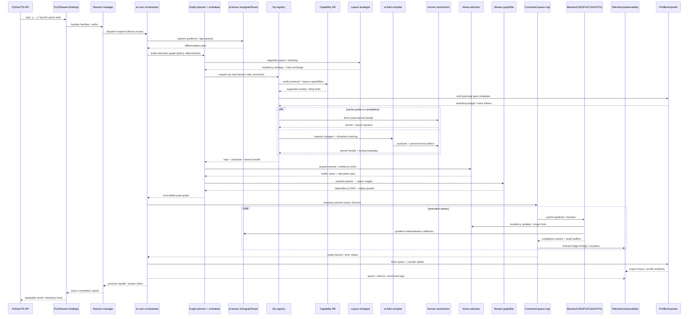

# Native runtime and core API tour

[Documentation index](../README.md) | [Project entry](../../README.md)

This is the detailed source-tree reference, moved from the README.
Examples retain their individual feature, device, and optional-dependency requirements.
A source-tree API is not a claim that an older PyPI wheel exposes it.
Run repository commands from the repository root.

## Contents

- [Python Surface Map](#python-surface-map)
- [Why SpiralTorch  ](#why-spiraltorch)
- [Python quickstart (wheel)](#python-quickstart-wheel)
- [🌟 Quick Tour: Core Features](#-quick-tour-core-features)
- [6) Zero-copy tensor exchange via DLPack](#6-zero-copy-tensor-exchange-via-dlpack)
- [7) Row softmax (GPU-accelerated when available)](#7-row-softmax-gpu-accelerated-when-available)
- [8) rl.stAgent multi-armed bandit](#8-rlstagent-multi-armed-bandit)
- [9) Self-supervised losses](#9-self-supervised-losses)
- [10) Z-space trainer](#10-z-space-trainer)
- [11) Vision × Canvas](#11-vision--canvas)
- [12) NN data utilities](#12-nn-data-utilities)
- [13) Recommender & RL](#13-recommender--rl)
- [14) Interop (PyTorch / JAX / TensorFlow)](#14-interop-pytorch--jax--tensorflow)
- [15) Math & pacing helpers](#15-math--pacing-helpers)

### Python Surface Map

SpiralTorch deliberately keeps its strange color: Z-space, desire telemetry,
roundtables, psychoid routes, and canvas traces are part of the vocabulary.
For day-to-day Python use, though, the first handles are ordinary:

- `spiraltorch.Tensor`, `spiraltorch.nn`, and `spiraltorch.optim` for native
  tensors, modules, losses, and Amegagrad loops without NumPy/PyTorch as hard
  dependencies.
- `SpiralSession(backend="auto" | "cpu" | "wgpu")` for one object that records
  the requested runtime route and device preflight evidence.
- `spiraltorch.ecosystem` for PyTorch/JAX/CuPy/TensorFlow tensor handoff when
  you do want to co-run another stack.
- `bindings/st-py/examples/checkpoint_preflight.py` for HF/PyTorch-style state
  dict audits before loading, resizing, projecting, or LoRA-wrapping weights.
- `ApiLLMZSpaceRuntime` for hosted/API-model LLM inference: pass an
  OpenAI-compatible response mapping or any callable API client, and SpiralTorch
  turns text/usage/latency into a Z-space partial trace, JSONL artifact, and
  summary without making hosted SDKs hard dependencies. Lazy OpenAI and
  Anthropic adapters are available when those optional SDKs are installed.
- `bindings/st-py/examples/byte_lm_profile_smoke.py` and
  `byte_lm_transformers_trace.py` for tokenizerless FT diagnostics plus
  same-process `torch` / `transformers` / `tokenizers` runtime evidence.

---


### Why SpiralTorch

Modern ML stacks were built around CUDA—fast, but closed and rigid.
**SpiralTorch** aims to make high-theory GPU computing *portable* again.
It keeps the expressive PyTorch-style API that researchers already know, but runs on **WGPU** (Metal / Vulkan / DX12), so the same code works across macOS, Windows, and Linux without vendor lock-in.

Where frameworks chase throughput, SpiralTorch chases **fidelity**: exact spectral operators, stable autodiff at microlocal scales, and a cooperative scheduler designed for reproducible research.
You can start with existing PyTorch checkpoints via `spiraltorch.compat.torch`, move training loops unchanged, and gradually adopt SpiralTorch’s runtime for fine-grained control over kernels and device orchestration. Attention, softmax, and related primitives are being fused in the WGPU backend so PyTorch users can migrate critical kernels one pass at a time without sacrificing stability.

It’s not just an engine—it’s a **bridge** between the pragmatism of deep-learning frameworks and the precision of computational geometry.

---

**Architecture Overview.**


Reverse-mode meaning is owned once by `st-tensor::AutogradTensor`; Python and
WASM expose handles to that graph, while WGPU/CPU backends execute its tensor
operations without redefining derivatives. `AmegaHypergrad` and
`AmegaRealgrad` remain Z-space optimizer/accumulator tapes rather than a second
compute graph. See the [Rust-owned autograd contract](../autograd_contract.md)
for the exact ownership boundaries and v1 invariants.

The graph also supports `add_row`, `relu`, tanh-approximate `gelu`, and
`row_softmax`, including their Rust VJPs. Leaves and saved gradients capture
protected snapshots: mutating an imported NumPy/PyTorch array cannot silently
change a previously built graph. Run `python examples/autograd_xor.py` with a
native wheel, or `cargo run -p st-tensor --example autograd_xor`, for a bounded
600-step nonlinear learning fixture. This checks learning mechanics, not LLM
fine-tuning quality.

For multiclass or flattened-token training, `row_log_softmax()` and
`cross_entropy_with_logits(labels, label_smoothing=0.05)` now share stable
Rust CPU kernels across Tensor, autograd, Python and WASM. Integer labels,
ignored tokens and reduction rules live in one core; `nn.CrossEntropyWithLogits`
connects it to `ModuleTrainer`. The [classification contract](../autograd_contract.md#classification-from-logits)
explains the boundaries. `python examples/autograd_classification.py` runs a
300-step, three-class learning fixture without NumPy or PyTorch.

For GPU-resident class-last logits, the same loss exposes
[`evaluate_resident(logits, labels)`](../module_resident_classification.md)
across Rust, Python and WASM, connecting classification to resident VJP and
explicit learner updates without intermediate CPU observations.

For larger effective batches, [resident microbatch accumulation](../module_resident_microbatch.md)
combines gradients across changing inputs in reusable GPU buffers before one
transactional update, with explicit sample weighting and stale-state rejection.
An optional [global gradient norm limit](../module_resident_gradient_clip.md)
clips the policy-normalized window on GPU before the all-parameter update;
Rust, Python and WASM share the same rule without a norm readback.
Optional [Topos EMA momentum](../module_resident_momentum.md) keeps gradient
history resident and commits it together with all parameters, including
explicit reset, disable/re-enable and failed-update recovery rules.

Version 0.4.23 adds `st.AutogradSgd(parameters, learning_rate=0.1)`
for plain Rust-owned CPU updates. Fetch `optimizer.parameters()` for each forward
pass, call `loss.backward()`, then `optimizer.step()`. All parameters are replaced
with fresh immutable leaves together; missing gradients or overflow cannot leave
a partial update. Python and WASM classification fixtures use this path. See
[atomic SGD](../autograd_contract.md#atomic-sgd-for-immutable-leaves) for the
ownership rules and the distinction from Z-space optimizer tapes.

Version 0.4.24 corrects the shared `st-frac::fft` radix-4 sign and binary-reversal
ordering, including inverse transforms and singleton signals. The allocation-free
mixed radix-2/4 path remains in place; Python and WASM use the same corrected Rust
kernel rather than a client-side DFT fallback:

```python
import spiraltorch as st

spectrum = st.frac.fft_real([1.0, 2.0, 3.0, 4.0])
assert spectrum == [(10.0, 0.0), (-2.0, 2.0), (-2.0, 0.0), (-2.0, -2.0)]
restored = st.frac.fft_complex32(spectrum, inverse=True)
```

Forward uses the negative-exponent convention; inverse divides by the signal
length. This fixes `fft_real`, `fft_complex32`, `fft_radix4`, WASM FFT helpers,
and their Canvas/temporal-fusion callers. Earlier nontrivial FFT-derived results
from these paths should be recomputed: impulse-only checks did not validate bin
order or phase. These helpers remain CPU/WASM transforms, not WebGPU dispatch.

Version 0.4.25 stabilizes affine LayerNorm on CPU and WGPU, including large
offsets with small variance and finite values whose variance exceeds f32.
`nn.LayerNorm` backward now uses the same Rust-owned centered moments.
Python can reuse the un-affined normalized values and per-row inverse standard
deviation directly:

```python
import spiraltorch as st

x = st.Tensor(1, 4, [10000.0, 10001.0, 10002.0, 10003.0])
normalized, inverse_std = x.layer_norm_stats(epsilon=1e-5)
assert normalized.shape() == (1, 4)
assert inverse_std.shape() == (1, 1)
```

The statistics helper is CPU/f64 with finite f32 outputs; affine forward retains
its WGPU kernel. Constant rows require positive epsilon. Recheck earlier
LayerNorm-derived results on offset-heavy inputs; this is a numerical correction,
not evidence of improved LLM fine-tuning quality.

Version 0.4.27 connects affine LayerNorm to the native reverse-mode graph:
`x.layer_norm_affine(gamma, beta)` now works on `AutogradTensor` in Python,
with the same Rust VJP exposed as WASM `layerNormAffine`. All three operands
can learn; affine gradients sum rows without hidden batch averaging.
Plain tensors expose `layer_norm_affine_backward(gamma, upstream)` for a
graph-free VJP. CPU backward keeps f64 intermediates; `nn.LayerNorm` shares the
core while retaining its existing WGPU utility path and parameter-update scale.
See the [contract and examples](../autograd_contract.md#affine-layernorm), or
run `python examples/autograd_layer_norm.py` for a 400-step learning fixture.

Source builds also expose exact integer row indexing: `Tensor.gather_rows(ids)`
and `scatter_add_rows(ids, output_rows)`, plus the same differentiable operations
on `AutogradTensor`. Repeated IDs accumulate rather than overwrite; IDs are never
rounded or clamped. `python examples/autograd_tied_embedding.py` learns a small
token-transition fixture with one embedding table shared by lookup and output
projection. See [row indexing](../autograd_contract.md#integer-row-indexing)
for CPU/WGPU precision and browser boundaries. This addition is not in PyPI 0.4.27.

**Licensing**

SpiralTorch ships under a dual-license model:

- **Open-source:** [AGPL-3.0-or-later](../licensing.md#open-source-license-agpl-30-or-later) for community contributions and network-transparent deployments.
- **Commercial:** Flexible subscriptions with priority support for teams that need to keep modifications private or run proprietary SaaS. [Explore tiers and contact details →](../licensing.md#commercial-license)

<p align="center">
  
  
  
  
  
</p>

<p align="center">
  <b>SpiralTorch — a Rust-first learning framework for Z-space.<br>
  Runs natively on WGPU · MPS · CUDA · CPU.</b>
</p>

- © 2025 Ryo ∴ SpiralArchitect — Licensed under AGPL-3.0-or-later
- Contact: [Discussions](https://github.com/RyoSpiralArchitect/SpiralTorch/discussions) · <mailto:kishkavsesvit@icloud.com>
- Unauthorized derivations are non-compliant with AGPL §13
- **For research collaborations or integration inquiries, please reach out directly.**
- **Cloud integrations:** see [Cloud Integration Guide](../cloud_integration.md) for
  Azure and AWS deployment blueprints.
- **If you’re cloning this automatically for analysis:** please cache once, respect AGPL, and avoid generating unnecessary traffic to the maintainer or future contributors. Any network-facing use must comply with AGPL §13.
- **Non-Goals (unsupported):** anonymous/“hands-off” operators, managed hosting, production babysitting, automated scraping/mirroring/star-farming


## Python quickstart (wheel)

> The snippets below run against the published `spiraltorch` wheel and showcase the rich ecosystem of Python bindings that make SpiralTorch's Z-space runtime accessible and intuitive.
> Copy-paste scripts live in `bindings/st-py/examples/` (e.g. `sot_biome_quickstart.py`, `spiralk_plan_rewrite_quickstart.py`, `zspace_stream_training_quickstart.py`).

### 🌟 Quick Tour: Core Features

#### 0) Native module + checkpoint handoff

```python
import spiraltorch as st
from spiraltorch.nn import Linear

head = Linear(2, 2, name="head")
native_state = dict(head.state_dict())
external_state = {
    "lm_head.weight": native_state["head::weight"],
    "lm_head.bias": native_state["head::bias"],
}
key_map = {
    "lm_head.weight": "head::weight",
    "lm_head.bias": "head::bias",
}

report = head.state_dict_compatibility_with_key_map(external_state, key_map)
assert report["compatible"]
load_report = head.load_state_dict_subset_mapped_checked(external_state, key_map)
assert load_report["matched"]
print("matched checkpoint tensors:", report["matched"])

print("wgpu plan surface:", st.describe_device("wgpu").get("backend"))
```

#### 1) Tensor creation and basic operations

```python
import spiraltorch as st

# Create tensors from Python lists
x = st.tensor([[1.0, 2.0, 3.0], [4.0, 5.0, 6.0]])
y = st.Tensor(2, 3)  # Zero-initialized 2x3 tensor

# Label your dimensions for clarity
labeled = st.tensor(
    [[0.2, 0.8], [0.4, 0.6]],
    axes=[st.Axis("batch", 2), st.Axis("feature", 2)],
)

# Basic operations
z = x.scale(2.0)  # Multiply by scalar
print("Shape:", x.shape())
print("Data:", x.tolist())
print("Axis names:", labeled.axis_names())
```

#### 2) Zero-copy interop with PyTorch via DLPack

```python
import spiraltorch as st

# DLPack roundtrip (no extra deps)
st_tensor = st.Tensor(2, 3, [1, 2, 3, 4, 5, 6])
capsule = st_tensor.to_dlpack()
st_roundtrip = st.from_dlpack(capsule)
print("Roundtrip:", st_roundtrip.tolist())

try:
    import torch
    from torch.utils.dlpack import from_dlpack as torch_from_dlpack
except ImportError:
    print("PyTorch not installed; skipping torch interop demo.")
else:
    # SpiralTorch → PyTorch (zero-copy)
    torch_tensor = torch_from_dlpack(st_tensor.to_dlpack())

    # Mutations are visible in both (shared memory)
    torch_tensor += 10
    print("SpiralTorch sees changes:", st_tensor.tolist())

    # PyTorch → SpiralTorch
    pt_tensor = torch.arange(6, dtype=torch.float32).reshape(2, 3)
    st_from_torch = st.Tensor.from_dlpack(pt_tensor)
    pt_tensor.mul_(2)
    print("SpiralTorch sees torch mul_:", st_from_torch.tolist())
```

#### 3) Hypergrad tapes for Z-space optimization

```python
import spiraltorch as st

# Initialize weights and create hypergrad tape
weights = st.Tensor(1, 3, [0.1, 0.2, 0.3])
tape = st.hg[weights](
    curvature=-0.9,  # Hyperbolic curvature
    learning_rate=0.02,
)

# Add topological guards for stability
guarded = st.hg[weights].with_topos(
    tolerance=1e-3,
    saturation=0.8,
    max_depth=8
)

# Accumulate gradients
prediction = st.Tensor(1, 3, [0.25, 0.25, 0.25])
target = st.Tensor(1, 3, [0.0, 1.0, 0.0])
tape.accumulate_pair(prediction, target)

# Apply updates to weights
tape.apply(weights)

print("Tape shape:", tape.shape())
print("Learning rate:", tape.learning_rate())
print("Guard curvature:", guarded.curvature())
```

#### 4) Advanced hypergrad sessions with operator hints

```python
import spiraltorch as st

weights = st.Tensor(1, 4, [0.05, -0.15, 0.25, 0.10])
targets = st.Tensor(1, 4, [0.0, 1.0, 0.0, 0.0])

tape = st.Hypergrad(curvature=-0.85, learning_rate=0.03, rows=1, cols=4)
real = st.Realgrad(learning_rate=0.01, rows=1, cols=4)
try:
    tape.accumulate_pair(weights, targets)
    real.accumulate_pair(weights, targets)

    summary = tape.summary()
    telemetry = tape.telemetry()
    print("summary:", {"l2": summary.l2(), "rms": summary.rms(), "std": summary.std()})
    print("non-finite ratio:", telemetry.non_finite_ratio())

    # Desire-derived operator hints (mix/gain etc.)
    control = tape.desire_control(real.summary())
    print("operator mix/gain:", control.operator_mix(), control.operator_gain())
    print("control events:", control.events())
finally:
    tape.reset()
    real.reset()
```

#### 5) Z-space encoding and metric normalization

```python
import spiraltorch as st

z_vec = st.z["Spin up the roundtable", 0.4]

metrics = st.z.metrics(
    speed=0.55,
    memory=0.12,
    stability=0.78,
    drs=0.05,
    gradient=[0.1, -0.2, 0.05],
)

roundtable = st.z.partial(
    metrics,
    origin="telemetry",
    telemetry={"roundtable": {"mean": 0.44, "focus": 0.67}},
)
canvas_hint = st.z.partial(speed=0.35, memory=0.22, coherence_peak=0.61, weight=0.5)
bundle = st.z.bundle(roundtable, canvas_hint)

trainer = st.ZSpaceTrainer(z_dim=z_vec.shape()[1])
loss = trainer.step(bundle)

print("z shape:", z_vec.shape(), "loss:", loss)
```

`st.z[...]` is shorthand for `encode_zspace`, letting you blend text, temperature
overrides, or `(key, value)` tweaks inline. `st.z.metrics(...)` canonicalises the
wheel’s metric aliases, `st.z.partial(...)` captures telemetry/weights in a
`ZSpacePartialBundle`, and `st.z.bundle(...)` (alias `st.z.blend`) merges those
partials before handing them to `ZSpaceTrainer`.
Use `st.z.clear()` at run boundaries when process-global softlogic feedback must
not leak into the next experiment; it returns whether Rust actually removed a value.

Open-topos pressure can now be projected into named learning and inference
hints. The same signal can damp a local Z-space trainer and tune hosted-model
sampling controls:

```python
import spiraltorch as st

topos = st.hypergrad_topos(max_depth=10, max_volume=100)
signal = st.topos_control_signal(topos, observed_depth=4, visited_volume=25)
training = st.topos_training_hints(signal)
runtime = st.topos_runtime_adapter(signal, request_options={"base_temperature": 0.8})
projection = st.topos_zspace_projection(signal, gradient_dim=4)

trainer = st.ZSpaceTrainer(z_dim=4, topos_control_gain=0.5)
trainer.step(st.z.metrics(speed=0.0, memory=0.0, stability=0.0, telemetry={"topos": signal}))

print(
    training["gradient_bias_scale"],
    runtime["request"]["temperature"],
    projection["gradient"],
)
```

For hosted-model experiments, sweep several topological postures through the
same prompt/provider and compare the traces:

```python
import spiraltorch as st


def invoke_api_model(prompt: str, **request):
    route = "guarded" if "topos:sweep:guarded" in prompt else "open"
    return {
        "model": "demo-topos-model",
        "output_text": f"{route} route temperature={request['temperature']:.2f}",
        "status": "completed",
        "usage": {"prompt_tokens": 8, "completion_tokens": 6, "total_tokens": 14},
    }


result = st.run_api_llm_topos_sweep(
    ["Explain this route in one paragraph."],
    invoke_api_model,
    z_state=[0.2, -0.1, 0.4, 0.05],
    topos_profiles={
        "open": {"porosity": 0.7, "max_depth": 10, "max_volume": 100},
        "guarded": {"porosity": 0.02, "observed_depth": 9, "max_depth": 10},
    },
    request_options={"base_temperature": 0.8, "include_penalties": True},
    context_prompt=True,
    create_session=False,
    jsonl_dir="/tmp/spiraltorch-topos-sweep",
    report_out="/tmp/spiraltorch-topos-sweep/report.json",
)

print(result["labels"], result["comparison"]["topos_context"]["observed_run_rate"])
print(st.compare_api_llm_topos_sweep_reports(result["report_path"])["winners"])
```

### 6) Zero-copy tensor exchange via DLPack

```python
import spiraltorch as st

a = st.Tensor(2, 3, [1, 2, 3, 4, 5, 6])
capsule = st.to_dlpack(a)
roundtrip = st.from_dlpack(capsule)
print("roundtrip:", roundtrip.tolist())
```

The wheel exposes both `Tensor.to_dlpack()` and `Tensor.from_dlpack(...)` so you
can share contiguous 2D CPU `float32` storage directly with PyTorch or NumPy.
Versioned DLPack adds read-only metadata and explicit copy requests without
removing the legacy path. See the [Rust/Python interchange contract](../dlpack_interop.md)
for ownership, copy policy, and autograd boundaries.

### 7) Row softmax (GPU-accelerated when available)

```python
from spiraltorch import Axis, tensor

time = Axis("time")
feature = Axis("feature", 4)

wave = tensor(
    [
        [0.20, 0.80, -0.10, 0.40],
        [0.90, -0.30, 0.10, 0.50],
    ],
    axes=[time.with_size(2), feature],
)

print(wave.describe())
softmax = wave.row_softmax()
print(softmax.axis_names())  # ('time', 'feature')
```

`Axis`/`tensor` build `LabeledTensor` instances that remember semantic
dimensions. `row_softmax()` automatically dispatches to the best backend
available (WGPU/MPS/CPU) and keeps the axis metadata intact.

### 8) rl.stAgent multi-armed bandit

```python
import random
import spiraltorch as st

Agent = getattr(st.rl, "stAgent", None)
if Agent is None:
    raise SystemExit("st.rl.stAgent not available in this build")

def reward(action: int) -> float:
    p = 0.6 if action == 0 else 0.4
    return 1.0 if random.random() < p else 0.0

agent = Agent(state_dim=1, action_dim=2, discount=0.0, learning_rate=5e-2)

T = 2_000
FORCE_EXPLORE = 200
eps_hi, eps_lo = 0.3, 0.01

wins = 0
pulls = [0, 0]
wins_by_arm = [0, 0]

for t in range(1, T + 1):
    if t <= FORCE_EXPLORE:
        a = t % 2
    else:
        frac = (t - FORCE_EXPLORE) / (T - FORCE_EXPLORE)
        eps = eps_hi + (eps_lo - eps_hi) * frac
        agent.set_epsilon(eps)
        trace = agent.select_action_trace(0)
        a = trace["action"]

    r = reward(a)
    wins += r
    pulls[a] += 1
    wins_by_arm[a] += r
    agent.update(0, a, r, 0)

print(f"total win rate: {wins / T:.3f}")
for k in range(2):
    rate = (wins_by_arm[k] / pulls[k]) if pulls[k] else 0.0
    print(f"arm {k}: pulls={pulls[k]}, empirical p≈{rate:.3f}")
```

### 9) Self-supervised losses

```python
import spiraltorch as st

anchors = [[0.1, 0.9], [0.8, 0.2]]
positives = [[0.12, 0.88], [0.79, 0.21]]
print("info_nce:", st.selfsup.info_nce(anchors, positives, temperature=0.1, normalize=True))

pred = [[0.2, 0.8], [0.6, 0.4]]
tgt = [[0.0, 1.0], [1.0, 0.0]]
mask = [[1], [0]]  # mask by column indices per row
print("masked_mse:", st.selfsup.masked_mse(pred, tgt, mask))
```

### 10) Z-space trainer

```python
import spiraltorch as st

trainer = st.ZSpaceTrainer(z_dim=4, alpha=0.35, lam_frac=0.1, lr=1e-2)
samples = [
    {"speed": 0.2, "mem": 0.1, "stab": 0.7, "gradient": [0.05, -0.02, 0.01, 0.0]},
    {"speed": 0.3, "mem": 0.2, "stab": 0.6, "drs": 0.1},
]
print("z:", st.step_many(trainer, samples))
print("semantic owner:", trainer.last_optimizer_report["semantic_owner"])
```

`ZSpaceTrainer` is a Python orchestrator over the versioned
`st-core::runtime::zspace_optimizer` contract. Rust alone validates checkpoints,
normalises observations, evaluates the periodic fractional Sobolev regulariser
and its FFT-derived analytic gradient, resolves bounded Topos controls, and
commits the Adam update. Client-controlled Z dimensions are capped at 4096.
Use `last_optimizer_report` to inspect the objective decomposition, effective
learning rate, clipping, regularisation scale, applied gradient, and complete
before/after state. `gradient_projection="exact"` rejects mismatched observed
gradients; the compatibility default is `"tile_or_truncate"`.

The reported objective is an observed resource cost, not a claim that resource
telemetry was differentiated through Z. State updates combine the supplied
Z-gradient with the normalised analytic fractional gradient and optional Topos
bias. Topos `learning_rate_scale` changes the actual Adam learning rate, while
`regularization_scale` changes the actual fractional weight. `clip_scale` is not
another learning-rate multiplier: Rust derives a scale-invariant threshold from
the biased-gradient RMS, with `clip_scale=1` as an exact no-op.

Native parameter training consumes that same report without rebuilding its
semantics in Python:

```python
import spiraltorch as st

z_optimizer = st.ZSpaceTrainer(z_dim=2, topos_control_gain=1.0)
z_optimizer.step({
    "gradient": [0.1, -0.2],
    "telemetry": {"topos.training_hints.learning_rate_scale": 0.5},
})
model = st.nn.Sequential()
model.add(st.nn.Linear("controlled", 2, 1))
module_trainer = st.nn.ModuleTrainer(
    backend="cpu",
    curvature=-1.0,
    hyper_learning_rate=1e-2,
    fallback_learning_rate=1e-2,
)
module_trainer.prepare(model)
receipt = module_trainer.apply_zspace_meta_optimizer_report(
    model,
    z_optimizer.last_optimizer_report,
)
print(receipt["absolute_learning_rate_scale"], receipt["changed"])
```

Rust re-derives the bounded Topos scale, applies it idempotently to all trainer
learning rates, and rejects stale, conflicting, or modified reports before
mutating optimizer state. WASM exposes the same verified control receipt as a
peer-client transport, but does not pretend to own a browser parameter runtime.

### 11) Vision × Canvas

```python
import spiraltorch as st

vision = st.SpiralTorchVision(depth=4, height=3, width=3, alpha=0.2, window="hann", temporal=4)
canvas = st.CanvasTransformer(width=3, height=3, smoothing=0.85)

for t in range(3):
    vol = [[[0.0+(t*0.1) for _ in range(3)] for _ in range(3)] for _ in range(4)]
    vision.accumulate(vol)

# If you packaged an apply helper under st.canvas:
snap = st.canvas.apply_vision_update(vision, canvas, include_patch=True)
print("canvas summary:", snap.summary)
print("patch[0][:3]:", snap.patch[0][:3] if snap.patch else None)
```

### 12) NN data utilities

```python
import spiraltorch as st

pairs = [
    (st.Tensor(1,2,[1,0]), st.Tensor(1,2,[1,0])),
    (st.Tensor(1,2,[0,1]), st.Tensor(1,2,[0,1])),
]
dataset = st.dataset.Dataset.from_samples(pairs)
loader = dataset.loader().shuffle(123).batched(2).prefetch(2)
for x, y in loader:
    print("batch:", x.shape(), y.shape())
```

### 13) Recommender & RL

```python
import spiraltorch as st

rec = st.Recommender(users=8, items=12, factors=4, learning_rate=0.05, regularization=0.002)
rec.train_epoch([(0, 0, 5.0), (0, 1, 3.0), (1, 0, 4.0)])
print("top-k:", rec.recommend_top_k(0, k=3))
```

### 14) Interop (PyTorch / JAX / TensorFlow)

```python
import spiraltorch as st

x = st.Tensor(1,3,[1.0, 2.0, 3.0])
try:
    import torch
except ImportError:
    print("PyTorch not installed; skipping st.compat.torch demo.")
else:
    xt = st.compat.torch.to_torch(x, dtype=torch.float32, device="cpu")
    x_back = st.compat.torch.from_torch(xt)
    print(x_back.tolist())
```

### 15) Math & pacing helpers

```python
import spiraltorch as st
st.set_global_seed(42)
print(st.golden_ratio(), st.golden_angle())
print(st.fibonacci_pacing(12))
print(st.pack_tribonacci_chunks(20))
plan = st.sot.generate_plan(16, radial_growth=0.08)
print("sot:", plan.total_steps, plan.polyline()[:3])
```
